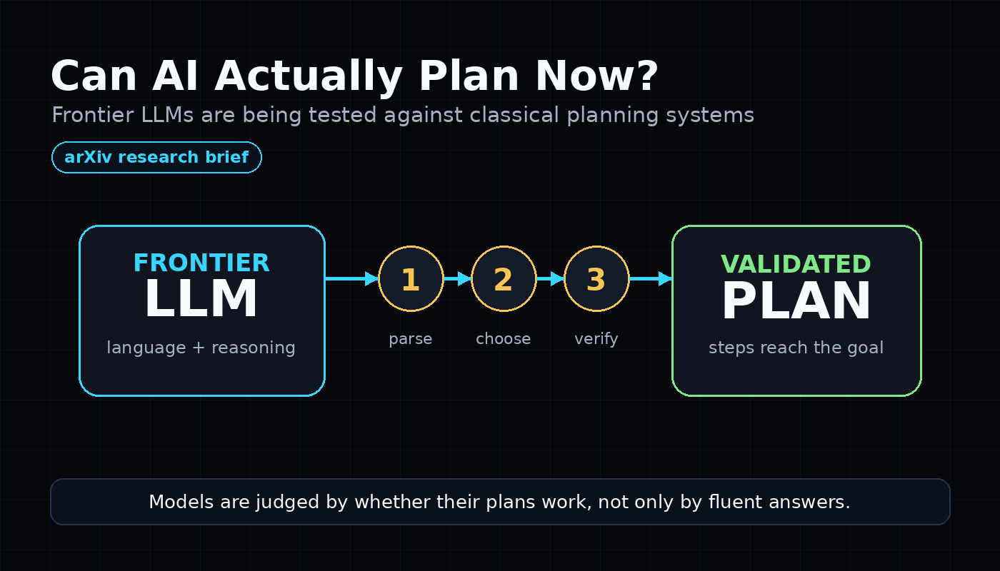
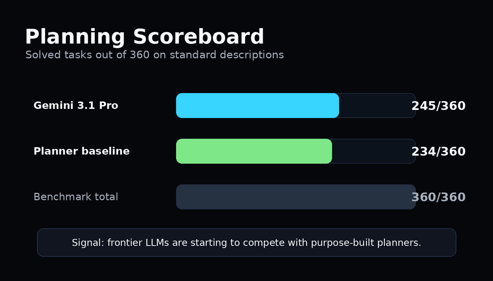
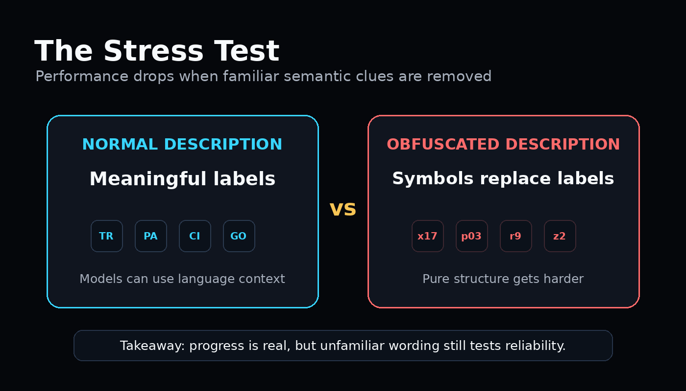

# Can AI Actually Plan Now?

**Subheadline:** A new arXiv paper suggests frontier language models are moving beyond fluent answers and into structured planning.

Large language models are famous for writing, summarizing, and answering questions. Planning is harder. It requires choosing steps that transform a starting situation into a goal, while respecting rules along the way.

That is why **Frontier Large Language Models Rival State-of-the-Art Planners**, a recent arXiv paper by Augusto B. Correa, Andre G. Pereira, and Jendrik Seipp, is worth attention. The study revisits an old criticism of LLMs: they can sound smart, but they often fail when asked to produce reliable plans.

The researchers tested frontier models on formal planning tasks based on the International Planning Competition. Instead of accepting persuasive-looking answers, they verified plans with a validation tool and compared the models against classical planning systems built specifically for this kind of problem.

The headline result is striking. On standard task descriptions, **Gemini 3.1 Pro solved 245 out of 360 tasks**, while the strongest classical planner baseline solved **234 out of 360**. GPT-5 performed at a level comparable to the planner baselines.

That does not mean LLMs have suddenly solved planning. The paper includes a useful stress test: when task descriptions were obfuscated to remove familiar semantic clues, performance dropped. In plain language, the models did better when the problem still carried meaningful names and context, and worse when they had to rely more purely on symbolic structure.

This caveat matters. Real-world planning often mixes both worlds. A workplace assistant may understand that "send the report" means email, attachments, permissions, and timing. But it also needs dependable step-by-step control when labels are unfamiliar, screens change, or a process branches.

The study's most important message is not that classical planners are obsolete. It is that the gap is shrinking faster than many people expected. Earlier models struggled badly on these tasks. Newer frontier models are beginning to compete with systems designed for planning from the ground up.

For journalists and AI users, the takeaway is simple: the next wave of AI progress may not be only about better conversation. It may be about whether models can carry goals through structured, verifiable steps.

## Sources

- arXiv: [Frontier Large Language Models Rival State-of-the-Art Planners](https://arxiv.org/abs/2511.09378)
