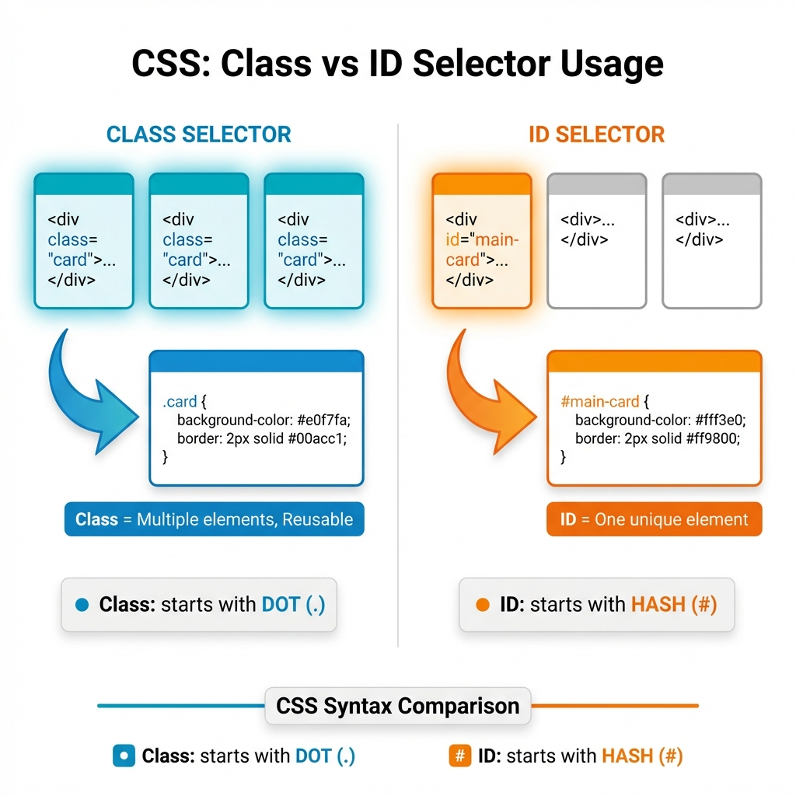
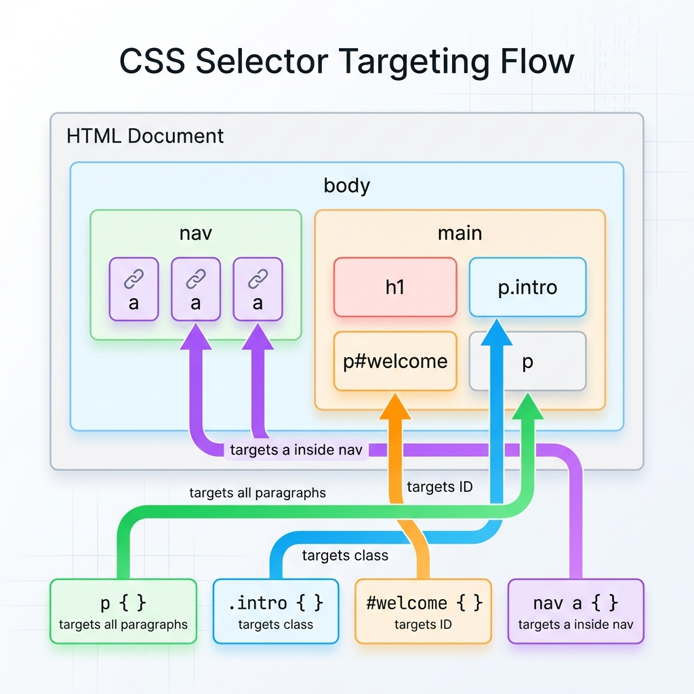

*Imagine you're in a crowded room and need to get someone's attention. You might say "Hey everyone!" (general), "Hey people in blue shirts!" (a group), or "Hey Sarah!" (specific). CSS selectors work exactly the same way — they help you choose which HTML elements to style.*

---

## Why CSS Selectors Are Needed

HTML gives structure to a webpage, but without CSS, every page looks like a boring word document from 1995 — black text on a white background, no colors, no styling.

But here's the problem: **How do you tell the browser WHICH elements to style?**

You might want:
- All paragraphs to be blue
- Only the "warning" messages to be red
- Just the main heading to be extra large

**CSS selectors are how you point at specific elements and say "You — I want to style YOU."**

---

## Selector Analogy: Addressing People in a Room

Think of selectors like getting attention in a room full of people:

| Real-World Phrase | CSS Selector | Who Gets Styled? |
|-------------------|--------------|------------------|
| "Hey everyone!" | `*` | All elements |
| "Hey, you there!" | `p` | All `<p>` elements |
| "Hey, people wearing badges!" | `.badge` | Elements with class="badge" |
| "Hey, Sarah!" | `#sarah` | The one element with id="sarah" |
| "Hey, people in the kitchen!" | `kitchen .person` | Descendants |

Let's explore each type.

---

## 1. The Element Selector (The Broad Net)

The most basic selector targets **all instances of an HTML element**.

### Syntax

```css
element-name {
  property: value;
}
```

### Example

**HTML:**
```html
<p>This is my first paragraph.</p>
<p>This is another paragraph.</p>
<h1>This is a heading.</h1>
<p>This is a third paragraph.</p>
```

**CSS:**
```css
p {
  color: blue;
  font-size: 18px;
}
```

**Result:**
```
This is my first paragraph.        ← Blue, 18px
This is another paragraph.         ← Blue, 18px
This is a heading.                 ← Default style (not targeted)
This is a third paragraph.         ← Blue, 18px
```

### When to Use

Use element selectors when you want **every** instance of that element to look the same:

```css
/* All links should be green */
a {
  color: green;
}

/* All buttons should have padding */
button {
  padding: 10px 20px;
}
```

### Limitation

What if you want MOST paragraphs blue, but ONE paragraph red? Element selectors are too broad — they hit everything. That's where classes come in.

---

## 2. The Class Selector (The Group Identifier)

Classes are the workhorse of CSS. They let you create **groups** of elements that share styling.

### Syntax

```css
.class-name {
  property: value;
}
```

The dot (`.`) before the name tells CSS "this is a class."

### Example

**HTML:**
```html
<p class="intro">Welcome to our website!</p>
<p class="intro">We're glad you're here.</p>
<p class="warning">Don't forget to save your work!</p>
<p>Just a regular paragraph.</p>
```

**CSS:**
```css
.intro {
  font-size: 20px;
  color: darkblue;
}

.warning {
  background-color: yellow;
  color: red;
  font-weight: bold;
}
```

**Result:**
```
Welcome to our website!        ← Dark blue, 20px (intro class)
We're glad you're here.        ← Dark blue, 20px (intro class)
⚠ Don't forget to save...      ← Yellow bg, red, bold (warning class)
Just a regular paragraph.      ← Default style
```

### Key Points About Classes

1. **Multiple elements can share the same class**
   ```html
   <button class="btn">Save</button>
   <button class="btn">Cancel</button>
   <a class="btn">Learn More</a>
   ```

2. **One element can have multiple classes** (space-separated)
   ```html
   <button class="btn btn-primary">Submit</button>
   <button class="btn btn-danger">Delete</button>
   ```

3. **Class names should describe purpose, not appearance**
   ```css
   /* Good: describes what it IS */
   .warning { color: red; }
   .success { color: green; }
   
   /* Not as good: describes how it LOOKS */
   .red-text { color: red; }
   .green-text { color: green; }
   ```

---

## 3. The ID Selector (The Unique Identifier)

IDs are for **one specific element only**. Think of them like a person's name — unique to that individual.

### Syntax

```css
#id-name {
  property: value;
}
```

The hash (`#`) before the name tells CSS "this is an ID."

### Example

**HTML:**
```html
<header id="main-header">
  <h1>My Website</h1>
</header>

<nav id="main-nav">
  <a href="#">Home</a>
  <a href="#">About</a>
</nav>

<div id="special-offer">
  Limited time: 50% off!
</div>
```

**CSS:**
```css
#main-header {
  background-color: navy;
  color: white;
  padding: 20px;
}

#special-offer {
  background-color: gold;
  border: 3px solid red;
  font-size: 24px;
}
```

**Result:**
```
┌─────────────────────────────┐
│  My Website                 │  ← Navy background, white text
│  (header#main-header)       │
└─────────────────────────────┘

Home | About                   ← Default nav style

┌─────────────────────────────┐
│  🌟 Limited time: 50% off!  │  ← Gold background, red border
│  (div#special-offer)        │
└─────────────────────────────┘
```



### Important Rules for IDs

1. **IDs must be unique** — only ONE element per page can have a specific ID
   ```html
   <!-- This is WRONG -->
   <div id="header">...</div>
   <div id="header">...</div>  ❌ Can't reuse ID!
   
   <!-- This is correct -->
   <div id="main-header">...</div>
   <div id="secondary-header">...</div>  ✓
   ```

2. **Use IDs sparingly** — prefer classes for styling
   - IDs are great for JavaScript targeting and page anchors
   - Classes are better for reusable styles

---

## 4. Group Selectors (Styling Multiple Things at Once)

What if you want the same styling for different elements? You could write:

```css
h1 {
  font-family: Arial;
}

h2 {
  font-family: Arial;
}

h3 {
  font-family: Arial;
}
```

But that's repetitive. Instead, use a **group selector**:

### Syntax

```css
selector1, selector2, selector3 {
  property: value;
}
```

### Example

```css
h1, h2, h3 {
  font-family: Arial, sans-serif;
  color: #333;
}
```

Now all headings share the same font and color.

### Real-World Example

**HTML:**
```html
<h1>Main Title</h1>
<h2>Section Heading</h2>
<h3>Subsection</h3>
<button>Click Me</button>
<a href="#">Learn More</a>
```

**CSS:**
```css
/* All headings share this */
h1, h2, h3 {
  font-family: Georgia, serif;
  color: #222;
}

/* Buttons and links share this */
button, a {
  padding: 10px 20px;
  border-radius: 5px;
}
```

---

## 5. Descendant Selectors (Narrowing Down)

Sometimes you want to style an element **only when it's inside another specific element**.

### Analogy: "People in the Kitchen"

Imagine you want to talk to people who are in the kitchen (not people in the living room, not people outside — specifically in the kitchen).

### Syntax

```css
parent descendant {
  property: value;
}
```

The space between selectors means "inside of."

### Example

**HTML:**
```html
<nav class="main-menu">
  <a href="#">Home</a>
  <a href="#">About</a>
  <a href="#">Contact</a>
</nav>

<footer>
  <a href="#">Privacy Policy</a>
  <a href="#">Terms of Service</a>
</footer>
```

**CSS:**
```css
/* Style links inside .main-menu ONLY */
.main-menu a {
  color: blue;
  font-weight: bold;
}

/* Style links inside footer ONLY */
footer a {
  color: gray;
  font-size: 14px;
}
```

**Result:**
```
NAVIGATION (main-menu)
Home | About | Contact     ← Blue, bold

Page content here...

FOOTER
Privacy Policy | Terms     ← Gray, small
```

Same element (`<a>`), different styling based on where it lives.

### Another Example

```css
/* Paragraphs inside articles should be special */
article p {
  line-height: 1.8;
  font-size: 18px;
}

/* Paragraphs in sidebars are smaller */
aside p {
  font-size: 14px;
  color: #666;
}
```

---

## Understanding Selector Priority (Specificity)

What happens when multiple selectors target the same element?

### Analogy: Whose Instructions Win?

Imagine you're wearing:
- A "Team Blue" t-shirt (class)
- A name tag that says "VIP" (ID)
- You ARE a person (element)

If someone says "Everyone sit down" and another person says "VIP members stand up," what do you do? **The more specific instruction wins.**

### Specificity Hierarchy (Simple Version)

```
More Specific          Less Specific
     │                      │
     ▼                      ▼
┌─────────┐            ┌─────────┐
│   ID    │   >        │  Class  │   >   Element
│  #name  │            │  .name  │         p
└─────────┘            └─────────┘
(100 pts)              (10 pts)         (1 pt)
```

### Example: Specificity in Action

**HTML:**
```html
<p class="intro" id="first-paragraph">
  This is a paragraph.
</p>
```

**CSS:**
```css
/* Element selector: 1 point */
p {
  color: black;
}

/* Class selector: 10 points */
.intro {
  color: blue;  /* Wins over element! */
}

/* ID selector: 100 points */
#first-paragraph {
  color: red;   /* Wins over class! */
}
```

**Result:** The paragraph is **RED** because ID has the highest specificity.

### Simple Rules to Remember

1. **ID beats Class** (100 > 10)
2. **Class beats Element** (10 > 1)
3. **More specific selectors beat less specific**
   ```css
   /* This is MORE specific */
   nav a { color: blue; }      /* 11 points */
   
   /* This is LESS specific */
   a { color: red; }           /* 1 point */
   
   /* Links in nav will be BLUE */
   ```

### Visual Summary



```
┌─────────────────────────────────────┐
│  Specificity Hierarchy (High → Low) │
├─────────────────────────────────────┤
│  1. Inline styles (in HTML)         │
│  2. ID selectors (#name)            │
│  3. Class selectors (.name)         │
│  4. Element selectors (p)           │
└─────────────────────────────────────┘
```

---

## Complete Example: Putting It All Together

**HTML:**
```html
<!DOCTYPE html>
<html>
<head>
  <title>My Page</title>
</head>
<body>
  <header id="top-header">
    <h1>Welcome to My Site</h1>
  </header>
  
  <nav class="main-nav">
    <a href="#">Home</a>
    <a href="#">About</a>
    <a href="#">Contact</a>
  </nav>
  
  <main>
    <article>
      <h2>Latest News</h2>
      <p class="intro">Welcome to our update.</p>
      <p>Here's what happened this week...</p>
    </article>
    
    <aside class="sidebar">
      <h3>Quick Links</h3>
      <p>Check out these resources.</p>
    </aside>
  </main>
</body>
</html>
```

**CSS:**
```css
/* Element: All headings */
h1, h2, h3 {
  font-family: Arial, sans-serif;
}

/* ID: Unique header */
#top-header {
  background: navy;
  color: white;
  padding: 20px;
}

/* Class: Navigation group */
.main-nav {
  background: #f0f0f0;
  padding: 10px;
}

/* Descendant: Links inside nav */
.main-nav a {
  color: blue;
  margin-right: 15px;
}

/* Class: Intro paragraphs */
.intro {
  font-size: 18px;
  font-style: italic;
}

/* Descendant: Paragraphs in sidebar */
.sidebar p {
  font-size: 14px;
  color: #666;
}
```

---

## Quick Reference

| Selector | Symbol | Example | Targets |
|----------|--------|---------|---------|
| **Element** | None | `p` | All `<p>` elements |
| **Class** | `.` | `.warning` | Elements with class="warning" |
| **ID** | `#` | `#header` | Element with id="header" |
| **Group** | `,` | `h1, h2` | All h1 AND all h2 |
| **Descendant** | ` ` (space) | `nav a` | Links inside nav |

---

## Key Takeaways

1. **Selectors choose elements** to apply styles to
2. **Element selector** (`p`) — broad, hits all instances
3. **Class selector** (`.warning`) — group elements, most common
4. **ID selector** (`#header`) — unique element, use sparingly
5. **Group selector** (`h1, h2`) — style multiple things at once
6. **Descendant selector** (`nav a`) — context-specific styling
7. **Specificity** — IDs beat classes, classes beat elements

---
