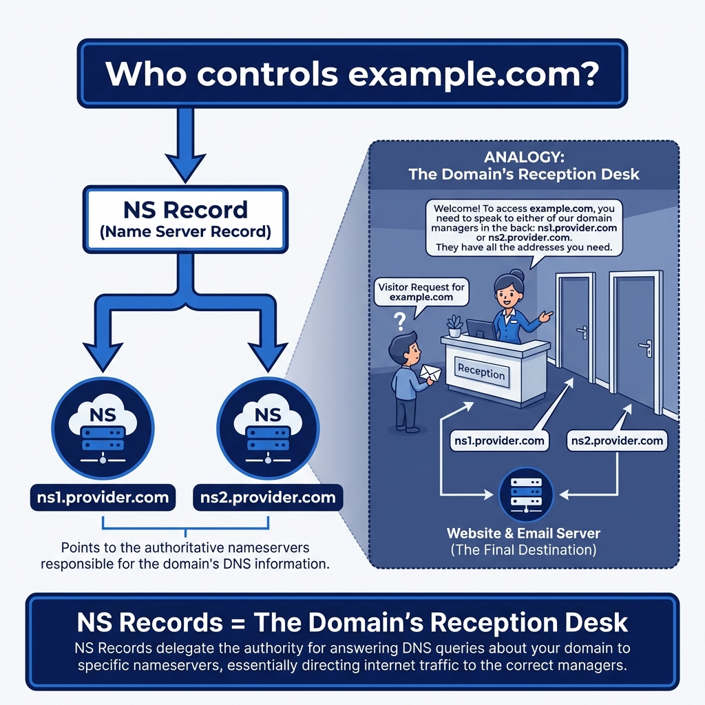
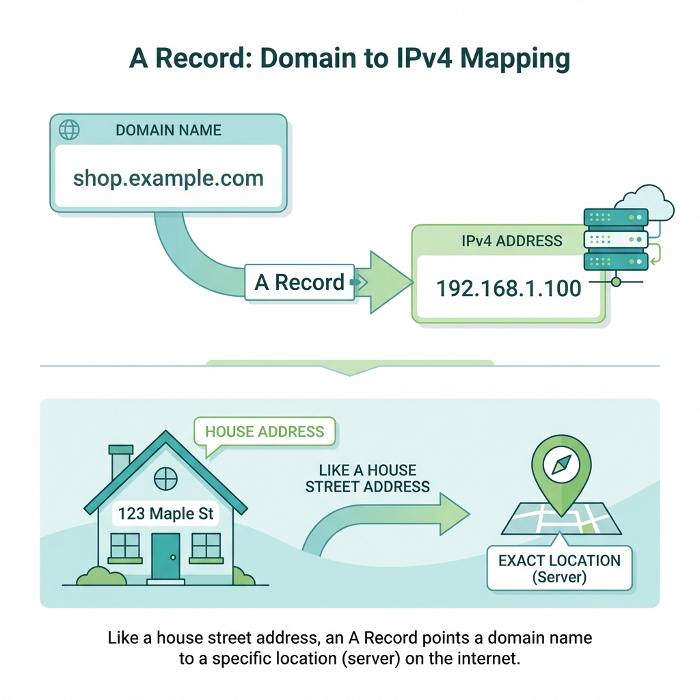
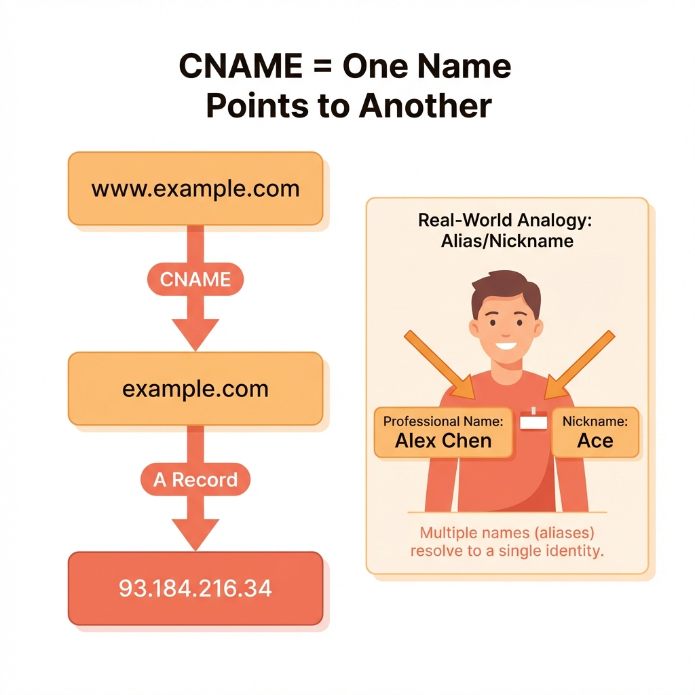
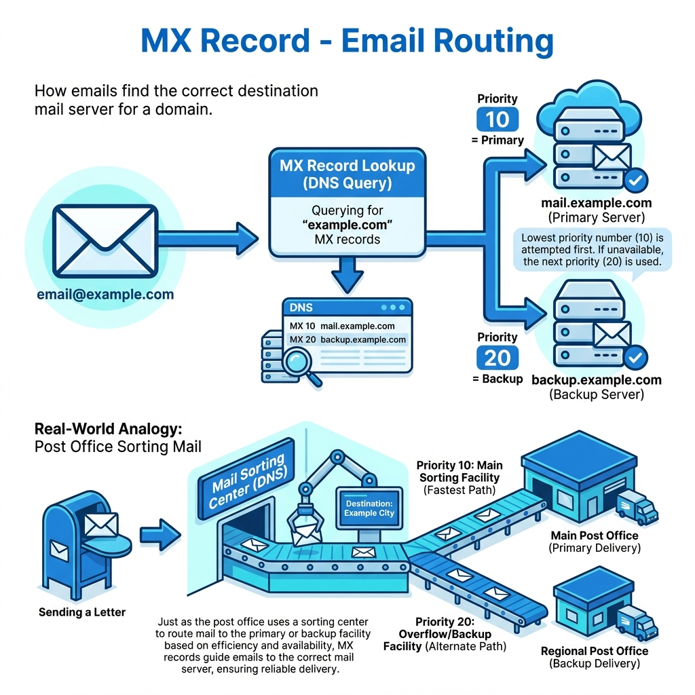
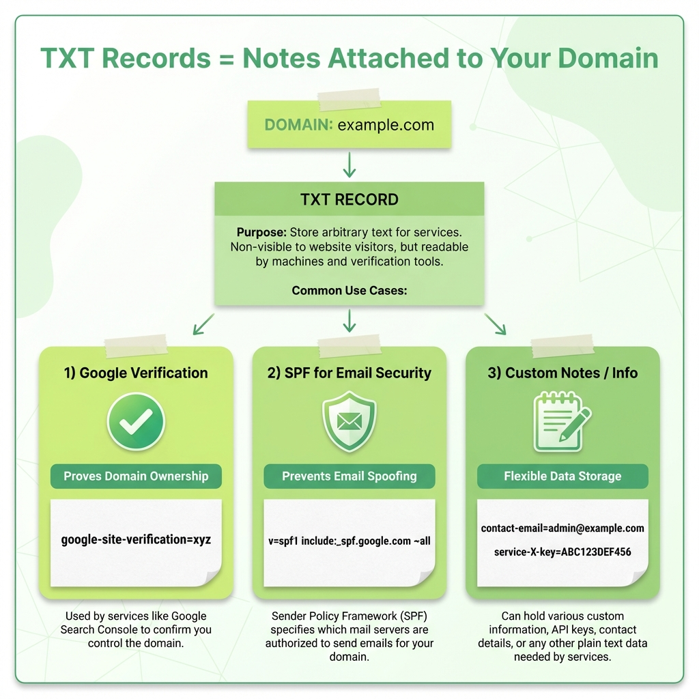

*Ever typed a website address and wondered how your browser magically knows where to go? I spent way too long figuring this out when I first started, so here's everything I wish someone had told me about DNS records.*

---

## How Does a Browser Know Where a Website Lives?

Think about this for a second. You type `google.com` into your browser, hit enter, and boom – you're looking at Google's homepage. But here's the thing: **computers don't actually understand "google.com"**. They speak in numbers – IP addresses like `142.250.195.206`.

So how does your browser figure out which numbers to call? 


That's where **DNS** comes in.

---

## What is DNS? (The Internet's Phonebook)

**DNS** stands for **Domain Name System**, and honestly, the best way to explain it is this: **it's like your phone's contact list**.

When you want to call your friend, you don't memorize their phone number. You just tap their name, and your phone looks up the number for you. DNS works exactly the same way.

You type a **name** (like `example.com`), and DNS looks up the **"phone number"** (the IP address) so your browser can make the connection.

Without DNS, we'd all be memorizing strings of numbers just to visit websites. Imagine telling someone, "Check out my website at 192.168.45.112!" Not exactly catchy, right?

---

## Why Do We Need Different DNS Records?

Here's where it gets interesting. A domain name isn't just about one thing. Think about your house for a moment:

| What You Have | What It Does |
|--------------|--------------|
| Your **street address** | Tells people where you live |
| Your **mailbox** | Receives letters and packages |
| Your **phone number** | Lets people call you |
| Your **name on the door** | Confirms they're at the right place |

Similarly, a domain needs to do **multiple jobs**:
- Point visitors to the right web server
- Route emails to the correct mail server
- Verify ownership for various services
- Handle subdomains and aliases

That's why we have **different types of DNS records**, each handling a specific job. Let's go through them one by one.

---

## 1. NS Record: Who's Responsible for This Domain?

Let's start at the top. When someone looks up your domain, the first question is: *"Who's responsible for answering questions about this domain?"*

That's what **NS (Name Server) records** answer.



### The Reception Desk Analogy

Picture a big office building. When you walk in, there's a **reception desk**. You tell the receptionist you're looking for "Example Company," and they point you to the right floor.

NS records work the same way. They say: *"Hey, if you want to know anything about `example.com`, talk to these name servers:"*

```
example.com.    NS    ns1.cloudprovider.com.
example.com.    NS    ns2.cloudprovider.com.
```

### Why Multiple NS Records?

You'll almost always see **at least two** NS records. Why? **Redundancy**. If one name server goes down, the other keeps your domain alive. It's like having a backup receptionist.

---

## 2. A Record: Domain → IPv4 Address (Your Home Address)

Now we're getting to the core stuff. The **A record** is probably the most common DNS record you'll encounter.

**A** stands for **Address**, and its job is dead simple: **map a domain name to an IPv4 address**.



### It's Just a Street Address

When someone asks, *"Where does `example.com` live?"* the A record answers with an IP address:

```
example.com.    A    93.184.216.34
```

That's it. **Domain name → IP address**. Simple.

### Real-World Example

Let's say you're building a website and hosting it on a server with IP `167.99.45.123`. Your A record would be:

```
myawesomesite.com.    A    167.99.45.123
```

When someone types `myawesomesite.com` in their browser, DNS looks up this A record, finds the IP, and connects them to your server.

---

## 3. AAAA Record: Domain → IPv6 Address (The New Address System)

Remember when I said A records map to IPv4 addresses? Well, we've got a problem: **IPv4 addresses are running out**.

Enter **IPv6** – longer addresses that can handle way more devices. And **AAAA records** (pronounced "quad-A") map domain names to these IPv6 addresses.


### What IPv6 Looks Like

IPv6 addresses look quite different:

```
example.com.    AAAA    2001:0db8:85a3:0000:0000:8a2e:0370:7334
```

Yeah, they're longer and use hexadecimal (letters and numbers). But they solve the address shortage problem.

### Do You Need AAAA Records?

If your server supports IPv6, absolutely add them. Many modern networks use IPv6, and having both ensures everyone can reach you:

```
example.com.    A       93.184.216.34
example.com.    AAAA    2001:0db8:85a3::8a2e:0370:7334
```

---

## 4. CNAME Record: One Name Pointing to Another Name

Okay, this one trips people up, so let me explain it carefully.

**CNAME** stands for **Canonical Name**, but I prefer to call it the **"nickname record."**



### The Nickname Analogy

You know how some people go by different names? My friend Alexander goes by "Alex" at work and "Xander" with friends. But they all refer to the **same person**.

CNAME records work the same way. **One domain name points to another domain name** (not an IP address!).

### Common Use Case: www Subdomain

Here's the classic example:

```
www.example.com.    CNAME    example.com.
```

This says: *"Hey, `www.example.com` is just an alias for `example.com`."*

### A Record vs CNAME: When to Use Which?

| Use | Record Type | Why |
|-----|-------------|-----|
| Root domain (`example.com`) | **A record** | CNAME can't coexist with MX/TXT |
| Subdomains (`www`, `blog`) | **CNAME** | Easy to update, points to root |

**Example:**
```
example.com.         A        1.2.3.4
www.example.com.     CNAME    example.com.
blog.example.com.    CNAME    example.com.
```

Change the IP once, and all aliases automatically follow!

---

## 5. MX Record: How Emails Find Your Mail Server

Time to talk about email. When someone sends an email to `hello@example.com`, how does that email know where to go?

**MX** stands for **Mail Exchange**, and these records tell email servers where to deliver mail for your domain.



### The Post Office Analogy

Think of MX records as instructions for the postal service. When a letter arrives addressed to your house, the post office knows which mailbox to drop it in.

Similarly, when an email arrives for `@example.com`, MX records tell the sending server which mail server should receive it:

```
example.com.    MX    10    mail.example.com.
example.com.    MX    20    backup-mail.example.com.
```

### What's That Number? Priority!

See those numbers (10 and 20)? That's the **priority**. **Lower number = higher priority**.

Email servers try `mail.example.com` first (priority 10). If it's down, they try `backup-mail.example.com` (priority 20).

### Common Confusion: NS vs MX

- **NS records** = "Who knows about this domain?" (DNS authority)
- **MX records** = "Where should email for this domain go?" (Email routing)

**Completely different jobs!**

---

## 6. TXT Record: Extra Information and Verification

Alright, on to **TXT records** – probably the most flexible record type.

**TXT** stands for **Text**, and these records let you attach **arbitrary text information** to your domain.



### What Are TXT Records Used For?

#### 1. Domain Verification

When you add your domain to Google Search Console, Google asks you to add a TXT record:

```
example.com.    TXT    "google-site-verification=abc123def456"
```

This **proves you own the domain** because only the owner can modify DNS records.

#### 2. Email Security (SPF)

**SPF** (Sender Policy Framework) prevents email spoofing:

```
example.com.    TXT    "v=spf1 include:_spf.google.com ~all"
```

This says: *"Only Google's mail servers should send email from my domain."*

#### 3. DKIM and DMARC

More email security that uses TXT records to prevent phishing and spam.

---

## Putting It All Together: A Complete DNS Setup

Let's see how all these records work together for a real website:


### Example: Complete DNS for example.com

```text
; Name Servers - Who manages this domain
example.com.         NS      ns1.cloudprovider.com.
example.com.         NS      ns2.cloudprovider.com.

; A and AAAA Records - Where the website lives
example.com.         A       192.0.2.1
example.com.         AAAA    2001:db8::1

; CNAME - Subdomain aliases
www.example.com.     CNAME   example.com.
blog.example.com.    CNAME   example.com.

; MX Records - Email routing
example.com.         MX      10    mail.example.com.
example.com.         MX      20    backup.example.com.

; TXT Records - Verification and security
example.com.         TXT     "v=spf1 include:_spf.google.com ~all"
example.com.         TXT     "google-site-verification=xyz123"
```

### How They Work Together

**Scenario 1: Someone types `www.example.com`**
1. DNS checks NS records → finds the name servers
2. Queries for `www.example.com`
3. Finds a CNAME pointing to `example.com`
4. Looks up A record → gets `192.0.2.1`
5. Browser connects to that IP

**Scenario 2: Someone sends email to `hello@example.com`**
1. Email server queries MX records
2. Finds `mail.example.com` with priority 10
3. Delivers email there

**Scenario 3: You verify domain with Google**
1. Add the TXT record Google provides
2. Google queries your TXT records
3. Finds verification string → Domain verified!

---

## Quick Reference Cheat Sheet

| Record | Purpose | Points To | Real-Life Analogy |
|--------|---------|-----------|-------------------|
| **NS** | Domain authority | Name servers | Reception desk |
| **A** | Website (IPv4) | IPv4 address | Street address |
| **AAAA** | Website (IPv6) | IPv6 address | New address system |
| **CNAME** | Alias/nickname | Another domain | Nickname |
| **MX** | Email routing | Mail server | Mailbox location |
| **TXT** | Extra info | Text string | Sticky notes |

---

## Common Beginner Mistakes (And How to Avoid Them)

### ❌ Using CNAME for Root Domain
You can't set a CNAME for `example.com` if you also have MX or TXT records. **Use an A record for root domains.**

### ❌ Confusing A and CNAME
- **A record** → Points to an IP address
- **CNAME** → Points to another domain name

### ❌ Confusing NS and MX
- **NS** = Who manages DNS (reception desk)
- **MX** = Where email goes (mailbox)

### ❌ Not Having Backup MX Records
Always have at least two MX records with different priorities. **Email is important – give it redundancy.**

---

## Wrapping Up

DNS might seem like magic at first, but it's really just a clever system of records, each doing a specific job:

- **NS** → "Who's in charge here?"
- **A/AAAA** → "What's the address?"
- **CNAME** → "What's another name for this?"
- **MX** → "Where should mail go?"
- **TXT** → "Here's some extra info"

Next time you're setting up a domain, you'll know exactly what each record does and why it matters. DNS issues happen to all of us, but now you know where to look!

---
