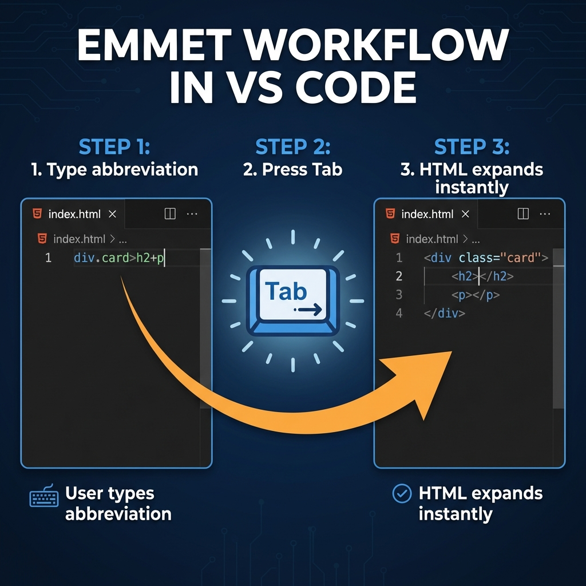
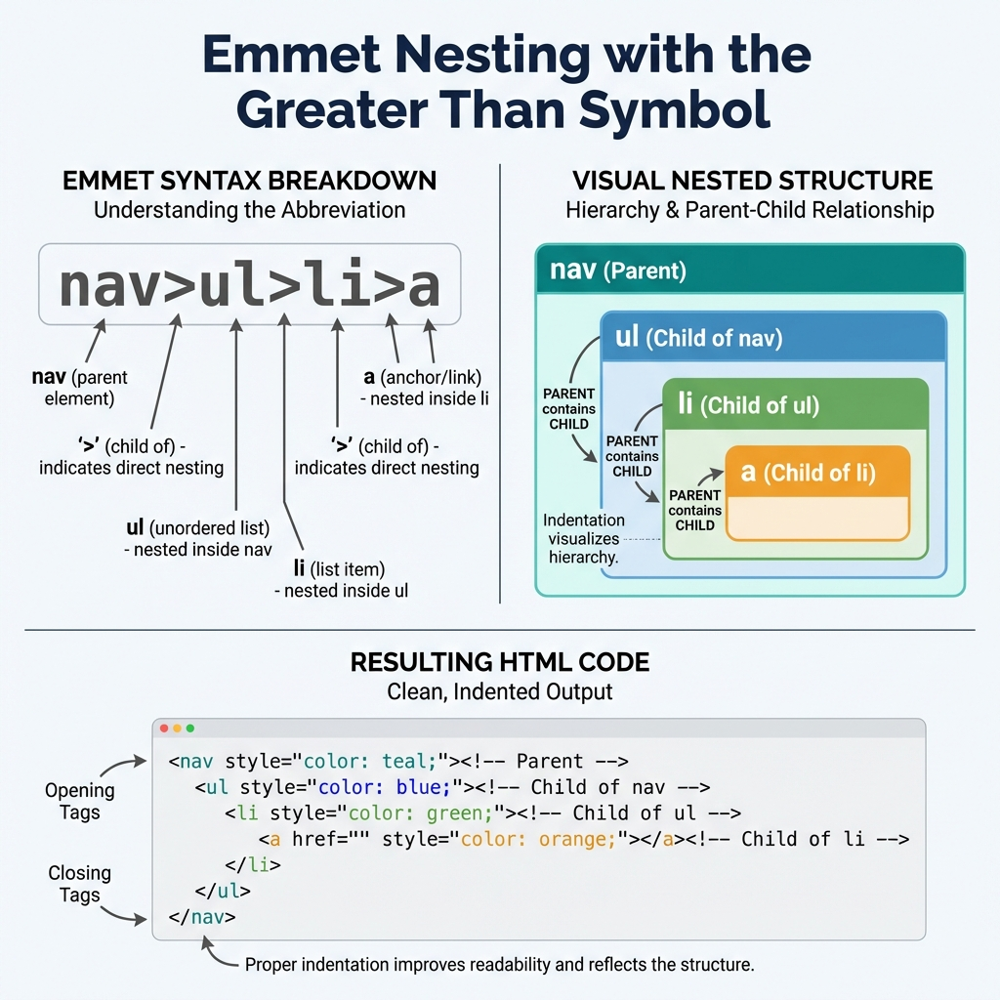
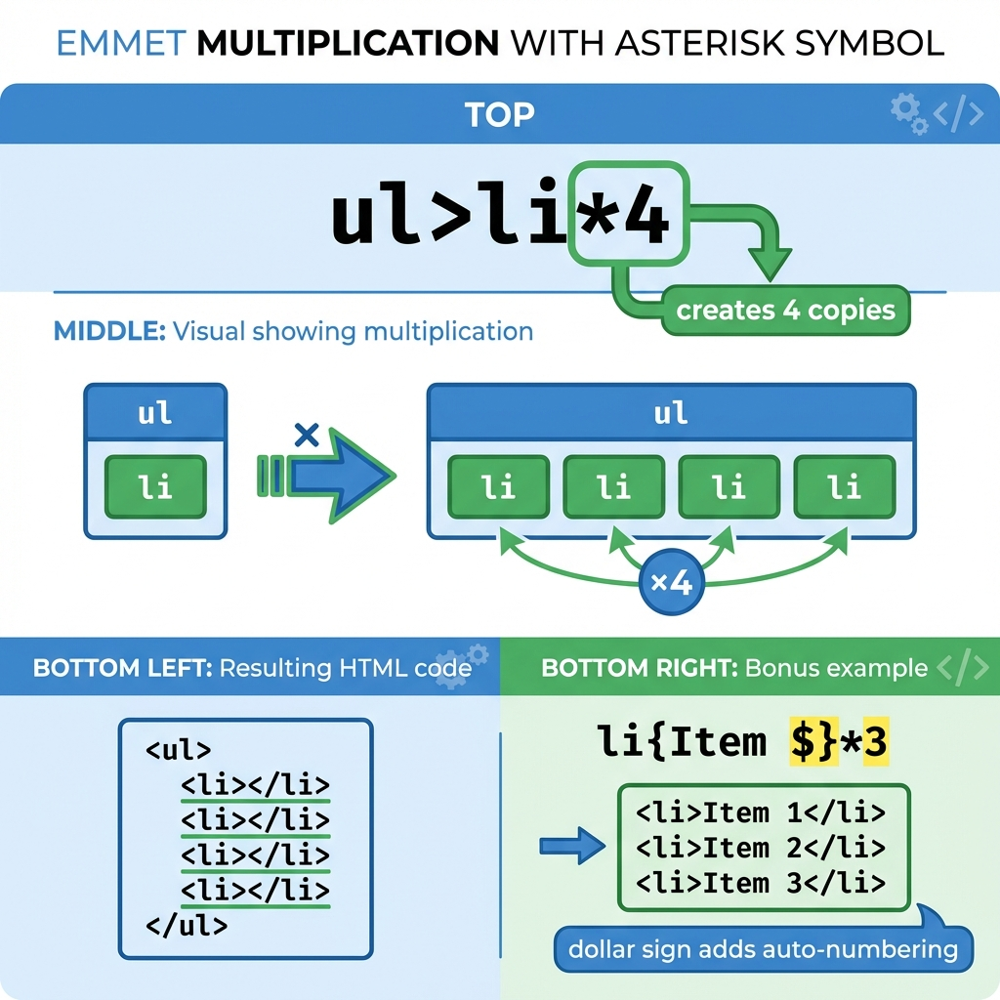

*Imagine typing just a few characters and watching them transform into complete HTML structures. No more typing every single angle bracket, no more forgetting closing tags, no more repetitive copy-pasting. That's the magic of Emmet.*

---

## The Problem: Writing HTML the Slow Way

Let's be honest — writing HTML by hand can be tedious. Look at this simple navigation menu:

**The Manual Way (What You Might Do Now):**
```html
<nav>
  <ul>
    <li><a href="/">Home</a></li>
    <li><a href="/about">About</a></li>
    <li><a href="/services">Services</a></li>
    <li><a href="/contact">Contact</a></li>
  </ul>
</nav>
```

That's **177 keystrokes** (including tabs for indentation).

Count them:
- `<nav>` → 5 characters
- Line break + indent
- `<ul>` → 4 characters
- Four `<li><a href="...">...</a></li>` blocks
- Closing tags for everything

Now imagine doing this for an entire webpage. It adds up fast.

---

## The Solution: Meet Emmet

**Emmet is a shortcut language for HTML (and CSS).** Think of it like texting abbreviations:

| Instead of typing... | You type... |
|---------------------|-------------|
| "Be right back" | "brb" |
| "Laugh out loud" | "lol" |
| "Navigation with list items" | `nav>ul>li*4` |

**What is Emmet in simple terms?**

Emmet is a tool built into most code editors (VS Code, Sublime Text, WebStorm) that:
1. You type short abbreviations
2. Press `Tab` (or `Enter`)
3. Emmet expands them into full HTML

**It's like autocorrect, but for code.**

---

## How Emmet Works in Your Editor

### Step-by-Step Workflow



1. **Type the abbreviation** (like `div.container`)
2. **Press Tab** (or Enter in some editors)
3. **Watch it expand** into `<div class="container"></div>`
4. **Your cursor is positioned** inside the element, ready to type

### Which Editors Support Emmet?

- **VS Code** ✓ Built-in (recommended for beginners)
- **Sublime Text** ✓ Built-in
- **Atom** ✓ Built-in
- **WebStorm** ✓ Built-in
- **Brackets** ✓ Built-in

**Good news:** If you're using a modern code editor, you probably already have Emmet installed.

---

## Basic Emmet: Creating Elements

Let's start with the simplest possible example.

### Creating a Single Element

**Emmet:**
```
div
```

**Press Tab → Expands to:**
```html
<div></div>
```

**Your cursor** is placed between the tags, ready to type content.

### Any HTML Element Works

| Emmet | Expands To |
|-------|------------|
| `p` | `<p></p>` |
| `h1` | `<h1></h1>` |
| `section` | `<section></section>` |
| `article` | `<article></article>` |
| `button` | `<button></button>` |

**Try it yourself:** Open your editor and type `p`, then press Tab. See what happens!

---

## Adding Classes and IDs

This is where Emmet starts saving you real time.

### Adding a Class

In CSS, classes use a dot (`.classname`). Emmet uses the same idea:

**Emmet:**
```
div.container
```

**Press Tab → Expands to:**
```html
<div class="container"></div>
```

**What you saved:** Instead of typing `class="container"`, you just added `.container`

### Adding Multiple Classes

**Emmet:**
```
div.container.fluid.responsive
```

**Press Tab → Expands to:**
```html
<div class="container fluid responsive"></div>
```

### Adding an ID

In CSS, IDs use a hash (`#idname`). Same in Emmet:

**Emmet:**
```
nav#main-nav
```

**Press Tab → Expands to:**
```html
<nav id="main-nav"></nav>
```

### Combining Classes and IDs

**Emmet:**
```
section#hero.hero-section.centered
```

**Press Tab → Expands to:**
```html
<section id="hero" class="hero-section centered"></section>
```

**Notice:** Emmet automatically puts the ID first, then classes. Perfect every time.

---

## Creating Nested Elements (The > Symbol)

The `>` symbol means "inside" or "child of."

### Simple Nesting

**Emmet:**
```
nav>ul
```

**Press Tab → Expands to:**
```html
<nav>
  <ul></ul>
</nav>
```

### Deeper Nesting



**Emmet:**
```
nav>ul>li
```

**Press Tab → Expands to:**
```html
<nav>
  <ul>
    <li></li>
  </ul>
</nav>
```

### Real-World Example

**Emmet:**
```
article.card>img+h2+p
```

**Press Tab → Expands to:**
```html
<article class="card">
  
  <h2></h2>
  <p></p>
</article>
```

**Visual breakdown:**
```
article.card      → <article class="card">
       >          →     (open and nest)
        img       →     
         +        →     (sibling, same level)
          h2      →     <h2>
           +      →     (sibling)
            p     →     <p>
```

**Try it yourself:** Type `header>nav` and press Tab. See the nesting!

---

## Creating Siblings (The + Symbol)

The `+` symbol means "at the same level" or "sibling."

### Basic Siblings

**Emmet:**
```
header+main+footer
```

**Press Tab → Expands to:**
```html
<header></header>
<main></main>
<footer></footer>
```

### Combining Nesting and Siblings

**Emmet:**
```
header>h1+nav>ul>li+li+li
```

**Press Tab → Expands to:**
```html
<header>
  <h1></h1>
  <nav>
    <ul>
      <li></li>
      <li></li>
      <li></li>
    </ul>
  </nav>
</header>
```

**How to read this:**
1. `header` → Create a `<header>`
2. `>h1` → Inside header, add an `<h1>`
3. `+nav` → Add a `<nav>` sibling to h1 (also inside header)
4. `>ul` → Inside nav, add a `<ul>`
5. `>li+li+li` → Inside ul, add three `<li>` siblings

---

## Repeating Elements (The * Symbol)

This is where Emmet saves you the MOST time.

### The Multiplication Magic



**The Problem:** You need 5 list items for a navigation menu.

**The Slow Way:**
```html
<li></li>
<li></li>
<li></li>
<li></li>
<li></li>
```

**The Emmet Way:**
```
li*5
```

**Press Tab → Expands to:**
```html
<li></li>
<li></li>
<li></li>
<li></li>
<li></li>
```

### Real Navigation Menu Example

**Emmet:**
```
nav>ul>li*5>a{Link $}
```

**Press Tab → Expands to:**
```html
<nav>
  <ul>
    <li><a href="">Link 1</a></li>
    <li><a href="">Link 2</a></li>
    <li><a href="">Link 3</a></li>
    <li><a href="">Link 4</a></li>
    <li><a href="">Link 5</a></li>
  </ul>
</nav>
```

**What just happened?**
- `nav>ul` → Navigation with unordered list inside
- `>li*5` → Five list items inside the ul
- `>a{Link $}` → Each li contains an anchor tag with text "Link 1", "Link 2", etc.

The `$` symbol is replaced with numbers 1, 2, 3, 4, 5.

### Numbered Classes

**Emmet:**
```
ul>li.item$*3
```

**Press Tab → Expands to:**
```html
<ul>
  <li class="item1"></li>
  <li class="item2"></li>
  <li class="item3"></li>
</ul>
```

### Real-World Example: Product Grid

**Emmet:**
```
section.products>article.product*6>img+h3{Product $}+p{Description $}+button{Buy}
```

**Press Tab → Expands to:**
```html
<section class="products">
  <article class="product">
    
    <h3>Product 1</h3>
    <p>Description 1</p>
    <button>Buy</button>
  </article>
  <!-- 5 more products... -->
</section>
```

**Count the keystrokes:**
- Manual: ~400+ characters
- Emmet: ~85 characters
- **You saved: 315+ keystrokes!**

---

## Adding Attributes

Sometimes you need to add attributes like `src`, `alt`, `href`, or `type`.

### The Attribute Syntax

Use square brackets `[]` for attributes:

**Emmet:**
```
img[src="photo.jpg" alt="My photo"]
```

**Press Tab → Expands to:**
```html

```

### Common Examples

| Emmet | Expands To |
|-------|------------|
| `a[href="/about"]` | `<a href="/about"></a>` |
| `input[type="text"]` | `<input type="text">` |
| `input[type="email" placeholder="Your email"]` | `<input type="email" placeholder="Your email">` |
| `link[rel="stylesheet" href="style.css"]` | `<link rel="stylesheet" href="style.css">` |

### Combining Everything

**Emmet:**
```
form.contact>input[type="text" placeholder="Name"]+input[type="email" placeholder="Email"]+textarea[placeholder="Message"]+button[type="submit"]{Send}
```

**Press Tab → Expands to:**
```html
<form class="contact">
  <input type="text" placeholder="Name">
  <input type="email" placeholder="Email">
  <textarea placeholder="Message"></textarea>
  <button type="submit">Send</button>
</form>
```

---

## The HTML5 Boilerplate Shortcut

This is the single most useful Emmet command for beginners.

### The ! Shortcut

**Emmet:**
```
!
```

**Press Tab → Expands to:**
```html
<!DOCTYPE html>
<html lang="en">
<head>
  <meta charset="UTF-8">
  <meta name="viewport" content="width=device-width, initial-scale=1.0">
  <title>Document</title>
</head>
<body>
  
</body>
</html>
```

**One character** creates your entire HTML structure!

### Starting a New Page

From now on, every HTML file you create:
1. Type `!`
2. Press Tab
3. Start coding in the body

No more copy-pasting boilerplate or typing it manually.

---

## Practice Examples

Try typing these in your editor and watch them expand:

### Example 1: Simple Card
**Emmet:** `article.card>h2{Title}+p{Content here}`

### Example 2: Image Gallery
**Emmet:** `div.gallery>img*6[src="image-$.jpg"]`

### Example 3: Contact Section
**Emmet:** `section#contact>h2{Get in Touch}+p{Email us}+a[href="mailto:hi@example.com"]{hi@example.com}`

### Example 4: Form with Labels
**Emmet:** `form>label[for="name"]{Name}+input#name[type="text"]^label[for="email"]{Email}+input#email[type="email"]`

*(The `^` symbol climbs up one level — useful for complex nesting)*

---

## Quick Reference Cheat Sheet

| Symbol | Meaning | Example | Result |
|--------|---------|---------|--------|
| `.` | Class | `div.container` | `<div class="container">` |
| `#` | ID | `nav#main` | `<nav id="main">` |
| `>` | Child | `ul>li` | `<ul><li></li></ul>` |
| `+` | Sibling | `h1+p` | `<h1></h1><p></p>` |
| `*` | Multiply | `li*3` | Three `<li>` elements |
| `$` | Number | `item$*3` | `item1`, `item2`, `item3` |
| `[]` | Attribute | `img[src="a.jpg"]` | `` |
| `{}` | Content | `p{Hello}` | `<p>Hello</p>` |
| `!` | Boilerplate | `!` | Full HTML5 document |

---

## Important: Emmet is Optional (But Powerful)

**You don't NEED Emmet to write HTML.** It's completely optional.

But here's why it's worth learning:

| Without Emmet | With Emmet |
|---------------|------------|
| Typing every character | Type shortcuts |
| Easy to forget closing tags | Emmet generates them |
| Repetitive copy-paste | One abbreviation expands to many elements |
| Slower development | 2-10x faster |
| More typos | Consistent structure |

Think of Emmet like keyboard shortcuts in a word processor. You can write an essay without them, but why would you want to?

---

## Daily-Use Patterns (Memorize These)

Focus on learning these patterns first — they'll cover 80% of your needs:

1. **`!`** — HTML boilerplate
2. **`tag.class`** — Element with class
3. **`parent>child`** — Nesting
4. **`sibling1+sibling2`** — Multiple elements
5. **`item*n`** — Repeating elements
6. **`tag{content}`** — Elements with text

Once these are muscle memory, you can explore advanced features.

---

## Key Takeaways

1. **Emmet is a shortcut language** for HTML
2. **Type abbreviation + Tab = Full HTML**
3. **`.` adds classes**, `#` adds IDs
4. **`>` creates nesting**, `+` creates siblings
5. **`*` repeats elements**, `$` adds numbers
6. **`!` creates the full HTML5 boilerplate**
7. **Start simple**, build up complexity gradually

---
