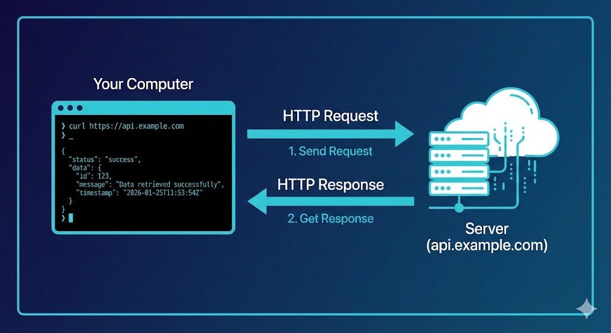
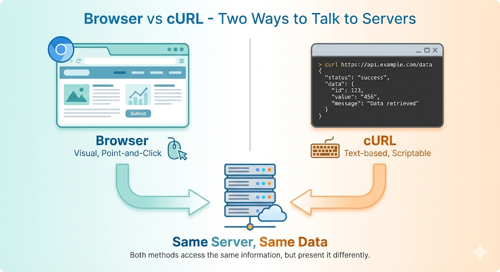
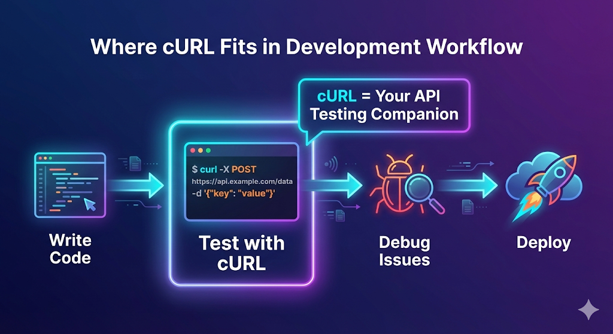
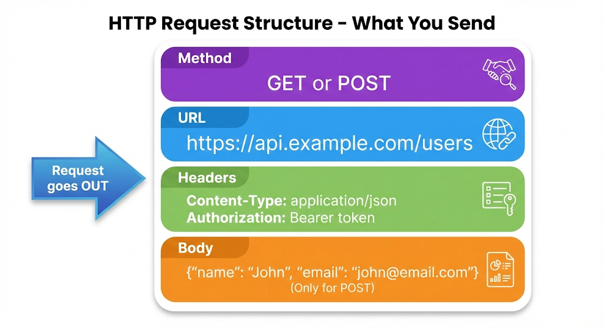

*When I first started learning web development, I kept seeing tutorials mention "just use cURL" – but nobody explained what it actually was or why I should care. This guide is what I wish I'd had back then.*

---

## What is a Server, and Why Do We Need to Talk to It?

Before we dive into cURL, let's understand the basics.

### The Restaurant Analogy

Imagine you walk into a restaurant:
- **You** are the customer (client)
- **The kitchen** is the server
- **Your order** is the request
- **The food** is the response



In the digital world, it's the same concept:
- **Your computer** is the customer
- **The web server** is the kitchen
- **Your cURL command** is the order slip
- **The data returned** is your meal

### What is a Server?

A **server** is just a computer that's always on, waiting to respond to requests. When you visit a website:

1. Your browser asks the server: *"Hey, can you send me the homepage?"*
2. The server responds: *"Sure, here it is!"*



### Why Use the Terminal?

You might wonder: *"I can just use my browser, why do I need cURL?"*

Great question! Browsers are great for viewing websites, but they're not great for:
- **Testing APIs** (checking if your backend works)
- **Automating tasks** (running requests in scripts)
- **Debugging** (seeing exactly what's being sent and received)
- **Learning** (understanding how HTTP actually works)

That's where cURL comes in.

---

## What is cURL?

**cURL** stands for **Client URL**. It's a command-line tool that lets you send messages (requests) to servers and see their responses – all from your terminal.

Think of it as a **text-based browser** that shows you the raw conversation between your computer and a server.

### Where cURL Fits in Development



As a developer, you'll use cURL to:
- Test if your API is working
- Debug why something isn't loading
- Download files programmatically
- Learn how HTTP requests work

---

## Your First cURL Request

Let's start with the simplest possible command: fetching a webpage.

### The Basic Command

Open your terminal and type:

```bash
curl https://www.example.com
```

That's it! Press Enter, and you'll see a bunch of HTML code flood your screen. 

**What just happened?**
1. cURL sent a message to `example.com`
2. The server received it and sent back the HTML
3. cURL printed that HTML to your terminal



### Understanding What You See

The stuff that flooded your screen is **HTML** – the code that makes up web pages. It looks messy in the terminal, but that's exactly what your browser receives and turns into a nice-looking website.

---

## Understanding the Response

When you make a request, the server sends back a response. Let's understand what that means.

### Breaking Down a Response

A response has three main parts:

| Part | What It Is | Example |
|------|------------|---------|
| **Status** | Did it work? | `200 OK`, `404 Not Found` |
| **Headers** | Metadata about the response | Content type, date, etc. |
| **Body** | The actual data | HTML, JSON, etc. |

### Seeing the Status Code

Let's see the status code without the full HTML:

```bash
curl -I https://www.example.com
```

The `-I` flag means "show me just the headers." You'll see something like:

```
HTTP/1.1 200 OK
Content-Type: text/html; charset=UTF-8
Date: Mon, 15 Jan 2024 10:00:00 GMT
```

That `200 OK` means: *"Success! The server found what you asked for."*

### Common Status Codes

| Code | Meaning | When You See It |
|------|---------|-----------------|
| **200** | OK | Everything worked |
| **404** | Not Found | The page doesn't exist |
| **500** | Server Error | Something broke on the server |
| **403** | Forbidden | You don't have permission |

---

## Making Different Types of Requests

There are different "methods" for talking to servers. Think of them as different types of questions:

### GET Request: "Can I See That?"

**GET** is the default. It means: *"Please give me this resource."*

```bash
curl https://api.github.com/users/github
```

This asks GitHub's API: *"Tell me about the user named 'github'."*

### POST Request: "Here's Some Data"

**POST** means: *"I'm sending you some data to process."*

Imagine filling out a contact form. When you click "Submit," that's a POST request.

```bash
curl -X POST https://httpbin.org/post \
  -H "Content-Type: application/json" \
  -d '{"name":"Anik","message":"Hello!"}'
```

Let's break this down:
- `-X POST` = Use the POST method
- `-H "Content-Type: application/json"` = Tell the server we're sending JSON
- `-d '{...}'` = The actual data we're sending

**Why two different methods?**
- **GET** is for reading/retrieving
- **POST** is for creating/sending data

---

## Using cURL to Talk to APIs

APIs (Application Programming Interfaces) are how different software talks to each other. cURL is perfect for testing them.

### Example: Getting Weather Data

```bash
curl wttr.in/London?format=3
```

This asks a weather API: *"What's the weather in London?"* 

The response might be:
```
London: ⛅️ +15°C
```

### Example: Checking if a Website is Up

```bash
curl -sSf https://www.google.com > /dev/null && echo "Google is up!" || echo "Google is down!"
```

This silently checks if Google responds, then tells you if it's working.

### Example: Getting Your Public IP

```bash
curl ifconfig.me
```

This asks a service: *"What IP address am I connecting from?"*

---

## Common Mistakes Beginners Make

Let me save you some frustration:

### ❌ Forgetting the Protocol
```bash
# Wrong:
curl www.example.com

# Right:
curl https://www.example.com
```

Always include `https://` or `http://` at the start.

### ❌ Not Following Redirects
```bash
# This might fail:
curl http://bit.ly/3xyz

# This follows the redirect:
curl -L http://bit.ly/3xyz
```

The `-L` flag tells cURL to follow redirects (like URL shorteners).

### ❌ Getting Overwhelmed by Output
```bash
# This shows everything (messy):
curl https://api.example.com/big-response

# This limits to first 10 lines:
curl https://api.example.com/big-response | head -10
```

Use `| head` or `| less` to control what you see.

### ❌ Trying to Learn All Flags at Once

cURL has hundreds of options. **Don't try to learn them all.** Start with:
- Basic requests (no flags)
- `-I` for headers
- `-L` for redirects
- `-X POST` for sending data

Add more as you need them.

---

## Practice Makes Perfect

### Try These Commands

1. **Get a joke:**
```bash
curl https://official-joke-api.appspot.com/random_joke
```

2. **Get weather:**
```bash
curl wttr.in/Mumbai?0
```

3. **Get your IP:**
```bash
curl ipinfo.io/ip
```

4. **Check a website's status:**
```bash
curl -I https://www.github.com
```

### What to Remember

| Concept | Simple Explanation |
|---------|-------------------|
| cURL | A tool to talk to servers from terminal |
| GET | "Give me this data" |
| POST | "Here's some data for you" |
| Status 200 | Success! |
| Status 404 | Not found |
| -I flag | Show headers only |
| -L flag | Follow redirects |

---

## Wrapping Up

cURL might seem intimidating at first, but it's really just a way to have a conversation with servers. You ask for something, they respond. That's it.

**Start simple:**
1. Make basic GET requests
2. Look at the responses
3. Try POST with simple data
4. Gradually explore more flags

Remember, every expert was once a beginner who didn't give up. Keep practicing, and soon cURL will feel as natural as using your browser.

---
