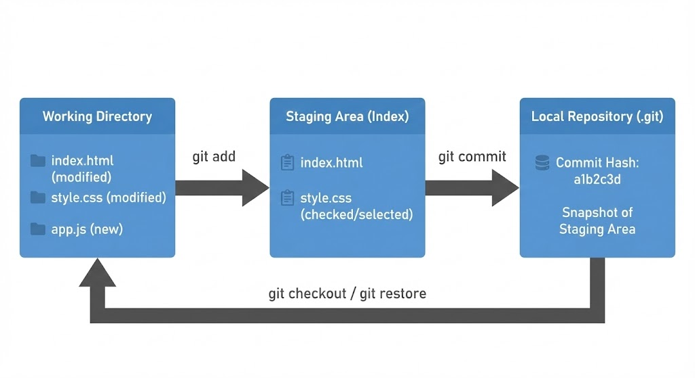
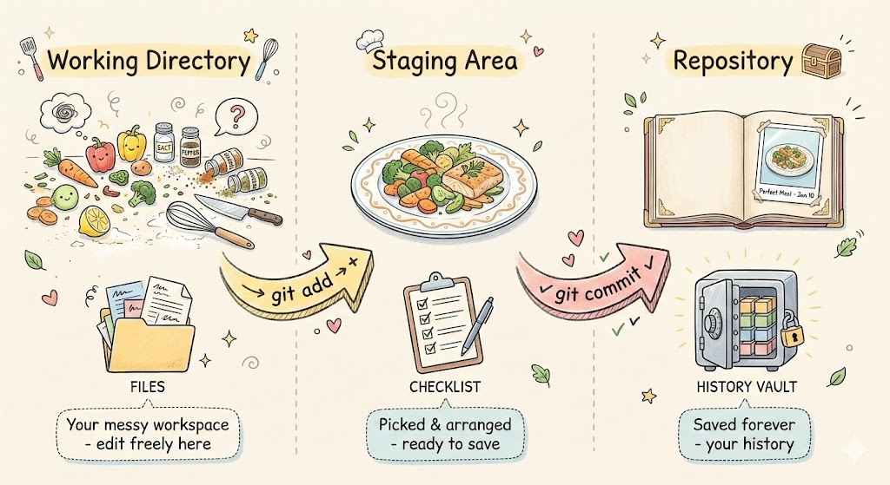
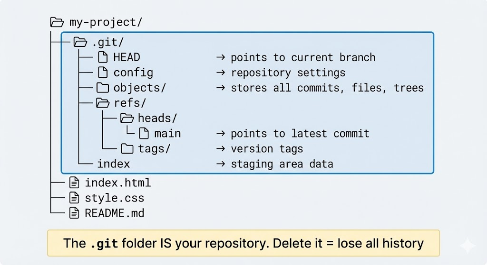
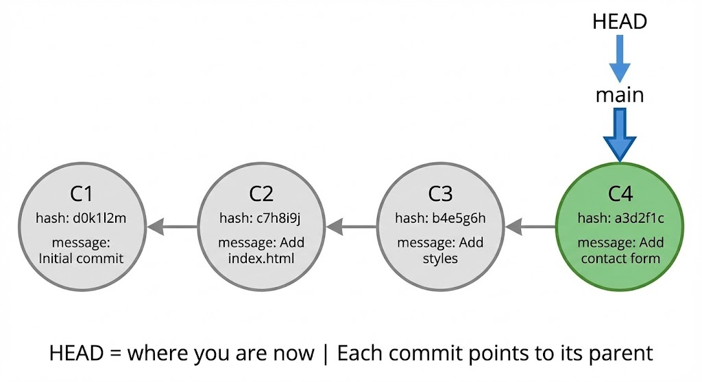
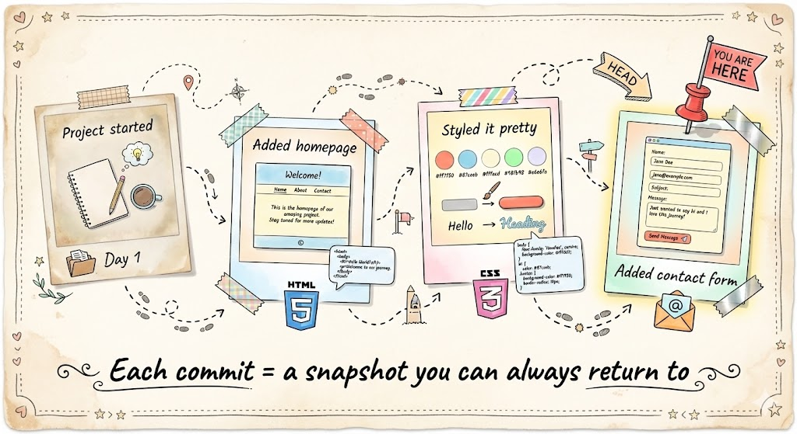

We've all been there.

You're working on a project, things are going well, and then you decide to "just try something real quick." Twenty minutes later, your code is broken, you can't remember what you changed, and your folder looks like this:

```
my-project/
my-project-backup/
my-project-FINAL/
my-project-FINAL-v2/
my-project-DONT-TOUCH/
my-project-working-maybe/
```

Sound familiar? This is exactly the problem Git solves.

---

## What is Git?

**Git is a distributed version control system** — but let's skip the jargon.

Think of Git as a **time machine for your code**. Every time you save a checkpoint (called a "commit"), Git remembers exactly what your entire project looked like at that moment. Broke something? Just travel back to when it worked.

Here's what makes Git different from just copying folders:

- It tracks **what changed**, **when**, and **who** made the change
- It stores changes efficiently (not full copies of everything)
- It works **completely offline** — everything lives on your machine
- Multiple people can work on the same project without chaos

The "distributed" part means every developer has the complete project history on their own computer. No central server required to work.

---

## Why Git is Used

Let me be real with you — you could survive without Git. But here's why almost every developer uses it:

**You will mess up your code.** Not "if" — "when." Git lets you undo mistakes like they never happened. Deleted an important file? Broke a feature that was working? Just go back.

**Working with others becomes possible.** Ever tried editing the same file as someone else? Without Git, it's chaos. Git handles merging everyone's work together.

**It's the industry standard.** Whether you're applying for an internship or a senior role, Git knowledge is expected. GitHub, GitLab, Bitbucket — they all run on Git.

**It creates a clear project history.** Six months from now, you'll forget why you wrote that weird code. Git commit messages tell the story.

---

## Git Basics and Core Terminologies

Before typing commands, let's understand what's actually happening inside Git.

### The Three Areas: Where Your Files Live

This is the most important concept. Everything else builds on this.



**Working Directory** — This is your project folder. The actual files you see and edit. When you modify `index.html`, the change happens here first.

**Staging Area (Index)** — A preparation zone. Before saving a snapshot, you choose which changes to include. Maybe you changed 5 files but only 2 are ready — you stage just those 2.

**Repository (.git folder)** — The database where Git stores all your snapshots (commits). This is your project's complete history.

The workflow:
1. Edit files in working directory
2. Stage changes you want to save → `git add`
3. Commit staged changes to repository → `git commit`

Here's a simple way to visualize it:



- **Working Directory** = Your messy kitchen counter (ingredients everywhere, you're experimenting)
- **Staging Area** = The plate where you arrange food before serving (picking what's ready)
- **Repository** = Taking a photo for your recipe book (saved forever)

### What's Inside a Git Repository?

When you run `git init`, Git creates a hidden `.git` folder. Here's what's inside:



The key parts:
- **HEAD** — Points to your current branch (where you are right now)
- **objects/** — Stores all your commits, file contents, and directory structures
- **refs/heads/** — Contains your branches (like `main`)
- **index** — The staging area data

> ⚠️ **Important:** The `.git` folder IS your repository. Delete it and you lose all history. Your files stay, but Git forgets everything.

### Core Terms You Need to Know

**Repository (Repo):** A project folder being tracked by Git. Has a `.git` folder inside.

**Commit:** A snapshot of your project at a specific moment. Each commit has:
- A unique hash ID (like `a3d2f1c`)
- A message describing what changed
- A pointer to its parent commit
- Author and timestamp

**Branch:** An independent line of development. Default is `main`. Create branches to experiment without affecting your main code.

**HEAD:** A pointer to where you currently are — usually the latest commit on your current branch.



See how each commit points back to its parent? That's how Git tracks history. HEAD points to `main`, which points to the latest commit (C4). You can always travel back to C1, C2, or C3.

---

## Common Git Commands

Here are the commands you'll use daily.

### One-Time Setup

```bash
git config --global user.name "Your Name"
git config --global user.email "you@example.com"
```

This tells Git who you are. Your name appears on every commit you make.

### Starting a Project

```bash
# Start tracking a new project
git init

# Or clone an existing project
git clone <repository-url>
```

### The Core Workflow

```bash
# Check what's changed
git status

# Stage specific file
git add filename.txt

# Stage all changes
git add .

# Commit with a message
git commit -m "Add login feature"

# View commit history
git log --oneline
```

### Seeing Changes

```bash
# What changed but not staged yet?
git diff

# What's staged and ready to commit?
git diff --staged
```

### Undoing Things

```bash
# Unstage a file (keep the changes)
git restore --staged filename.txt

# Discard changes in a file (careful - can't undo!)
git restore filename.txt
```

---

## Putting It Together: A Real Workflow

Let's build a simple website and track it with Git. This is how you'll actually use Git day-to-day.

### Step 1: Create and Initialize

```bash
mkdir my-website
cd my-website
git init
```

Output:
```
Initialized empty Git repository in /home/you/my-website/.git/
```

Check status:
```bash
git status
```
```
On branch main
No commits yet
nothing to commit
```

### Step 2: Create First File

```bash
echo '<!DOCTYPE html>
<html>
<head>
    <title>My Website</title>
</head>
<body>
    <h1>Welcome!</h1>
    <p>This is my first Git-tracked project.</p>
</body>
</html>' > index.html
```

```bash
git status
```
```
Untracked files:
    index.html
```

Git sees the file but isn't tracking it yet.

### Step 3: First Commit

```bash
git add index.html
git commit -m "Add homepage structure"
```
```
[main (root-commit) d0k1l2m] Add homepage structure
 1 file changed, 10 insertions(+)
```

First snapshot saved! 🎉

### Step 4: Add More Files

```bash
echo 'body {
    font-family: Arial, sans-serif;
    max-width: 800px;
    margin: 0 auto;
    padding: 20px;
}' > style.css

git add style.css
git commit -m "Add basic stylesheet"
```

### Step 5: View Your History

```bash
git log --oneline
```
```
c7h8i9j Add basic stylesheet
d0k1l2m Add homepage structure
```

Two commits. Two snapshots you can return to anytime.

Here's what your journey looks like:



Each polaroid is a commit — a moment in time you can always go back to.

---

## Quick Reference

| Command | What It Does |
|---------|--------------|
| `git init` | Start tracking a folder |
| `git status` | See what's changed |
| `git add <file>` | Stage a file |
| `git add .` | Stage everything |
| `git commit -m "msg"` | Save a snapshot |
| `git log --oneline` | View history |
| `git diff` | See unstaged changes |
| `git restore <file>` | Discard changes |

---

## Wrapping Up

That's Git basics — and honestly, that's 90% of what you'll use daily.

The core workflow is simple:
1. **Edit** your files
2. **Stage** what's ready (`git add`)
3. **Commit** with a clear message (`git commit`)
4. **Repeat**

Don't worry about memorizing everything. You'll Google things, make mistakes, accidentally commit wrong files. That's normal. Git is forgiving — there's almost always a way to fix it.

Start using Git on your next project, even a small one. The best way to learn is by doing.

---
