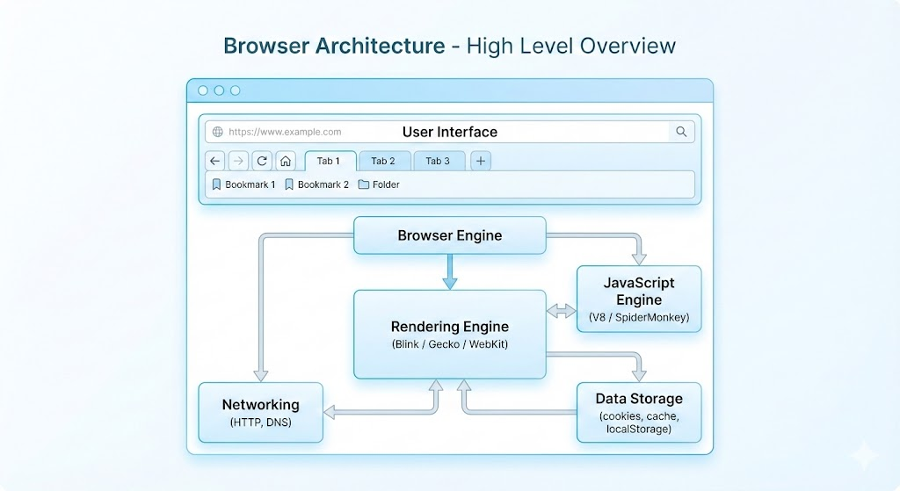
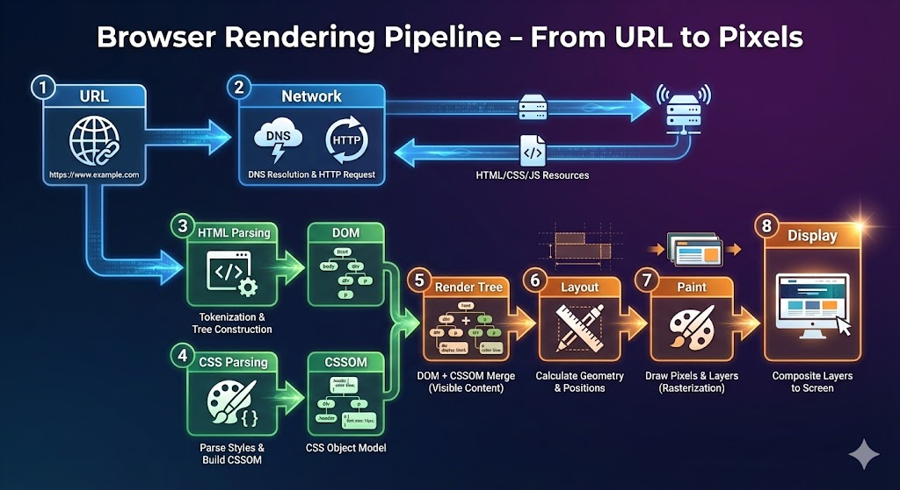
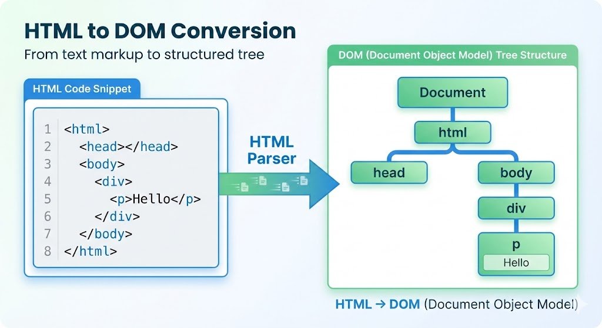
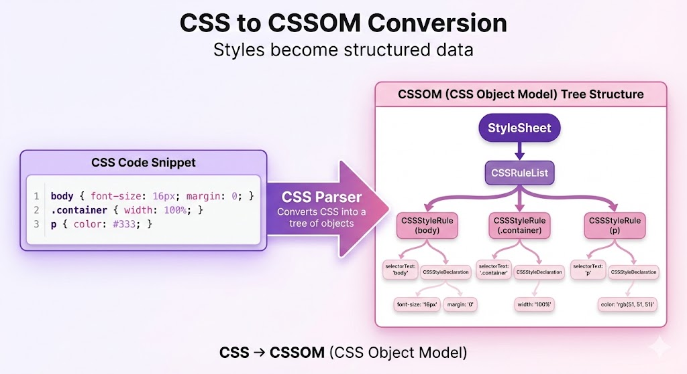
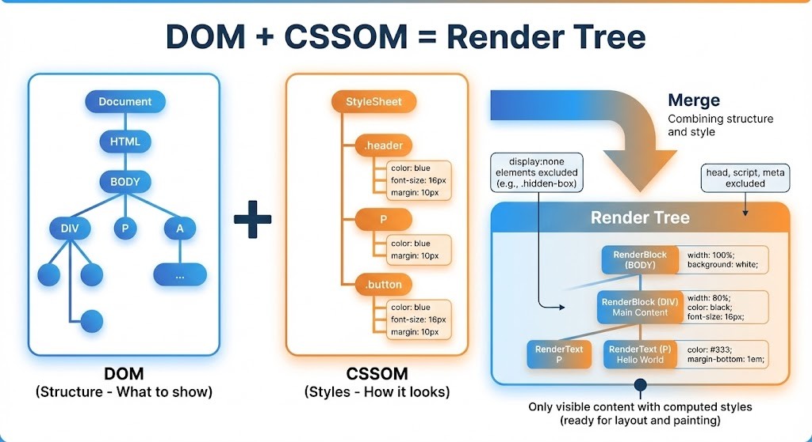

*You type `google.com`, press Enter, and within seconds, a fully-formed webpage appears on your screen. But what actually happened in those seconds? Let's open the hood and look inside.*

---

## What Is a Browser, Really?

Beyond "it opens websites," a browser is essentially a **sophisticated document reader and display engine**.

Think of it like this:
- A **PDF reader** knows how to open, parse, and display PDF files
- A **video player** knows how to decode and play video files
- A **web browser** knows how to fetch, parse, and render web pages (HTML, CSS, JavaScript)

Your browser is a collection of specialized components working together to turn code (HTML, CSS, JS) into the visual experience you see on screen.

---

## The Big Question: What Happens After You Type a URL?

Let's follow the complete journey from typing a URL to seeing pixels on your screen.



---

## Part 1: The Browser's Main Components

Before we dive into the journey, let's meet the key players inside your browser:

### 1. User Interface (UI)
This is everything you see and interact with:
- **Address bar**: Where you type URLs
- **Tabs**: Multiple pages in one window
- **Back/Forward buttons**: Navigation history
- **Bookmark bar**: Your saved links
- **Settings menu**: Browser preferences

Think of the UI as the **dashboard of a car** — all the controls you use to drive.

### 2. Browser Engine
The browser engine acts as a **coordinator** or **project manager**. It:
- Takes commands from the UI (like "go back" or "reload")
- Tells the rendering engine what to display
- Manages communication between components

**Simple analogy**: If the browser is a restaurant, the browser engine is the **maître d'** who coordinates between the kitchen, waiters, and customers.

### 3. Rendering Engine
This is where the magic happens! The rendering engine:
- Reads HTML and builds the DOM
- Reads CSS and builds the CSSOM
- Combines them into a render tree
- Calculates layout and paints pixels

**Popular rendering engines:**
- **Blink**: Used by Chrome, Edge, Opera
- **WebKit**: Used by Safari
- **Gecko**: Used by Firefox

**Simple analogy**: The rendering engine is the **chef** who takes raw ingredients (HTML, CSS) and turns them into a finished dish (the webpage).

### 4. Networking Component
This handles all communication with the internet:
- DNS lookups (finding server addresses)
- HTTP requests (asking for files)
- Downloading HTML, CSS, images, JavaScript
- Caching files for faster future visits

**Simple analogy**: The networking component is the **delivery driver** who fetches ingredients from the market.

### 5. JavaScript Engine
This executes JavaScript code:
- Adds interactivity to pages
- Handles user interactions
- Modifies the DOM dynamically

**Examples**: V8 (Chrome), SpiderMonkey (Firefox)

**Simple analogy**: The JavaScript engine is the **special effects crew** that makes the page come alive with animations and interactions.

---

## Part 2: The Journey from URL to Pixels

Now let's follow what happens when you type `example.com` and press Enter.



### Step 1: You Type the URL

```
You type: https://example.com/blog/hello-world
                │       │              │
                │       │              └── Path (specific page)
                │       └── Domain (which website)
                └── Protocol (how to communicate)
```

The browser breaks down what you typed into meaningful parts.

### Step 2: Find the Server (DNS Lookup)

The networking component asks: "What's the IP address for example.com?"

This is like looking up a phone number in a phonebook — you know the name, but you need the number to call.

### Step 3: Establish Connection (TCP Handshake)

The browser and server perform a "handshake" to establish communication:
1. Browser: "Can we talk?" (SYN)
2. Server: "Yes, I'm here!" (SYN-ACK)
3. Browser: "Great, let's begin!" (ACK)

### Step 4: Fetch the HTML (HTTP Request)

The browser sends a request:
```
GET /blog/hello-world HTTP/1.1
Host: example.com
```

Translation: "Please send me the webpage at this address."

### Step 5: Receive the Files (HTTP Response)

The server responds with HTML, and the browser starts downloading CSS, JavaScript, and images referenced in that HTML.

---

## Part 3: Understanding Parsing (The Simple Math Example)

Before we look at how browsers parse HTML, let's understand what "parsing" means with a simple example.

### What Is Parsing?

**Parsing** means taking a string of characters and giving it structure/meaning.

**Example: Parsing a Math Expression**

Consider this expression: `2 + 3 * 4`

If you process left-to-right: `(2 + 3) * 4 = 20` ❌ Wrong!

If you understand operator precedence: `2 + (3 * 4) = 14` ✓ Correct!

The parser creates a **tree structure** to represent this:

```
       +
      / \
     2   *
        / \
       3   4
```

This tree shows that multiplication happens first, then addition.

**Parsing = Breaking down text into a structured representation that a computer can understand and process.**

---

## Part 4: From HTML to DOM

### What Is the DOM?

**DOM (Document Object Model)** is a tree representation of your HTML.

**Analogy: A Family Tree**

Just like a family tree shows relationships (parent, child, sibling), the DOM shows the relationships between HTML elements.

### HTML Parsing in Action

Consider this simple HTML:

```html
<!DOCTYPE html>
<html>
  <head>
    <title>My Page</title>
  </head>
  <body>
    <h1>Hello World</h1>
    <p>This is a paragraph.</p>
  </body>
</html>
```

The browser parses this and creates the DOM tree:



```
Document
└── html
    ├── head
    │   └── title
    │       └── "My Page"
    └── body
        ├── h1
        │   └── "Hello World"
        └── p
            └── "This is a paragraph."
```

**Why a tree?** Because HTML is nested — elements contain other elements, just like branches contain smaller branches.

---

## Part 5: From CSS to CSSOM

### What Is the CSSOM?

**CSSOM (CSS Object Model)** is like the DOM, but for CSS. It's a tree representation of all the styles.

### CSS Parsing Example

```css
body {
  font-size: 16px;
  color: black;
}

h1 {
  font-size: 32px;
  color: blue;
}

p {
  margin: 10px;
}
```

The browser creates the CSSOM:



```
CSSOM
├── body
│   ├── font-size: 16px
│   └── color: black
├── h1
│   ├── font-size: 32px
│   └── color: blue
└── p
    └── margin: 10px
```

---

## Part 6: Bringing It Together — The Render Tree

Now the browser combines DOM + CSSOM to create the **Render Tree**.

### What Is the Render Tree?

The render tree contains only the visible elements with their computed styles:



```
DOM Tree                CSSOM               Render Tree
─────────────────────────────────────────────────────────
html                    body {              [ViewPort]
├── head                    font: 16px           │
│   └── title (hidden)  }                        ▼
└── body                h1 {                [Layout Box: body]
    ├── h1                  size: 32px          ├── [Box: h1 "Hello"]
    │   └── "Hello"         color: blue         │       font: 32px blue
    └── p                 }                   └── [Box: p "This is..."]
        └── "This is..."  p {                     font: 16px, margin: 10px
                              margin: 10px
                          }
```

**Important**: Invisible elements (like `<head>`, `<script>`, or `display: none`) are NOT in the render tree.

---

## Part 7: From Render Tree to Pixels

Now the browser has a tree of what to display. But where does everything go on screen?

### Step 1: Layout (Reflow)

The browser calculates the exact position and size of every element:

```
Render Tree          Layout Process
─────────────────────────────────────────
[body]               Body: width=1200px, height=800px
  ├── [h1]               positioned at (0, 0)
  │     "Hello"        H1: width=1200px, height=40px
  │                          positioned at (8, 8)
  └── [p]              P: width=1200px, height=20px
        "This is..."         positioned at (8, 56)
```

The browser asks:
- How wide is each element?
- How tall is each element?
- Where does it start (x, y coordinates)?
- Does it need to wrap to a new line?

### Step 2: Paint

Now the browser actually draws the pixels:

```
Layout Tree          Paint Process
─────────────────────────────────────────
[body]               1. Paint background color
  ├── [h1]           2. Paint text "Hello" in blue
  └── [p]            3. Paint text "This is..." in black
                     4. Add margins and spacing
```

Painting involves:
- Background colors
- Text
- Borders
- Shadows
- Images

### Step 3: Composite

Finally, the browser combines all painted layers into the final image you see on screen.


```
┌─────────────────────────────────────┐
│  1. HTML Parsing → DOM              │
│  2. CSS Parsing → CSSOM             │
│  3. DOM + CSSOM → Render Tree       │
│  4. Layout (position & size)        │
│  5. Paint (draw pixels)             │
│  6. Composite (final image)         │
│                                     │
│         [PIXELS ON SCREEN]          │
└─────────────────────────────────────┘
```

---

## The Complete Flow: From URL to Pixels

Let's put it all together:

```
USER ACTION          BROWSER INTERNALS
─────────────────────────────────────────────────────────
Type URL             UI → Browser Engine
     │                    ↓
     │               Networking Component
     │                    ↓
Press Enter          DNS Lookup (find server IP)
     │                    ↓
     │               TCP Connection (handshake)
     │                    ↓
     │               HTTP Request (ask for HTML)
     │                    ↓
     │               Receive HTML Response
     │                    ↓
     │               HTML Parsing → DOM Tree
     │                    ↓
     │               Fetch CSS → CSSOM Tree
     │                    ↓
     │               DOM + CSSOM → Render Tree
     │                    ↓
     │               Layout (calculate positions)
     │                    ↓
     │               Paint (draw pixels)
     │                    ↓
     │               Composite (layers)
     │                    ↓
     └──────────────► Display on screen!
```

---

## Don't Worry About Memorizing Everything

If this feels like a lot, that's okay! Here's what's important to remember:

1. **Browser = Document reader** for web files
2. **Components work together**: UI, Engine, Renderer, Network, JS
3. **Parsing = Structured understanding** of code
4. **DOM = Tree of HTML elements**
5. **CSSOM = Tree of styles**
6. **Render Tree = DOM + CSSOM (visible only)**
7. **Layout → Paint → Display** turns code into pixels

The details will become clearer as you build more websites. For now, just understand the flow.

---

## Summary: Key Terms to Know

| Term | Simple Definition |
|------|-------------------|
| **DOM** | Tree representation of your HTML |
| **CSSOM** | Tree representation of your CSS |
| **Render Tree** | DOM + CSSOM combined (what actually gets displayed) |
| **Layout/Reflow** | Calculating where everything goes on screen |
| **Paint** | Drawing the actual pixels |
| **Parsing** | Converting text into structured data |

---
