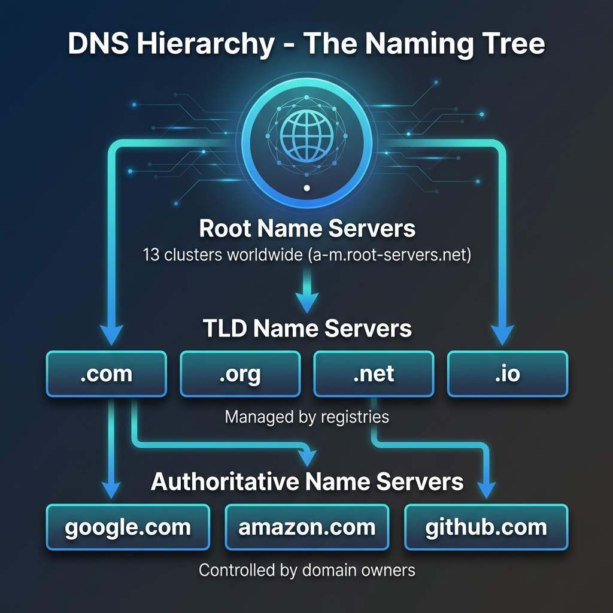
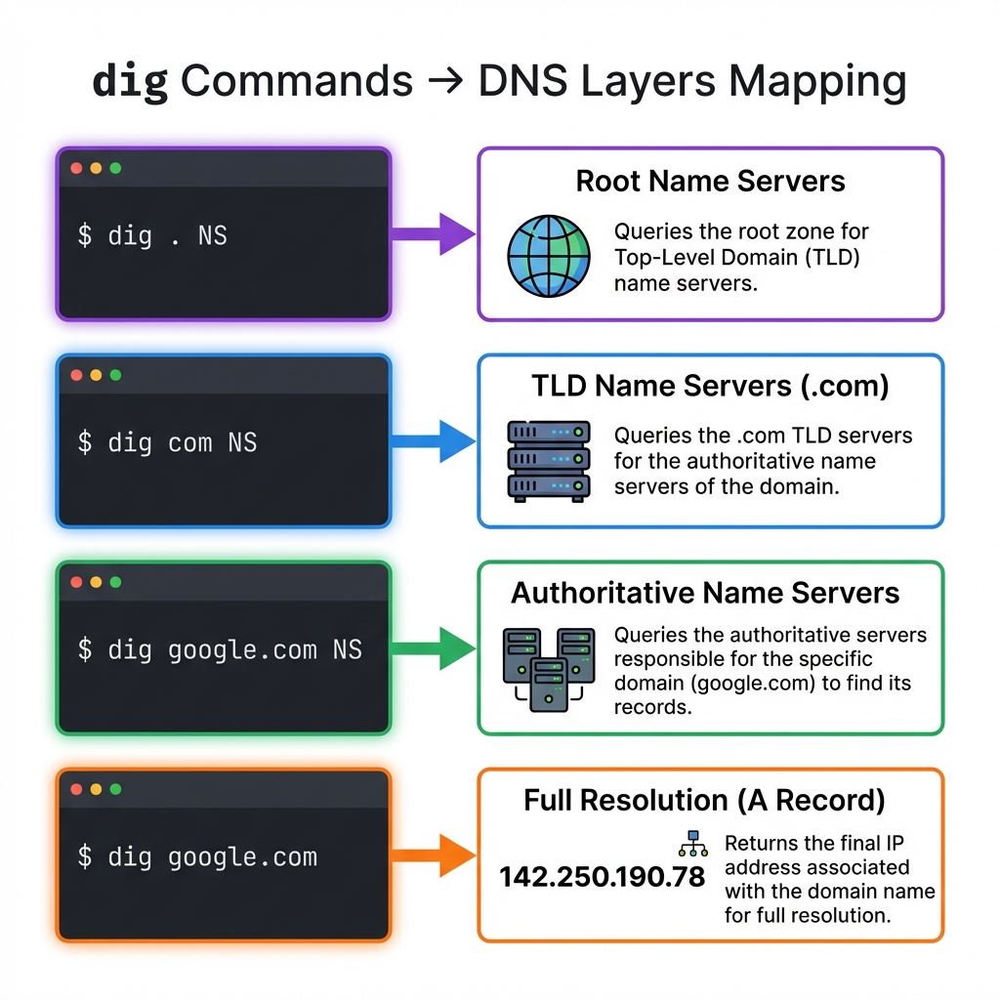
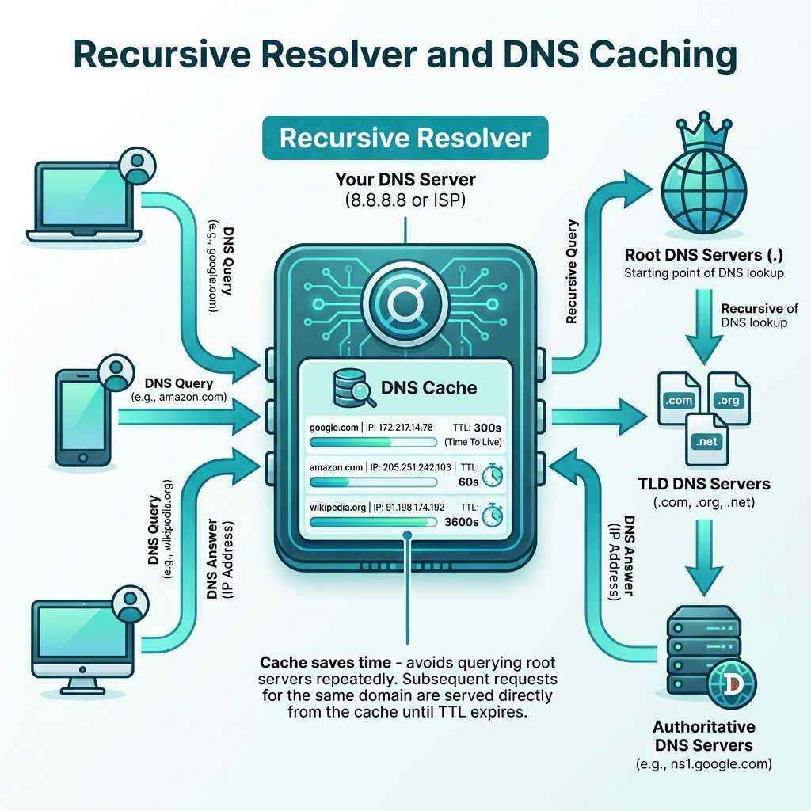

*When you type `google.com` and press Enter, a fascinating journey happens behind the scenes. Let's trace that journey step by step using one of the most powerful DNS tools: `dig`.*

---

## What is DNS and Why Name Resolution Exists

Imagine you want to visit your friend's house. You know their name, but you don't know their address. So you look them up in a phonebook, find their address, and then you can go visit.

**DNS (Domain Name System)** is the internet's phonebook.

Computers don't understand names like `google.com`. They only understand **IP addresses** like `142.250.80.46`. DNS exists to bridge this gap — translating human-friendly domain names into machine-friendly IP addresses.



Without DNS, you'd have to memorize IP addresses for every website you visit. Not very practical, right?

---

## Introducing dig: Your DNS Diagnostic Tool

`dig` (Domain Information Groper) is a command-line tool that lets you inspect DNS resolution in real-time. Think of it as a way to "peek under the hood" and see exactly how DNS queries work.

### When to Use dig

- **Debugging**: Why can't I reach this website?
- **Learning**: How does DNS actually resolve names?
- **Verification**: Did my DNS changes propagate?
- **Troubleshooting**: Is this a DNS issue or something else?

### Your First dig Command

```bash
dig google.com
```

This asks: *"Hey DNS, what's the IP address for google.com?"*

But there's a lot happening behind this simple command. Let's break it down layer by layer.

---

## Understanding DNS Resolution Layers

DNS is hierarchical. It works like a pyramid with three main levels:

```
        ┌─────────────┐
        │  Root (.)   │  ← Knows about TLDs
        └──────┬──────┘
               │
       ┌───────┴───────┐
       │      TLD      │  ← Knows about domains
       │  (.com, .org) │
       └───────┬───────┘
               │
       ┌───────┴───────┐
       │ Authoritative │  ← Knows the actual IP
       │    Server     │
       └───────────────┘
```

**Root → TLD → Authoritative**

Each level delegates to the next. Let's see this in action with `dig`.



---

## Step 1: Root Name Servers (dig . NS)

At the very top of the DNS hierarchy are the **root name servers**. There are 13 logical root servers (labeled A through M), distributed across hundreds of physical locations worldwide.

### The Command

```bash
dig . NS
```

This asks: *"Who are the root name servers?"*

### What You'll See

```
;; ANSWER SECTION:
.           518400  IN  NS  a.root-servers.net.
.           518400  IN  NS  b.root-servers.net.
.           518400  IN  NS  c.root-servers.net.
.           518400  IN  NS  d.root-servers.net.
.           518400  IN  NS  e.root-servers.net.
.           518400  IN  NS  f.root-servers.net.
.           518400  IN  NS  g.root-servers.net.
.           518400  IN  NS  h.root-servers.net.
.           518400  IN  NS  i.root-servers.net.
.           518400  IN  NS  j.root-servers.net.
.           518400  IN  NS  k.root-servers.net.
.           518400  IN  NS  l.root-servers.net.
.           518400  IN  NS  m.root-servers.net.
```

### What This Means

The root servers know one thing: **which servers manage each TLD** (Top Level Domain) like `.com`, `.org`, `.net`, etc.

They don't know the IP for `google.com`, but they know who manages `.com` domains.

**Analogy**: The root servers are like the international directory assistance. They don't know everyone's number, but they know which country's directory to ask.

---

## Step 2: TLD Name Servers (dig com NS)

Now let's ask the root servers: *"Who manages .com domains?"*

### The Command

```bash
dig @a.root-servers.net com NS
```

We're asking root server `a.root-servers.net` to tell us about the `.com` TLD.

### What You'll See

```
;; AUTHORITY SECTION:
com.        172800  IN  NS  a.gtld-servers.net.
com.        172800  IN  NS  b.gtld-servers.net.
com.        172800  IN  NS  c.gtld-servers.net.
com.        172800  IN  NS  d.gtld-servers.net.
com.        172800  IN  NS  e.gtld-servers.net.
...
```

### What This Means

The root server delegates to **gTLD servers** (generic Top Level Domain). These servers manage all `.com` domains.

They don't know `google.com`'s IP, but they know which name servers are authoritative for `google.com`.

**Analogy**: The TLD servers are like a country's directory. They know which local phone book has the number you're looking for.

---

## Step 3: Authoritative Name Servers (dig google.com NS)

Now we dig deeper. Let's ask the TLD servers: *"Who is authoritative for google.com?"*

### The Command

```bash
dig @a.gtld-servers.net google.com NS
```

We're asking the `.com` TLD server about `google.com`.

### What You'll See

```
;; AUTHORITY SECTION:
google.com.     172800  IN  NS  ns1.google.com.
google.com.     172800  IN  NS  ns2.google.com.
google.com.     172800  IN  NS  ns3.google.com.
google.com.     172800  IN  NS  ns4.google.com.

;; ADDITIONAL SECTION:
ns1.google.com. 172800  IN  A   216.239.32.10
ns2.google.com. 172800  IN  A   216.239.34.10
ns3.google.com. 172800  IN  A   216.239.36.10
ns4.google.com. 172800  IN  A   216.239.38.10
```

### What This Means

Now we know who has the final answer! The **authoritative name servers** for `google.com` are `ns1.google.com` through `ns4.google.com`.

These servers actually have the DNS records (A, AAAA, MX, etc.) for `google.com`.

**Analogy**: These are the local phone books that actually contain the phone number you're looking for.

---

## Step 4: Getting the Final Answer (dig google.com)

Finally, let's ask the authoritative server: *"What's the IP address for google.com?"*

### The Command

```bash
dig @ns1.google.com google.com
```

Or simply:

```bash
dig google.com
```

(Your system's configured resolver will handle the recursion for you.)

### What You'll See

```
;; ANSWER SECTION:
google.com.     300  IN  A   142.250.80.46
google.com.     300  IN  A   142.250.80.78
google.com.     300  IN  A   142.250.80.110
...
```

### What This Means

**We have the answer!** `google.com` resolves to multiple IP addresses (for load balancing and redundancy).

The journey is complete: **Root → TLD → Authoritative → Answer**

---

## Understanding NS Records

Throughout this journey, you kept seeing **NS records** (Name Server records). What are they?

### NS Records = Delegation Pointers

NS records tell the world: *"For questions about this domain, ask these servers."*

| Level | NS Record Meaning |
|-------|-------------------|
| Root (`.`) | Points to TLD servers |
| TLD (`.com`) | Points to domain's authoritative servers |
| Domain (`google.com`) | Points to subdomain servers (if any) |

### Why This Matters

NS records create the **distributed** nature of DNS:
- No single server knows everything
- Each level delegates to the next
- Changes can be made at the appropriate level

**Example**: Google can change their IP address by updating their authoritative servers. The root and TLD servers don't need to change.

---

## The Full Resolution Flow: Behind the Scenes

When you type `google.com` in your browser, here's what actually happens:


### 1. Browser Cache Check
- Browser: "Do I already know google.com's IP?"
- If yes → Use it
- If no → Continue

### 2. OS Cache Check
- OS: "Do I know google.com?"
- If yes → Return to browser
- If no → Continue

### 3. Recursive Resolver
Your computer asks its configured DNS resolver (usually your ISP or Google DNS at `8.8.8.8`).

This resolver does the heavy lifting:

```
Your Computer → Recursive Resolver
                      ↓
              "Hey, what's google.com?"
                      ↓
              [Checks its cache]
                      ↓
              If not cached:
                      ↓
              Ask Root (.) → Get TLD servers
                      ↓
              Ask TLD (.com) → Get authoritative servers
                      ↓
              Ask Authoritative → Get IP address
                      ↓
              Cache the result
                      ↓
              Return IP to your computer
```

### 4. Connection Established
Your browser now has the IP (`142.250.80.46`) and can establish a TCP connection.



---

## Watching It All Happen: dig +trace

Want to see the entire journey in one command?

```bash
dig +trace google.com
```

This shows you every step:
1. Querying root servers
2. Getting TLD referrals
3. Getting authoritative referrals
4. Final answer

**Try it yourself!** It's the best way to understand DNS resolution.

---

## Connecting dig to Browser Requests

So how does this relate to your daily browsing?

| What You Do | What DNS Does |
|-------------|---------------|
| Type `google.com` | Browser checks cache |
| Press Enter | OS checks cache |
| Wait briefly | Recursive resolver queries Root → TLD → Authoritative |
| Page starts loading | IP received, TCP connection starts |
| Page fully loaded | DNS result cached for next time |

The `dig` command lets you manually trace what your computer does automatically in milliseconds.

---

## Practical Troubleshooting with dig

### Check if DNS is the Problem

```bash
# Does the domain resolve?
dig example.com

# If no answer, check NS records
dig example.com NS

# If no NS records, domain might not exist
dig example.com | grep "NXDOMAIN"
```

### Check Propagation

```bash
# Check different DNS servers
dig @8.8.8.8 example.com      # Google DNS
dig @1.1.1.1 example.com      # Cloudflare DNS
dig @208.67.222.222 example.com  # OpenDNS
```

If they show different results, DNS is still propagating.

### Find the Authoritative Answer

```bash
# Get authoritative servers
dig example.com NS

# Query them directly
dig @ns1.example.com example.com
```

This bypasses caching and gives you the source of truth.

---

## Key Takeaways

1. **DNS is hierarchical**: Root → TLD → Authoritative
2. **NS records delegate**: They point to who knows the answer
3. **dig reveals the journey**: You can trace every step
4. **Recursive resolvers do the work**: They walk the tree for you
5. **Caching speeds things up**: Each level caches results

---

## Summary Table: dig Commands

| Command | What It Shows | DNS Level |
|---------|--------------|-----------|
| `dig . NS` | Root servers | Root |
| `dig com NS` | .com TLD servers | TLD |
| `dig google.com NS` | Authoritative servers | Domain |
| `dig google.com` | IP address | Answer |
| `dig +trace google.com` | Complete journey | All |

---

DNS resolution seems magical, but it's just a well-organized system of delegation. Each level knows just enough to point you to the next level, until you reach the final answer. Understanding this hierarchy makes you a better troubleshooter and system designer.
