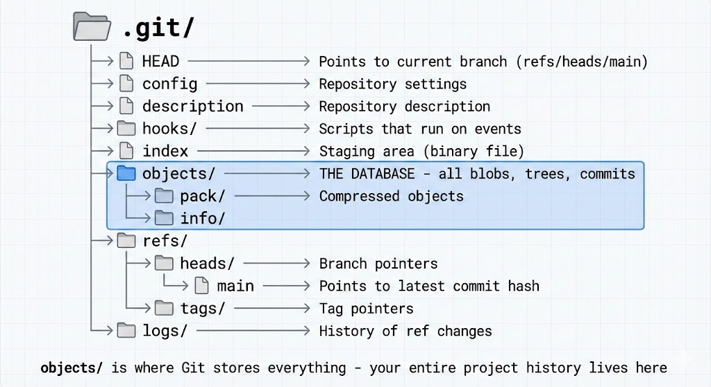
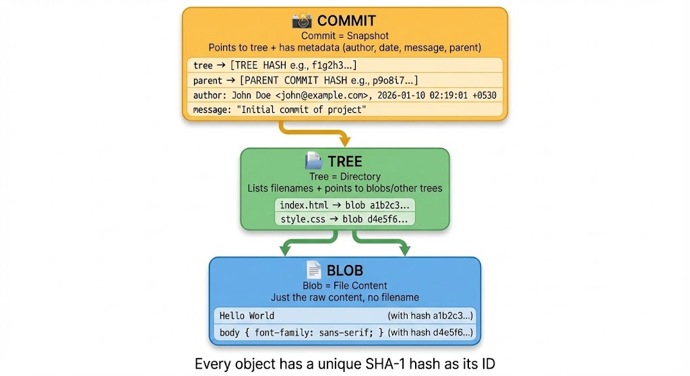
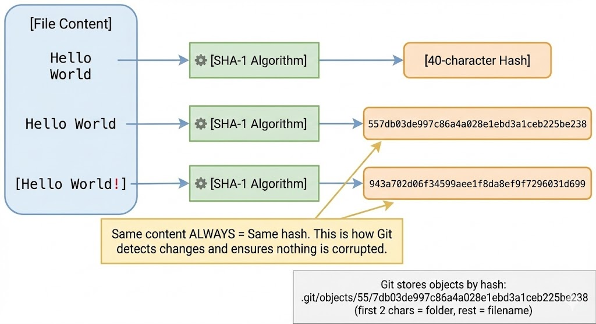
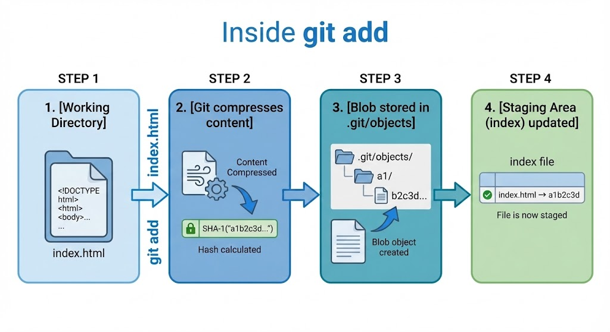
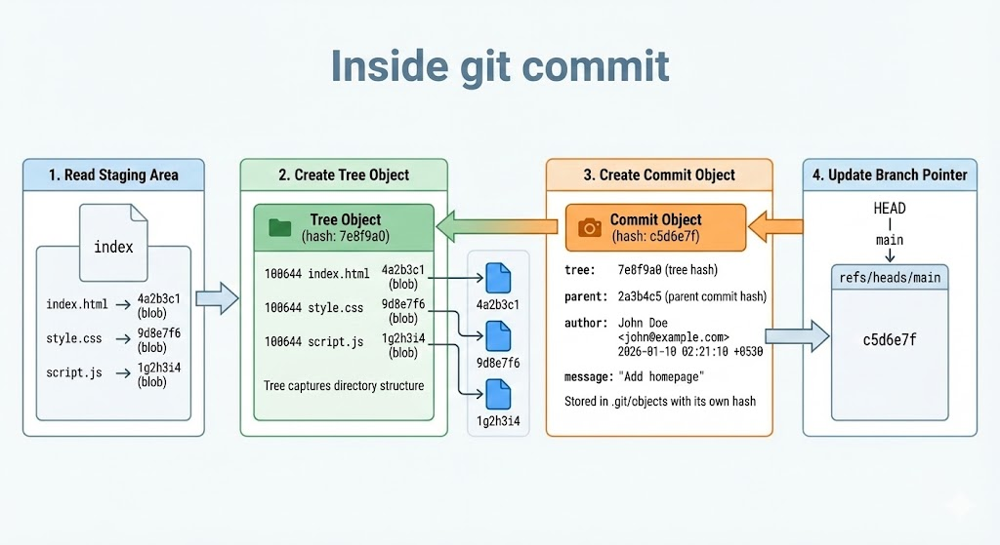
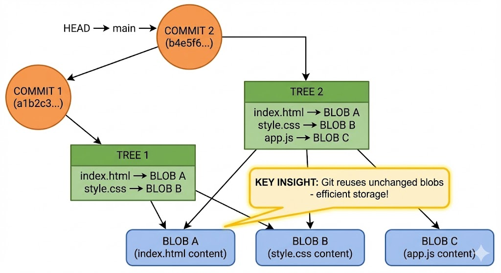

You've been using Git for a while now. `git add`, `git commit`, `git push` — the commands are becoming muscle memory. But have you ever wondered what actually happens when you run these commands?

Where does your code go? How does Git "remember" every version? What's inside that mysterious `.git` folder?

Today, we're opening the hood and looking at the engine. By the end of this post, you won't just *use* Git — you'll *understand* it.

---

## The .git Folder: Git's Brain

When you run `git init` in a folder, Git creates a hidden `.git` directory. This folder IS your repository. Everything Git knows about your project lives here.

```bash
$ ls -la
drwxr-xr-x  .git/
-rw-r--r--  index.html
-rw-r--r--  style.css
```

Your actual files (`index.html`, `style.css`) are just the "working directory." The real magic happens inside `.git/`.

### What's Inside .git?



Let's break down the important parts:

- **HEAD** — A file that tells Git which branch you're currently on. Usually contains `ref: refs/heads/main`
- **objects/** — This is the database. Every file, every commit, every piece of history is stored here as an "object"
- **refs/heads/** — Contains your branches. Each branch is just a file containing a commit hash
- **index** — The staging area. When you `git add` a file, it goes here

> ⚠️ **Important:** Delete the `.git` folder and you lose ALL history. Your files stay, but Git forgets everything — every commit, every branch, gone.

---

## Git Objects: The Building Blocks

Here's the key insight: **Git is basically a content-addressed filesystem.** Everything is stored as objects, and each object has a unique ID (a hash).

There are three types of objects:



### Blob (Binary Large Object)

A blob stores **file content** — nothing else. No filename, no permissions, just the raw content.

If you have a file `index.html` containing `Hello World`, Git stores `Hello World` as a blob. The filename `index.html` is stored separately (in a tree).

Why? Because if two files have identical content, Git only stores it once. Efficient!

### Tree

A tree is like a **directory listing**. It stores:
- Filenames
- File permissions
- Pointers to blobs (for files) or other trees (for subdirectories)

Think of it as a snapshot of your folder structure at a specific moment.

### Commit

A commit ties everything together. It contains:
- A pointer to a tree (the project snapshot)
- A pointer to parent commit(s)
- Author name and email
- Timestamp
- Commit message

When you run `git log`, you're looking at commit objects.

---

## How Git Uses Hashes

Every object in Git gets a unique 40-character hash (SHA-1). This hash is calculated from the content itself.



Here's the clever part:

**Same content = Same hash. Always.**

If you have `Hello World` in one file and `Hello World` in another file, they produce the exact same hash. Git stores it only once.

But change even one character — `Hello World!` — and you get a completely different hash.

This is how Git:
1. **Detects changes** — Different hash means something changed
2. **Ensures integrity** — If a file gets corrupted, the hash won't match
3. **Saves space** — Identical content is never duplicated

### Where Objects Are Stored

Git stores objects in `.git/objects/` using the hash as the path:

```
Hash: 557db03de997c86a4a028e1ebd3a1ceb225be238

Stored at: .git/objects/55/7db03de997c86a4a028e1ebd3a1ceb225be238
                        ↑↑
                   First 2 characters become the folder name
```

---

## What Happens During `git add`?

You type `git add index.html`. What actually happens?



**Step 1:** Git reads the file from your working directory

**Step 2:** Git compresses the content and calculates its SHA-1 hash

**Step 3:** Git stores the compressed content as a blob in `.git/objects/`

**Step 4:** Git updates the staging area (index file) to record: "index.html points to blob a1b2c3d..."

That's it. The file content is now safely stored in Git's database. The staging area knows about it. But it's not committed yet — no commit object exists.

### Let's See It Happen

```bash
$ echo "Hello Git" > test.txt
$ git add test.txt

# Let's peek inside .git/objects
$ find .git/objects -type f
.git/objects/9f/4d96d5b00d98959ea9960f069585ce42b1349a
```

A new object appeared! That's our blob.

We can even look inside it:

```bash
$ git cat-file -p 9f4d96d
Hello Git
```

The blob contains exactly what we put in the file.

---

## What Happens During `git commit`?

Now you run `git commit -m "Add test file"`. Here's what happens:



**Step 1:** Git reads the staging area (index) to see what's being committed

**Step 2:** Git creates a **tree object** that captures the directory structure — which files exist and which blobs they point to

**Step 3:** Git creates a **commit object** containing:
- Pointer to the tree
- Pointer to parent commit (if any)
- Your name and email
- Timestamp
- Your commit message

**Step 4:** Git updates the branch pointer. If you're on `main`, the file `.git/refs/heads/main` now contains the new commit's hash

### Let's See It Happen

```bash
$ git commit -m "Add test file"
[main 8a3b2c1] Add test file
 1 file changed, 1 insertion(+)

# Check what main points to
$ cat .git/refs/heads/main
8a3b2c1d5e6f7a8b9c0d1e2f3a4b5c6d7e8f9a0b

# Look at the commit object
$ git cat-file -p 8a3b2c1
tree 7e8f9a0b1c2d3e4f5a6b7c8d9e0f1a2b3c4d5e6f
parent 2a3b4c5d6e7f8a9b0c1d2e3f4a5b6c7d8e9f0a1b
author John <john@example.com> 1704825600 +0530
committer John <john@example.com> 1704825600 +0530

Add test file
```

See the structure? The commit points to a tree and a parent commit.

---

## The Big Picture: How Objects Connect

After a few commits, your repository looks like this:



Notice something important: **BLOB A and BLOB B appear only once**, even though both trees reference them.

When you made Commit 2 and added `app.js`, Git didn't copy `index.html` and `style.css` again. It just created a new tree pointing to the same blobs.

This is why Git is so efficient. A repository with 1000 commits doesn't have 1000 copies of every file — it only stores each unique version once.

---

## Building Your Mental Model

Let's summarize how to think about Git:

**Git is a database of snapshots.**

Every commit is a snapshot of your entire project. But Git is smart — it doesn't duplicate unchanged files.

**Everything is an object with a hash.**

- Blob = file content
- Tree = directory structure
- Commit = snapshot + metadata

**Branches are just pointers.**

A branch is literally a file containing a commit hash. That's it. Creating a branch is instant because Git just creates a tiny file.

**HEAD tells you where you are.**

HEAD points to your current branch, which points to a commit, which points to a tree, which points to blobs. It's pointers all the way down.

---

## Why This Matters

Understanding Git internals helps you:

1. **Debug problems** — When something goes wrong, you can actually look inside `.git` and understand what happened

2. **Use advanced features** — Rebasing, cherry-picking, and reflog make more sense when you understand objects and pointers

3. **Trust Git** — You know your data is safe because you understand how it's stored

4. **Recover from mistakes** — Even "deleted" commits often still exist as objects. If you know where to look, you can recover them

---

## Try It Yourself

Here's a quick experiment:

```bash
# Create a new repo
mkdir git-internals-test && cd git-internals-test
git init

# Create a file and add it
echo "Hello" > hello.txt
git add hello.txt

# See the blob that was created
find .git/objects -type f

# Look inside it
git cat-file -p <hash>

# Commit and see the tree and commit objects
git commit -m "First commit"
git cat-file -p HEAD        # Shows commit
git cat-file -p HEAD^{tree} # Shows tree
```

Play around. Look inside the objects. The more you explore, the more Git makes sense.

---

## Wrapping Up

Git isn't magic — it's a clever content-addressed storage system.

- The `.git` folder is the entire repository
- Everything is stored as objects (blobs, trees, commits)
- Every object has a unique hash based on its content
- `git add` creates blobs and updates the staging area
- `git commit` creates tree and commit objects, then updates the branch pointer

Next time you run a Git command, you'll know exactly what's happening under the hood.

---
