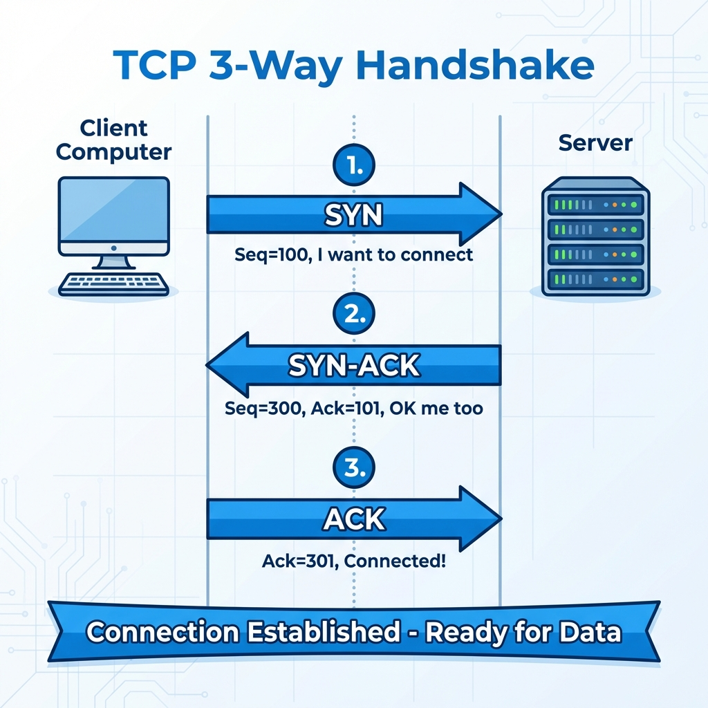
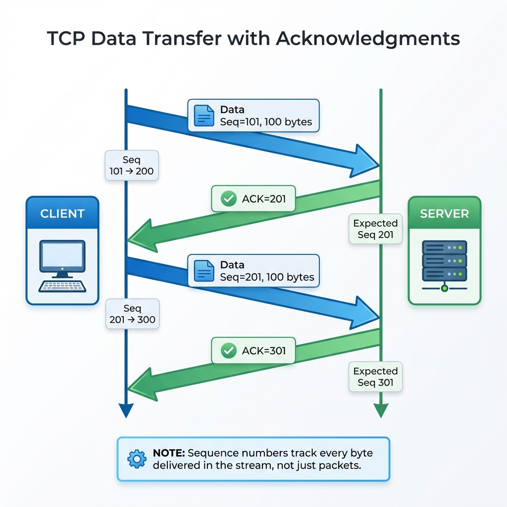
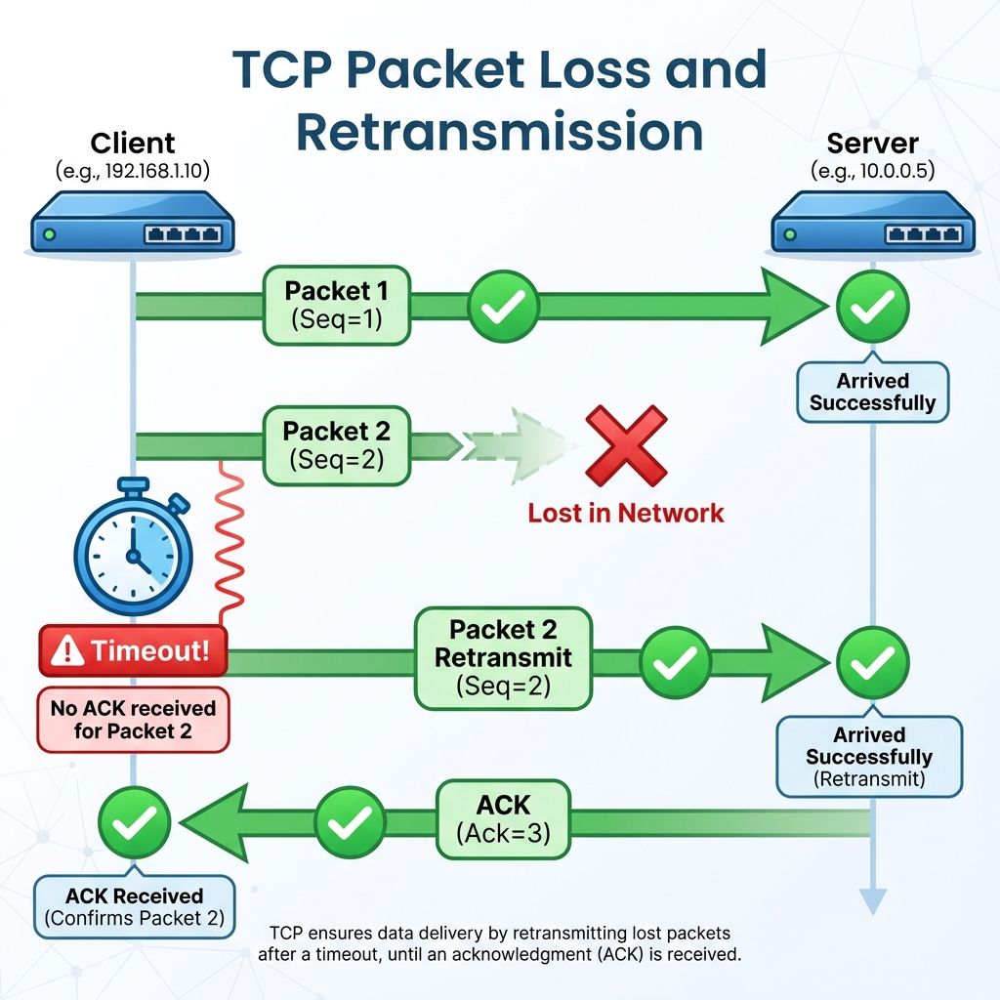
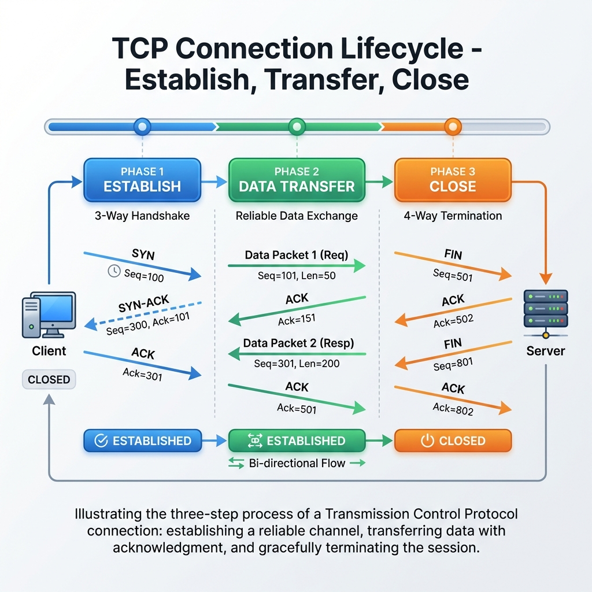

*Imagine sending a handwritten letter to a friend, but you have no way to know if they received it, if parts went missing, or if it arrived in the right order. That's what the internet would be like without TCP.*

---

## The Problem: Sending Data Without Rules

Let's say you want to send a 100-page document to a colleague. You could just toss the pages into the mail one by one and hope for the best. But what could go wrong?

- **Lost pages**: Some never arrive
- **Out of order**: Page 50 arrives before page 5
- **Damaged pages**: Coffee spills make some unreadable
- **Duplicate pages**: The mail system delivers some twice
- **Overwhelming**: You send faster than they can read

**Without a system to handle these problems, communication breaks down.**

This is exactly the challenge computers face when sending data over the internet. Data travels in **packets** — small chunks that take different routes through the network. Some get lost, some arrive out of order, some get corrupted.

**TCP (Transmission Control Protocol)** was designed to solve these problems.

---

## TCP: The Protocol That Ensures Reliable Communication

Think of TCP as a **certified mail service with tracking, confirmations, and insurance**.

Before sending any data, TCP:
1. **Establishes a connection** — Both sides agree to talk
2. **Numbers every byte** — So order can be maintained
3. **Requires acknowledgments** — "Did you get it?"
4. **Retransmits if needed** — "I didn't hear back, sending again"
5. **Controls the flow** — "Don't send faster than I can process"

Let's see how this works step by step.

---

## The TCP 3-Way Handshake: Starting the Conversation

### Analogy: A Formal Introduction

Imagine you're at a formal dinner and want to start a conversation with someone across the table:

**You**: "Hello, may I speak with you?" *(Establish intent)*

**Them**: "Yes, I can speak. Please go ahead." *(Confirm and reciprocate)*

**You**: "Wonderful, let's begin." *(Final confirmation)*

Only after this exchange do you start the actual conversation. This prevents awkward situations where you talk to someone who's not listening, or they respond to something you never said.

**TCP does exactly this with the 3-way handshake.**

---

## Step-by-Step: The 3-Way Handshake



### Step 1: SYN (Synchronize)

```
Client                                    Server
   │                                         │
   │  ─────── SYN, seq=x ───────────────►   │
   │  "I want to talk. My sequence         │
   │   number starts at x."                │
   │                                         │
```

**What happens:**
- The client sends a **SYN** (synchronize) packet to the server
- It includes a random starting number called the **Initial Sequence Number (ISN)**
- This number is like saying: "Let's label our conversation starting from ticket #1000"

**Real-world meaning**: "Hello server, I want to connect. I'm ready to send data, and I'll number my bytes starting from this number."

---

### Step 2: SYN-ACK (Synchronize-Acknowledge)

```
Client                                    Server
   │                                         │
   │  ◄────── SYN-ACK, seq=y, ack=x+1 ────  │
   │         "I got your message! My        │
   │          sequence starts at y, and     │
   │          I expect your next byte       │
   │          to be x+1."                   │
   │                                         │
```

**What happens:**
- The server responds with a **SYN-ACK** packet
- **SYN part**: Server sends its own Initial Sequence Number (y)
- **ACK part**: Server acknowledges receiving the client's SYN by sending `x+1` (one more than the client's ISN)

**Real-world meaning**: "Hi client! I received your request. I'm ready to talk too. My numbering starts at y, and I'm expecting your next message to continue from where you left off (x+1)."

---

### Step 3: ACK (Acknowledge)

```
Client                                    Server
   │                                         │
   │  ─────── ACK, ack=y+1 ─────────────►   │
   │  "I got your response too! I expect   │
   │   your next byte to be y+1."          │
   │                                         │
   │◄═══════════════════════════════════════►│
   │        CONNECTION ESTABLISHED!          │
```

**What happens:**
- The client sends a final **ACK** packet
- It acknowledges the server's SYN by sending `y+1`
- Both sides now know:
  - The other is alive and responsive
  - Both are ready to send and receive
  - The starting sequence numbers

**Real-world meaning**: "Perfect! I received your confirmation. Let's begin our conversation. The connection is now established."

---

## Why Three Steps? Why Not Two or Four?

Great question! Three steps is the minimum needed to solve three critical problems:

### 1. Confirm Both Sides Are Alive
A two-way handshake would only confirm the server received the client's message. But what if the server's response gets lost? The client doesn't know the server is ready.

### 2. Synchronize Sequence Numbers
Both sides need to agree on starting numbers for their data streams. This prevents confusion about which byte is which.

### 3. Prevent Stale Connections
Old, delayed packets from a previous connection might arrive. The three-way handshake with random sequence numbers makes it virtually impossible for stale packets to accidentally connect.

**Analogy**: It's like confirming a meeting:
- You: "Can we meet at 3 PM?" *(SYN)*
- Friend: "Yes, 3 PM works for me." *(SYN-ACK)*
- You: "Great, see you at 3!" *(ACK)*

Without your final confirmation, your friend doesn't know if you got their acceptance.

---

## How Data Transfer Works in TCP

Once the handshake is complete, data starts flowing. But TCP doesn't just send data blindly — it ensures reliability through several mechanisms.

### Sequence Numbers and Acknowledgments



Every byte sent gets a number. This allows both sides to track exactly what was sent and received.

```
Client sends:     "Hello" (5 bytes)
                  seq=101, data="Hello"
                       │
                       ▼
Server receives:  "Hello"
                  Sends ACK=106 (101 + 5)
                  "I received up to byte 105, 
                   expecting 106 next"
                       │
                       ▼
Client knows:     Server got "Hello"
                  Can send next chunk
```

### The Sliding Window: Efficient Communication

Instead of waiting for acknowledgment after every single byte, TCP uses a **window**:

```
Client can send up to 5 packets before needing an ACK:

Send: [Pkt 1] [Pkt 2] [Pkt 3] [Pkt 4] [Pkt 5]
       │       │       │       │       │
       └───────┴───────┴───────┘       │
               (waiting for ACK)        │
                                       │
Receive ACK for Pkt 1-3               │
       │                               │
       ▼                               ▼
Slide window: [Pkt 4] [Pkt 5] [Pkt 6] [Pkt 7] [Pkt 8]
                       ↑
                Can now send these
```

This makes TCP efficient while still reliable.

---

## How TCP Handles Problems

### Problem 1: Packet Loss



```
Client sends:    [Pkt 1] [Pkt 2] [Pkt 3] [Pkt 4]
                     │       │       X       │
                     │       │   (lost)      │
                     ▼       ▼               ▼
Server receives: [Pkt 1] [Pkt 2]        [Pkt 4]
                     │       │               │
                     └───────┘               │
                  Sends ACK=3 (missing 3!)   │
                     │       │               │
                     ▼       ▼               ▼
Client sees:    ACK=3, ACK=3, ACK=3 ← Duplicate ACKs!

Client: "Hmm, server keeps asking for 3. Must be lost."
        [Retransmits Pkt 3]
                     │
                     ▼
Server: Receives Pkt 3, now has 1-2-3-4
        Sends ACK=5 (all caught up!)
```

**TCP detects packet loss through:**
1. **Timeout**: "It's been too long, resending"
2. **Duplicate ACKs**: "Server asked for packet 3 three times, must be lost"

### Problem 2: Out-of-Order Packets

```
Sent order:      [Pkt 1] [Pkt 2] [Pkt 3] [Pkt 4]
                     │       │       │       │
Received order:  [Pkt 1] [Pkt 3] [Pkt 2] [Pkt 4]
                     │       │       │       │
                     ▼       ▼       ▼       ▼
Server buffer:   [Pkt 1] [___] [Pkt 3]        
                      "Waiting for 2..."
                         │
                         ▼
              [Pkt 2] arrives
                     │
                     ▼
              Reassemble: 1-2-3-4 ✓
```

TCP reassembles packets in the correct order before delivering them to your application.

### Problem 3: Duplicate Packets

```
Client sends:    [Pkt 5] 
                     │
         ┌──────────┼──────────┐
         │          │          │
         ▼          ▼          ▼
     [Pkt 5]    [Pkt 5]   (original lost)
    (delayed)   (retransmit)
         │          │
         └────┬─────┘
              ▼
         Server receives [Pkt 5] twice
              │
              ▼
         "I already have byte 500-600"
         Discards duplicate
         Sends ACK (no harm done)
```

Sequence numbers let TCP identify and discard duplicates.

---

## Flow Control: Not Overwhelming the Receiver

Imagine you're talking to someone who takes notes slowly. If you speak at full speed, they'll miss things. You need to match their pace.

TCP solves this with a **window size**:

```
Server: "I can receive up to 64000 bytes at once"
        (advertised in every ACK)
           │
           ▼
Client: Sends data up to that limit
           │
           ▼
Server: Buffer fills up...
        "Slow down! Window size now 1000 bytes"
           │
           ▼
Client: Reduces sending rate
           │
           ▼
Server: "Caught up! Window size back to 64000"
```

This prevents a fast sender from overwhelming a slow receiver.

---

## Closing the Connection: The 4-Way Handshake

Just as TCP carefully opens connections, it carefully closes them. This is called the **4-way handshake**.

### Why Not Just Hang Up?

Because both sides might still have data to send! One side might be done, but the other might have one last message.

### The 4 Steps



```
Step 1: Client sends FIN
"I'm done sending data."
        │
        ▼
Step 2: Server sends ACK
"I acknowledge your FIN."
        │
        ▼
   [Server may still send remaining data]
        │
        ▼
Step 3: Server sends FIN
"I'm also done sending."
        │
        ▼
Step 4: Client sends ACK
"I acknowledge your FIN."
        │
        ▼
   [Wait 2x maximum segment lifetime]
        │
        ▼
   CONNECTION FULLY CLOSED
```

**Real-world meaning:**
- **FIN** (Finish): "I'm done talking"
- **ACK**: "I heard you"
- The separate FINs allow each side to finish independently
- The final wait ensures the last ACK arrives

---

## The Complete TCP Lifecycle

```
┌─────────────────────────────────────────────────────────┐
│                    CONNECTION START                       │
│  1. SYN ──► 2. SYN-ACK ◄── 3. ACK                        │
│                    [ESTABLISHED]                          │
└─────────────────────────────────────────────────────────┘
                          │
                          ▼
┌─────────────────────────────────────────────────────────┐
│                   DATA TRANSFER                           │
│  • Send data with sequence numbers                        │
│  • Receive ACKs                                           │
│  • Retransmit if needed                                   │
│  • Reorder out-of-sequence packets                        │
│  • Discard duplicates                                     │
│  • Adjust flow based on window size                       │
└─────────────────────────────────────────────────────────┘
                          │
                          ▼
┌─────────────────────────────────────────────────────────┐
│                   CONNECTION END                          │
│  1. FIN ──► 2. ACK ◄── 3. FIN ──► 4. ACK                 │
│                    [CLOSED]                               │
└─────────────────────────────────────────────────────────┘
```

---

## Summary Table: TCP Mechanisms

| Problem | TCP Solution | How It Works |
|---------|--------------|--------------|
| **Lost packets** | Retransmission | Timeout or duplicate ACKs trigger resend |
| **Out of order** | Sequence numbers | Reassemble in correct order |
| **Duplicates** | Sequence numbers | Identify and discard duplicates |
| **Corruption** | Checksums | Detect and reject bad data |
| **Overwhelming** | Flow control | Window size limits sending rate |
| **Stale data** | 3-way handshake | Random ISN prevents old packets |

---

## Key Takeaways

1. **TCP solves reliability problems** that raw IP doesn't handle
2. **3-way handshake** establishes connections safely (SYN → SYN-ACK → ACK)
3. **Sequence numbers** track every byte for ordering and acknowledgment
4. **Acknowledgments** confirm receipt; missing ACKs trigger retransmission
5. **Flow control** prevents overwhelming receivers
6. **4-way handshake** closes connections cleanly (FIN → ACK → FIN → ACK)

---
