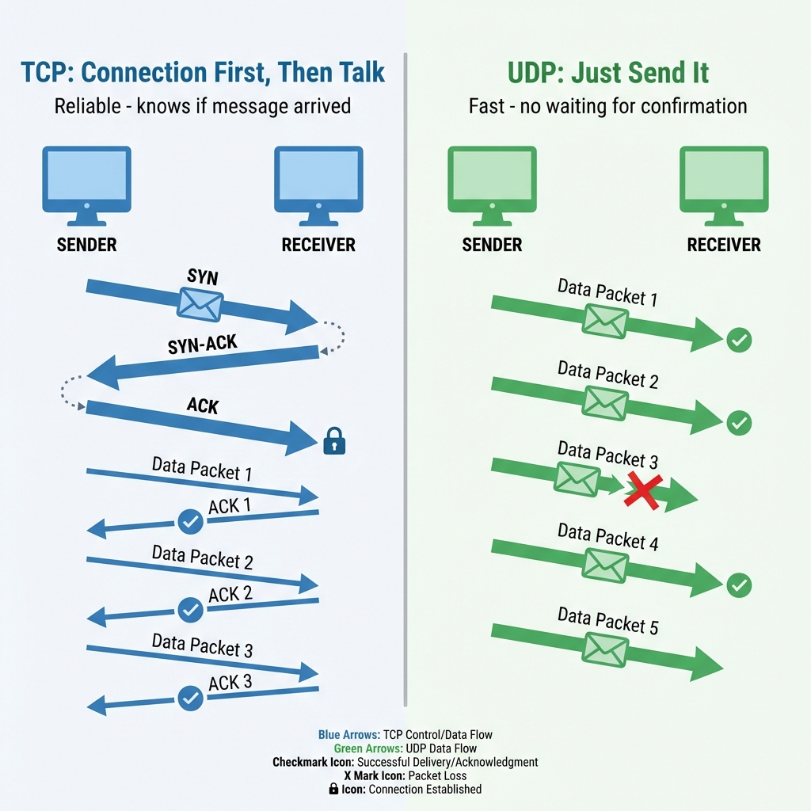
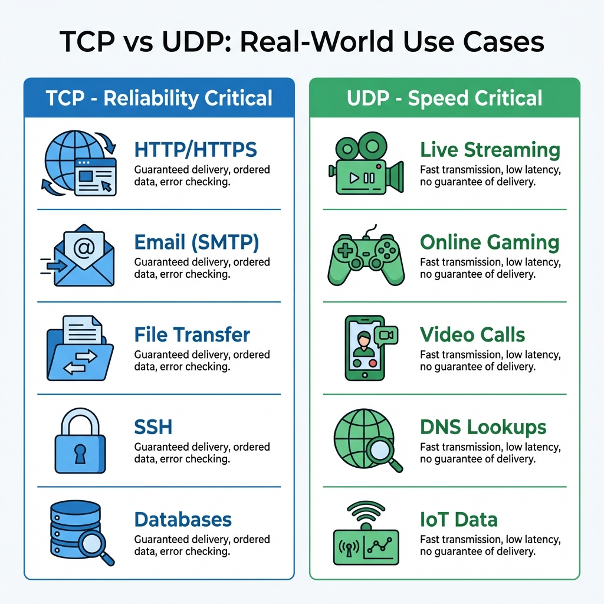
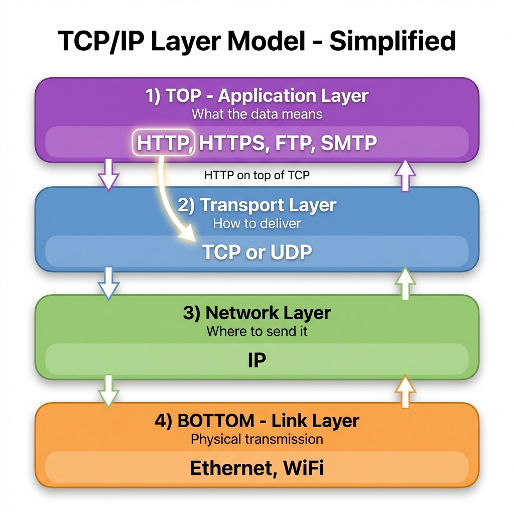
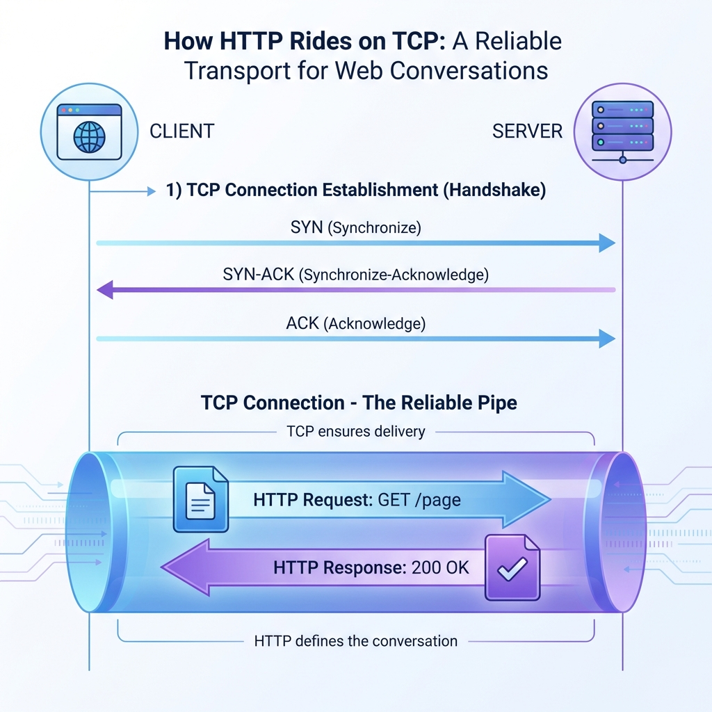

*When you send a message over the internet, how do you know it arrives? Does it matter if it arrives? The answer depends on whether you're using TCP or UDP — two different approaches to moving data across networks.*

---

## The Internet Needs Rules

Imagine the internet as a massive postal system. Millions of packages (data packets) are flying around every second. But without rules, chaos would ensue:
- Packages might get lost with no one knowing
- Some might arrive damaged
- Others might show up out of order
- A few might never arrive at all

**TCP and UDP are the rulebooks** for how data travels. They define the behavior — but they have very different philosophies.

---

## TCP: The Reliable Phone Call

### Analogy: A Important Business Call

Imagine you're negotiating a million-dollar deal over the phone. You need to:
- **Establish the connection first**: "Hello, is this John?"
- **Confirm receipt**: "Did you get that last point?"
- **Correct errors**: "Wait, I think you misheard me..."
- **Maintain order**: "Let me go through these points one by one."

**TCP (Transmission Control Protocol)** works exactly like this. It's a conversation with guarantees.

### What TCP Actually Does



**TCP's Promises:**
1. **Connection-oriented**: Handshake before talking ("Are you there?")
2. **Reliable delivery**: Every packet is acknowledged ("Got it!")
3. **Ordered delivery**: Packets arrive in sequence (Packet 1, then 2, then 3)
4. **Error checking**: Corrupted packets are retransmitted
5. **Flow control**: Won't overwhelm the receiver

### The TCP "Conversation"

```
You: "Hi, can we talk?"          ← SYN (Synchronize)
Server: "Yes, I'm here!"         ← SYN-ACK
You: "Great, let's begin!"       ← ACK (3-way handshake complete)

You: "Here's page 1 of my data"  ← Packet 1
Server: "Received page 1!"       ← ACK 1

You: "Here's page 2 of my data"  ← Packet 2
Server: "Received page 2!"       ← ACK 2

[Packet 3 gets lost...]
You: "Here's page 3..."          ← Packet 3
[No ACK received...]
You: "Let me resend page 3"      ← Retransmission
Server: "Received page 3!"       ← ACK 3

You: "Goodbye!"                  ← FIN (Finish)
Server: "Goodbye!"               ← FIN-ACK
```

### When to Use TCP

**Use TCP when you cannot afford to lose data:**

| Use Case | Why TCP? |
|----------|----------|
| **Web browsing** | HTML must be complete and in order |
| **File downloads** | Corrupted files are useless |
| **Email** | Messages must arrive intact |
| **Database queries** | Partial results break applications |
| **Banking transactions** | Missing data = lost money |

---

## UDP: The Live Broadcast

### Analogy: A Stadium Announcement

Imagine you're at a concert and the announcer says: "The show starts in 5 minutes!"

- They don't wait for everyone to confirm they heard it
- They don't repeat it if someone was in the bathroom
- They just broadcast and move on

**UDP (User Datagram Protocol)** works like this. It's a broadcast with no guarantees.

### What UDP Actually Does

**UDP's Characteristics:**
1. **Connectionless**: No handshake, just send
2. **No delivery guarantee**: Fire and forget
3. **No ordering**: Packets may arrive out of sequence
4. **No retransmission**: Lost packets stay lost
5. **Minimal overhead**: Just 8 bytes header (vs TCP's 20+ bytes)

### The UDP "Broadcast"

```
You: "Here's some data!"         ← Packet 1 (sent)
You: "Here's more data!"         ← Packet 2 (sent)
You: "Here's even more!"         ← Packet 3 (sent, but lost in transit)
You: "And more data!"            ← Packet 4 (sent)

[Receiver gets packets 1, 2, and 4. Packet 3 is gone forever.]
[No one complains. No one retries. Life goes on.]
```

### When to Use UDP

**Use UDP when speed matters more than perfection:**

| Use Case | Why UDP? |
|----------|----------|
| **Video streaming** | A missed frame is better than buffering |
| **Online gaming** | Old position data is useless; need current state NOW |
| **Voice calls (VoIP)** | Delayed audio is worse than dropped audio |
| **Live sports broadcasts** | Real-time over perfection |
| **DNS queries** | Small, fast; retry is cheap if needed |

---

## Head-to-Head: TCP vs UDP



| Feature | TCP (The Courier) | UDP (The Announcer) |
|---------|-------------------|---------------------|
| **Connection** | Requires handshake | No setup needed |
| **Reliability** | Guaranteed delivery | No guarantees |
| **Order** | Maintains sequence | Any order possible |
| **Speed** | Slower (checks + acks) | Fast (no overhead) |
| **Error handling** | Retransmits lost data | Ignores errors |
| **Best for** | Accuracy-critical apps | Speed-critical apps |
| **Analogy** | Certified mail with tracking | Megaphone announcement |

---

## Real-World Examples

### Example 1: Loading a Website

```
You type: example.com

1. DNS Lookup (UDP)
   "What's the IP for example.com?"
   → Fast, single packet, if lost we just retry

2. TCP Connection Established
   You ←────3-way handshake────→ Server
   "Let's establish a reliable connection"

3. HTTP Request (over TCP)
   You: "GET /homepage please"
   → Must arrive completely and in order

4. HTTP Response (over TCP)
   Server: "Here's your HTML..."
   → Every byte accounted for

5. More Resources (TCP connections)
   CSS files, JavaScript, images
   → All delivered reliably
```

**Why TCP for web pages?** Because a missing `</div>` tag or a corrupted image breaks the entire page.

### Example 2: Netflix Video Streaming

```
Netflix Server → Your TV

Video Frame 1 ──► (arrives) ──► Displayed ✓
Video Frame 2 ──► (arrives) ──► Displayed ✓
Video Frame 3 ──► (LOST) ───► Skipped, Frame 4 shown instead
Video Frame 4 ──► (arrives) ──► Displayed ✓
```

**Why UDP?** Because showing Frame 4 immediately is better than pausing to retry Frame 3. You might see a tiny glitch, but the video keeps flowing.

### Example 3: Online Gaming

```
Your Position: (100, 200)
     ↓ (sent via UDP)
Server receives: (100, 200)
     ↓
Other players see you at (100, 200)

[Next moment]
Your Position: (105, 205) ──► (packet lost)
Your Position: (110, 210) ──► (arrives)
```

**Why UDP?** Because knowing you're at `(110, 210)` NOW matters more than knowing you were at `(105, 205)` a second ago. Old position data is irrelevant in fast-paced games.

---

## Where Does HTTP Fit In?

Now for the part that confuses many beginners: **What is HTTP, and how does it relate to TCP?**

### The Protocol Stack



Think of network communication like mailing a letter:

```
┌─────────────────────────────────────┐
│  Layer 7: Application (HTTP)        │  ← "What does this mean?"
│  "GET /homepage"                    │     The content of your letter
├─────────────────────────────────────┤
│  Layer 4: Transport (TCP)           │  ← "How do we ensure it arrives?"
│  Connection, reliability, ordering  │     Certified mail service
├─────────────────────────────────────┤
│  Layer 3: Network (IP)              │  ← "Where does this go?"
│  Addressing, routing                │     The address on the envelope
├─────────────────────────────────────┤
│  Layer 1-2: Physical/Data Link      │  ← "How do we physically send it?"
│  Cables, WiFi, signals              │     The truck/plane carrying mail
└─────────────────────────────────────┘
```

### HTTP is NOT TCP

**HTTP (HyperText Transfer Protocol)** is the language web browsers and servers speak. It defines:
- Request methods: `GET`, `POST`, `PUT`, `DELETE`
- Status codes: `200 OK`, `404 Not Found`, `500 Server Error`
- Headers: `Content-Type`, `Authorization`, etc.

**TCP** is the delivery mechanism that ensures HTTP messages arrive intact.

### The Relationship: HTTP Runs ON TOP of TCP



```
┌─────────────┐                    ┌─────────────┐
│   Browser   │                    │   Server    │
│             │  ←── HTTP ──→      │             │
│  "GET /"    │    (the message)   │  "200 OK"   │
└──────┬──────┘                    └──────┬──────┘
       │                                  │
       │  Uses TCP to send/receive        │
       ▼                                  ▼
┌─────────────┐                    ┌─────────────┐
│     TCP     │ ←── Connection ──→ │     TCP     │
│  (Transport)│   (the delivery)   │  (Transport)│
└─────────────┘                    └─────────────┘
```

**Analogy**: 
- **HTTP** is like the language you speak (English)
- **TCP** is like the phone connection ensuring your words are heard clearly

You need both: Speaking English (HTTP) doesn't help if the phone line (TCP) isn't connected and clear.

### Why HTTP Doesn't Replace TCP

HTTP needs TCP because:

1. **HTTP is just text** — It has no mechanism to ensure delivery
2. **Web pages must be complete** — A partial HTML page is broken
3. **Resources arrive in order** — HTML before CSS before JavaScript matters

Without TCP, HTTP would have to implement all the reliability features itself — and that's exactly what TCP was built for.

### HTTP/3: The Exception That Proves the Rule

You might hear that HTTP/3 uses UDP instead of TCP. This is true, but with a twist:

```
HTTP/1.1 ──► TCP ──► IP
HTTP/2   ──► TCP ──► IP  
HTTP/3   ──► QUIC ──► UDP ──► IP
                ↑
         (QUIC adds reliability 
          on top of UDP)
```

**QUIC** is a new protocol that runs over UDP but adds TCP-like reliability features. So even when HTTP uses UDP, it still needs reliability — it just implements it differently.

**For beginners**: Don't worry about HTTP/3 yet. Most of the web still uses HTTP/1.1 and HTTP/2 over TCP.

---

## Addressing Common Confusion

### "Is HTTP the same as TCP?"

**No!** They're completely different things working at different levels:

| HTTP | TCP |
|------|-----|
| Application layer | Transport layer |
| Defines message format | Defines delivery method |
| "What to say" | "How to ensure it's heard" |
| Uses TCP | Used by HTTP, FTP, SMTP, etc. |

### "If TCP is reliable, why ever use UDP?"

Because **reliability has a cost**: speed and overhead.

Imagine you're live-streaming a concert:
- **TCP approach**: Pause the stream if a packet is lost, wait for retransmission, continue. Result: Buffering, delays.
- **UDP approach**: Skip the lost frame, keep showing the live feed. Result: Possible tiny glitch, but stays real-time.

### "Can I choose between TCP and UDP?"

Usually, the choice is made for you by the application:
- **Web browser** → Uses TCP (HTTP)
- **Zoom video** → Uses UDP for video, TCP for chat
- **Online game** → Uses UDP for gameplay, TCP for login

As a web developer, you typically work at the HTTP layer and TCP handles the transport automatically.

---

## Summary: When to Use What

### Use TCP When:
- ✅ Data integrity is critical
- ✅ Order matters
- ✅ You can tolerate some delay
- ✅ File transfers, web pages, emails, databases

### Use UDP When:
- ✅ Speed is more important than perfection
- ✅ Some loss is acceptable
- ✅ Real-time delivery is critical
- ✅ Streaming, gaming, VoIP, live broadcasts

---

## Key Takeaways

1. **TCP is like a phone call**: Reliable, ordered, but slower due to confirmations
2. **UDP is like a megaphone**: Fast, no guarantees, but efficient for broadcasts
3. **HTTP needs TCP**: Web pages must arrive complete and in order
4. **Different layers**: HTTP (application) uses TCP (transport) for delivery
5. **Neither is "better"**: They're designed for different needs

---
