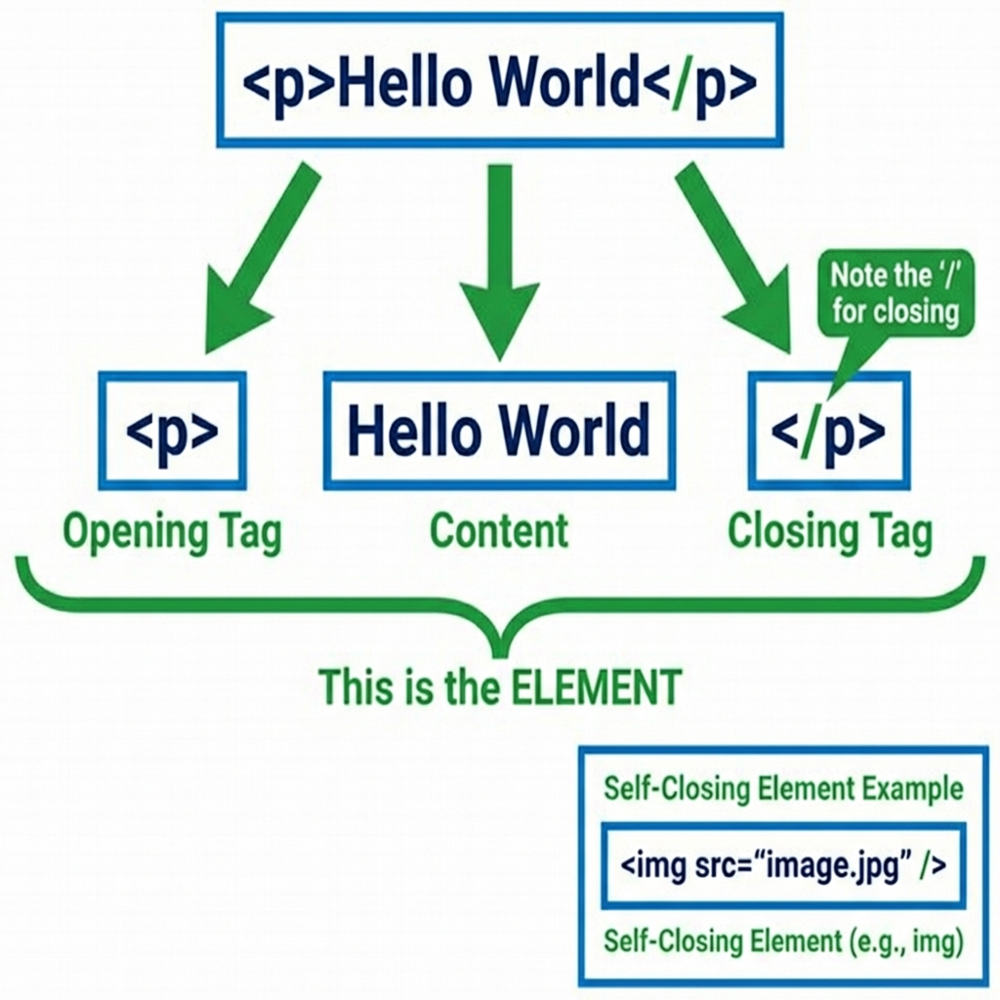
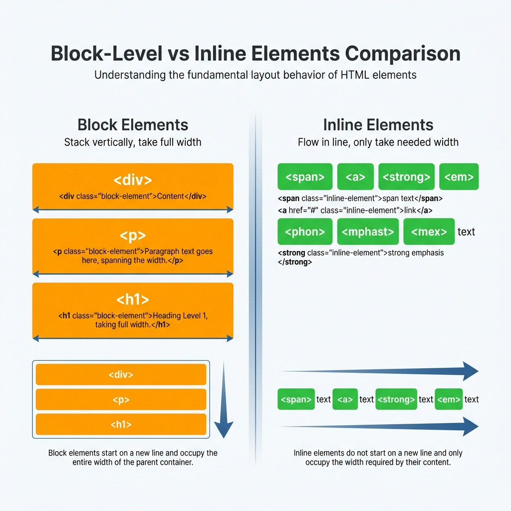

*Imagine you're building a house. Before you add paint, furniture, or decorations, you need walls, a roof, and a foundation. HTML is the walls and structure of every webpage — without it, there's nothing to style or make interactive.*

---

## What Is HTML and Why Do We Use It?

**HTML (HyperText Markup Language)** is the standard language for creating webpages. But what does that actually mean?

Think of a webpage like a **human body**:
- **HTML** is the **skeleton** — the structure that holds everything up
- **CSS** is the **skin and clothing** — makes it look good
- **JavaScript** is the **muscles and brain** — makes it move and think

Without HTML (the skeleton), there's nothing to style or animate.

### What HTML Actually Does

HTML tells the browser:
- "This is a heading"
- "This is a paragraph"
- "This is an image"
- "This is a link"

It provides **structure and meaning** to content.

---

## What Is an HTML Tag?

### Analogy: Labels on Boxes

Imagine you're organizing a storage room. You have boxes, and you put **labels** on them to indicate what's inside:
- A label saying "BOOKS" on a box
- A label saying "CLOTHES" on another
- A label saying "FRAGILE" to indicate special handling

**HTML tags are like these labels.** They mark the beginning and end of different types of content.

### The Anatomy of a Tag

Tags are written with angle brackets `< >`:

```html
<p>        ← This is an opening tag
</p>       ← This is a closing tag (note the forward slash)
```

**Opening tag**: `<p>` — "A paragraph starts here"  
**Closing tag**: `</p>` — "The paragraph ends here"

---

## What Is an HTML Element?

Here's where people often get confused. Let's clear it up:

### Tag vs Element: The Key Difference



```
┌─────────────────────────────────────┐
│  <p> This is a paragraph. </p>    │
│  └──┘ └────────────────────┘ └───┘  │
│    │            │              │    │
│    │            │              │    │
│  OPENING      CONTENT      CLOSING │
│    TAG                         TAG  │
│                                     │
│  └────────────────────────────────┘ │
│              ELEMENT                │
└─────────────────────────────────────┘
```

- **Tag**: The marker itself (`<p>` or `</p>`)
- **Element**: The complete thing — opening tag + content + closing tag

### Simple Examples

| Element | Opening Tag | Content | Closing Tag |
|---------|-------------|---------|-------------|
| `<h1>Hello</h1>` | `<h1>` | Hello | `</h1>` |
| `<p>Hi there</p>` | `<p>` | Hi there | `</p>` |
| `<div>Content</div>` | `<div>` | Content | `</div>` |

**Remember**: Tags are the labels; elements are the complete labeled boxes with content inside.

---

## Self-Closing (Void) Elements

Not all elements have content. Some elements stand alone and don't need a closing tag.

### Analogy: Single-Purpose Signs

Think of a "STOP" sign. It doesn't surround anything — it just exists as a complete instruction by itself.

**Self-closing elements** work the same way. They don't wrap around content; they **are** the content.

### Common Self-Closing Elements

```html
<!-- Image - displays a picture -->


<!-- Line break - creates a new line -->
<br>

<!-- Horizontal rule - creates a line across the page -->
<hr>

<!-- Input - creates a form field -->
<input type="text">

<!-- Meta - provides page information (goes in <head>) -->
<meta charset="UTF-8">
```

**Note**: You might also see these written with a slash at the end: `<br />`, ``. This is XHTML style. In HTML5, both `<br>` and `<br />` work, but `<br>` is preferred.

---

## Common HTML Tags You'll Use Daily

Let's look at the essential tags every beginner should know:

### Headings (Like Outline Levels)

```html
<h1>Main Title of the Page</h1>
<h2>Major Section Heading</h2>
<h3>Subsection</h3>
<h4>Smaller Heading</h4>
<h5>Even Smaller</h5>
<h6>Smallest</h6>
```

Think of headings like an outline for a paper:
- `h1` = Title
- `h2` = Chapter
- `h3` = Section
- And so on...

### Paragraphs

```html
<p>This is a paragraph of text. It can be long or short.</p>
<p>This is another paragraph. Each paragraph is separated by space.</p>
```

### Links (Anchor Tags)

```html
<a href="https://google.com">Click me to go to Google</a>
```

The `href` attribute tells the browser where to go.

### Images

```html

```

- `src` = source (the image file)
- `alt` = alternative text (for accessibility)

### Divisions (Containers)

```html
<div>
  <h2>A Section</h2>
  <p>Some content inside the section.</p>
</div>
```

`<div>` is a generic container — like a box that holds other elements.

### Spans (Inline Containers)

```html
<p>This is a paragraph with <span>highlighted text</span> in it.</p>
```

`<span>` is like `<div>` but for small pieces of text within a line.

---

## Block-Level vs Inline Elements

This is one of the most important concepts in HTML. It affects how elements appear on the page.

### Analogy: Blocks vs Words



**Block-level elements** are like **building blocks**:
- Each one starts on a new line
- Takes up the full width available
- Stacks vertically like blocks

**Inline elements** are like **words in a sentence**:
- They flow within text
- Only take up as much space as needed
- Sit side by side

### Block-Level Elements

```html
<div>A div element</div>
<div>Another div - notice it starts on a new line</div>
<p>This is a paragraph (block)</p>
<h1>This is a heading (block)</h1>
```

**Visual result:**
```
┌─────────────────────────────────┐
│ A div element                   │
└─────────────────────────────────┘
┌─────────────────────────────────┐
│ Another div - notice...         │
└─────────────────────────────────┘
┌─────────────────────────────────┐
│ This is a paragraph (block)     │
└─────────────────────────────────┘
┌─────────────────────────────────┐
│ This is a heading (block)       │
└─────────────────────────────────┘
```

**Common block elements:** `div`, `p`, `h1-h6`, `section`, `article`, `header`, `footer`

### Inline Elements

```html
<p>
  This is a paragraph with 
  <span>span</span> 
  and 
  <a href="#">link</a> 
  elements inside.
</p>
```

**Visual result:**
```
This is a paragraph with span and link elements inside.
                         ↑      ↑
                      (inline) (inline)
                      inline elements flow within text
```

**Common inline elements:** `span`, `a`, `strong`, `em`, `img`, `code`

### Why This Matters

```html
<!-- Block elements stack -->
<div>Block 1</div>
<div>Block 2</div>

<!-- Inline elements flow -->
<span>Inline 1</span>
<span>Inline 2</span>
<span>Inline 3</span>
```

**Result:**
```
Block 1        ← Full width, new line
Block 2        ← Full width, new line
Inline 1 Inline 2 Inline 3  ← Flow together on same line
```

---

## A Simple Complete Example

Let's put it all together:

```html
<!DOCTYPE html>
<html>
<head>
  <title>My First Page</title>
</head>
<body>
  <h1>Welcome to My Website</h1>
  
  <p>This is my first webpage. I'm learning HTML!</p>
  
  <h2>About Me</h2>
  
  <p>
    I love <strong>coding</strong> and 
    <em>building websites</em>.
  </p>
  
  <div>
    <h3>My Hobbies</h3>
    <p>Reading, gaming, and hiking.</p>
  </div>
  
  <p>
    Visit my <a href="https://example.com">portfolio</a>.
  </p>
</body>
</html>
```

**Breakdown:**
- `<!DOCTYPE html>`: Tells the browser this is HTML5
- `<html>`: The root element (contains everything)
- `<head>`: Contains metadata (title, styles, etc.)
- `<body>`: Contains visible content
- `<h1>`, `<h2>`, `<h3>`: Headings
- `<p>`: Paragraphs
- `<div>`: Container
- `<strong>`, `<em>`: Inline formatting
- `<a>`: Link

---

## Try It Yourself: Inspect in Browser

One of the best ways to learn HTML is to **inspect existing webpages**:

1. Open any website (like google.com)
2. Right-click anywhere on the page
3. Select "Inspect" or "Inspect Element"
4. Look at the HTML structure in the Elements tab

You'll see:
- How real websites use tags
- The nesting of elements
- Block vs inline in action

**Pro tip**: Try inspecting your favorite websites to see how they're built!

---

## Quick Reference Table

| Tag | Type | Purpose |
|-----|------|---------|
| `<h1>` - `<h6>` | Block | Headings (h1 = most important) |
| `<p>` | Block | Paragraph |
| `<div>` | Block | Generic container |
| `<span>` | Inline | Generic inline container |
| `<a>` | Inline | Link to another page |
| `` | Inline (self-closing) | Display an image |
| `<br>` | Inline (self-closing) | Line break |
| `<strong>` | Inline | Bold text |
| `<em>` | Inline | Italic text |

---

## Key Takeaways

1. **HTML is the skeleton** of a webpage — it provides structure
2. **Tags are like labels** that mark the beginning and end of content
3. **An element = opening tag + content + closing tag**
4. **Self-closing tags** don't have content (like ``, `<br>`)
5. **Block elements** stack vertically (like building blocks)
6. **Inline elements** flow horizontally (like words)
7. **Inspect in browser** to see HTML in action on real websites

---
