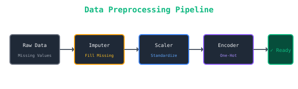
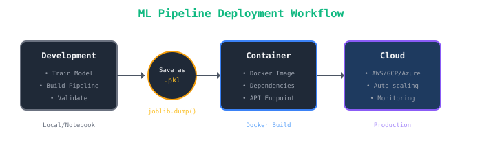

# Understanding Machine Learning Pipelines

> **Building robust, reproducible, and scalable ML workflows**

Machine Learning pipelines are essential for creating production-ready ML systems. In this post, I'll walk you through building a complete ML pipeline using Python and scikit-learn.

## What is an ML Pipeline?

An ML pipeline is a sequence of data processing steps that transforms raw data into predictions. It ensures:

- ✅ **Reproducibility**: Same steps every time
- ✅ **Modularity**: Easy to modify components
- ✅ **Efficiency**: Avoid repeated computations
- ✅ **Deployment**: Easy to productionize

## Pipeline Architecture


*Figure 1: Typical ML Pipeline Architecture*

### Key Components

1. **Data Ingestion** - Load data from various sources
2. **Preprocessing** - Clean and transform data
3. **Feature Engineering** - Create meaningful features
4. **Model Training** - Train the ML model
5. **Evaluation** - Assess model performance
6. **Deployment** - Serve predictions

## Building a Pipeline with Scikit-Learn

### Step 1: Setup and Imports

```python
import pandas as pd
import numpy as np
from sklearn.pipeline import Pipeline
from sklearn.compose import ColumnTransformer
from sklearn.preprocessing import StandardScaler, OneHotEncoder
from sklearn.impute import SimpleImputer
from sklearn.ensemble import RandomForestClassifier
from sklearn.model_selection import train_test_split
from sklearn.metrics import classification_report

# Set random seed for reproducibility
RANDOM_STATE = 42
```

### Step 2: Data Preprocessing Pipeline

```python
# Define column types
numeric_features = ['age', 'income', 'credit_score']
categorical_features = ['gender', 'education', 'employment_type']

# Numeric pipeline
numeric_transformer = Pipeline(steps=[
    ('imputer', SimpleImputer(strategy='median')),
    ('scaler', StandardScaler())
])

# Categorical pipeline
categorical_transformer = Pipeline(steps=[
    ('imputer', SimpleImputer(strategy='constant', fill_value='missing')),
    ('onehot', OneHotEncoder(handle_unknown='ignore'))
])

# Combine transformers
preprocessor = ColumnTransformer(
    transformers=[
        ('num', numeric_transformer, numeric_features),
        ('cat', categorical_transformer, categorical_features)
    ])
```


*Figure 2: Data Preprocessing Pipeline*

### Step 3: Complete ML Pipeline

```python
# Create the full pipeline
ml_pipeline = Pipeline(steps=[
    ('preprocessor', preprocessor),
    ('classifier', RandomForestClassifier(
        n_estimators=100,
        random_state=RANDOM_STATE
    ))
])

# Load your data
df = pd.read_csv('data.csv')
X = df.drop('target', axis=1)
y = df['target']

# Split data
X_train, X_test, y_train, y_test = train_test_split(
    X, y, test_size=0.2, random_state=RANDOM_STATE
)

# Train the pipeline
ml_pipeline.fit(X_train, y_train)

# Make predictions
predictions = ml_pipeline.predict(X_test)

# Evaluate
print(classification_report(y_test, predictions))
```

## Pipeline Benefits

| Aspect | Without Pipeline | With Pipeline |
|--------|-----------------|---------------|
| Code Reusability | ❌ Repetitive | ✅ Modular |
| Data Leakage | ⚠️ Risky | ✅ Prevented |
| Hyperparameter Tuning | 😵 Complex | ✅ Integrated |
| Deployment | 😰 Difficult | ✅ Easy |

## Advanced: Custom Transformers

You can create custom pipeline steps:

```python
from sklearn.base import BaseEstimator, TransformerMixin

class OutlierClipper(BaseEstimator, TransformerMixin):
    """Custom transformer to clip outliers"""
    
    def __init__(self, lower_percentile=1, upper_percentile=99):
        self.lower_percentile = lower_percentile
        self.upper_percentile = upper_percentile
    
    def fit(self, X, y=None):
        self.lower_ = np.percentile(X, self.lower_percentile, axis=0)
        self.upper_ = np.percentile(X, self.upper_percentile, axis=0)
        return self
    
    def transform(self, X):
        return np.clip(X, self.lower_, self.upper_)

# Use in pipeline
pipeline_with_custom = Pipeline([
    ('outlier_clipper', OutlierClipper()),
    ('scaler', StandardScaler()),
    ('model', RandomForestClassifier())
])
```

## Hyperparameter Tuning

```python
from sklearn.model_selection import GridSearchCV

# Define parameter grid
param_grid = {
    'classifier__n_estimators': [50, 100, 200],
    'classifier__max_depth': [3, 5, 7, None],
    'preprocessor__num__imputer__strategy': ['mean', 'median']
}

# Grid search with cross-validation
grid_search = GridSearchCV(
    ml_pipeline, 
    param_grid, 
    cv=5, 
    scoring='accuracy',
    n_jobs=-1
)

grid_search.fit(X_train, y_train)
print(f"Best parameters: {grid_search.best_params_}")
```

## Deployment: Saving and Loading

```python
import joblib

# Save the complete pipeline
joblib.dump(ml_pipeline, 'ml_pipeline.pkl')

# Load and use later
loaded_pipeline = joblib.load('ml_pipeline.pkl')
predictions = loaded_pipeline.predict(new_data)
```


*Figure 3: ML Pipeline Deployment Workflow*

## Common Pitfalls to Avoid

1. **🚫 Data Leakage**: Never fit transformers on test data
2. **🚫 Hardcoded Values**: Use configurable parameters
3. **🚫 Ignoring Edge Cases**: Handle missing values and outliers
4. **🚫 No Versioning**: Track pipeline versions
5. **🚫 Poor Documentation**: Document each step

## Best Practices

- ✅ Use `Pipeline` for sequential steps
- ✅ Use `ColumnTransformer` for different feature types
- ✅ Always split data before fitting
- ✅ Use cross-validation for robust evaluation
- ✅ Save complete pipelines, not just models

## Conclusion

ML pipelines are crucial for production ML systems. They make your code:
- More readable
- Easier to maintain
- Less prone to errors
- Ready for deployment

Start using pipelines in your next ML project!

---

## Resources

- [Scikit-Learn Pipelines Documentation](https://scikit-learn.org/stable/modules/compose.html)
- [MLflow for Pipeline Tracking](https://mlflow.org/)
- [Feature Engineering Book](https://www.oreilly.com/library/view/feature-engineering-for/9781491953235/)

*Have questions? Drop a comment or reach out on [Twitter](https://x.com/AnikCodes)!*
