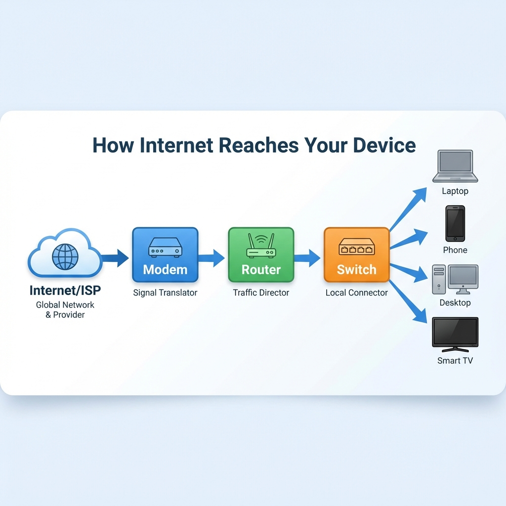
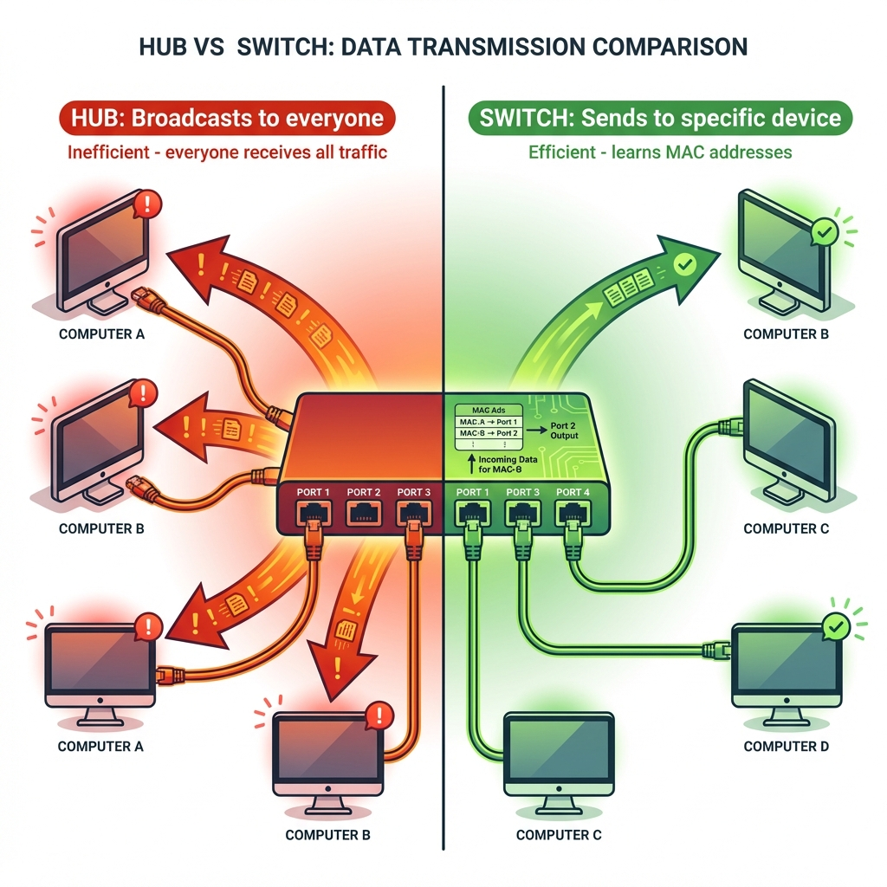
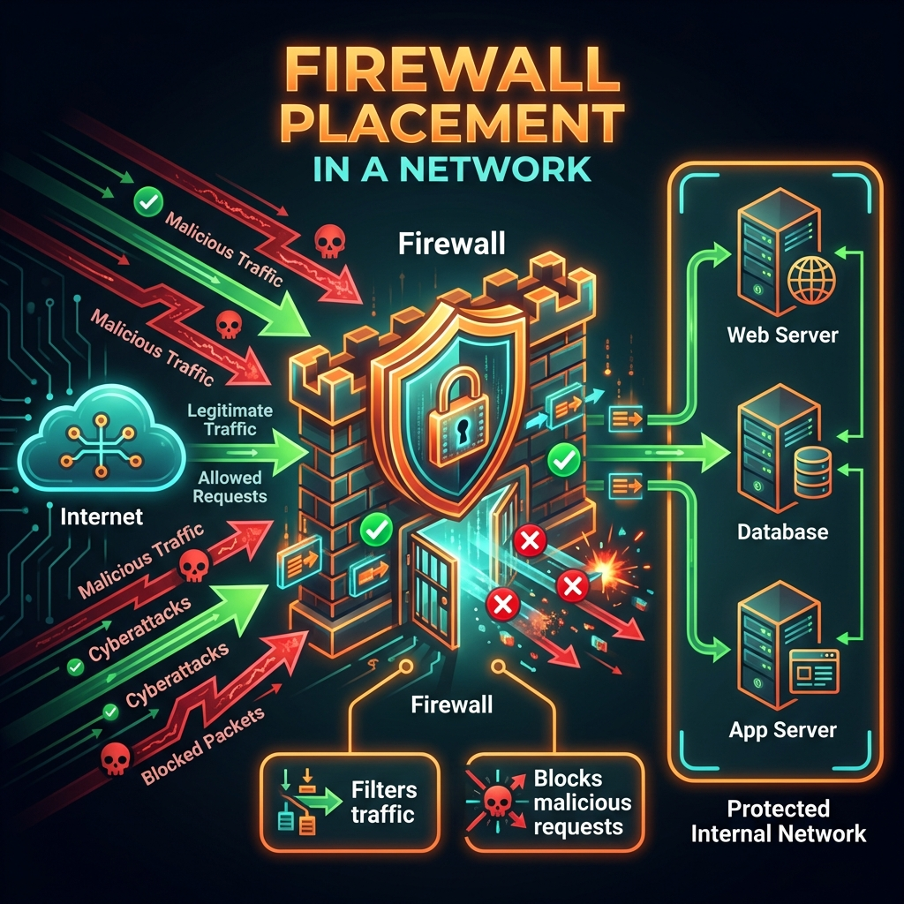
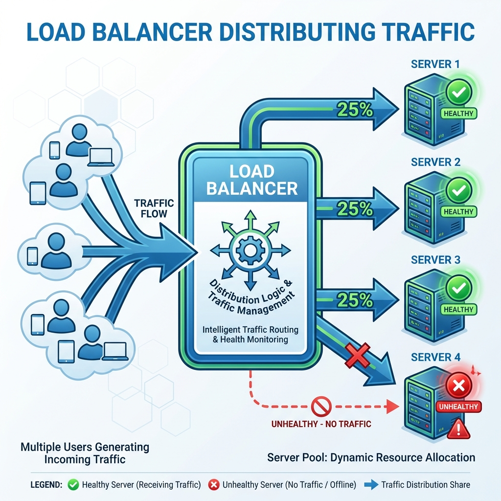
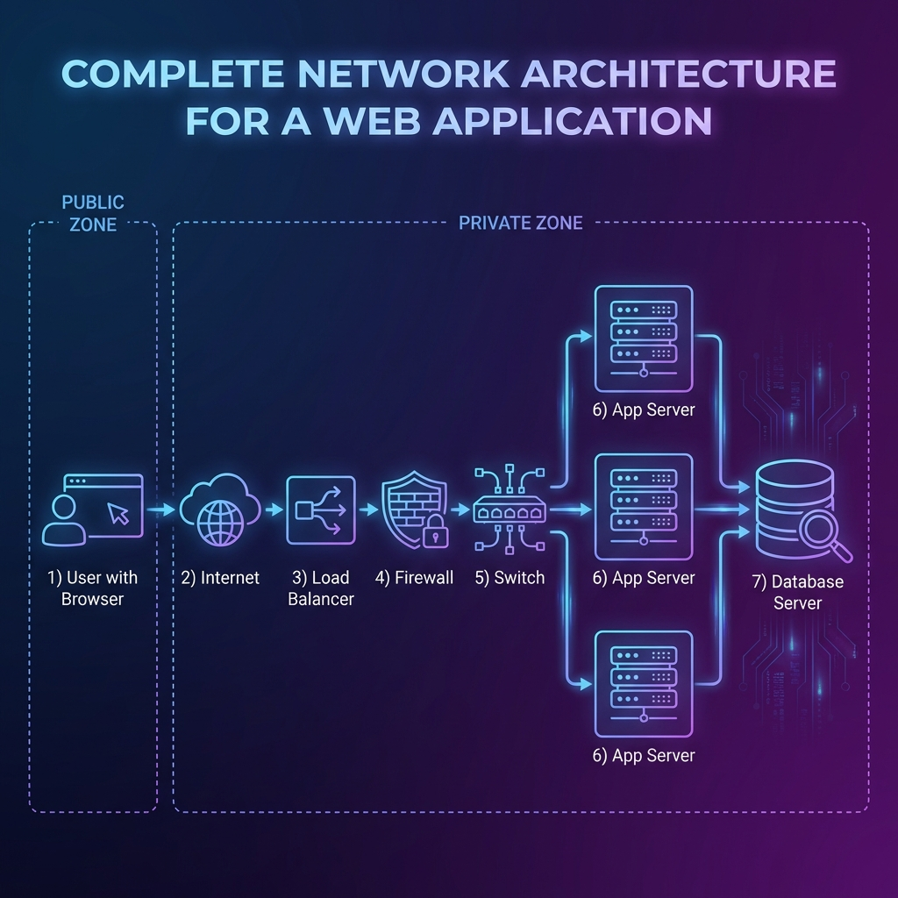

*Have you ever wondered how a website travels thousands of miles to appear on your screen? It's not magic — it's a carefully orchestrated journey through a series of network devices, each with a specific job. Let's follow that journey.*

---

## The Big Picture: Internet to Your Device

Before we dive into individual devices, let's see the full path:



```
Internet (World Wide Web)
    ↓
[Modem] — Translates signals
    ↓
[Router] — Directs traffic
    ↓
[Switch] — Connects local devices
    ↓
[Your Computer/Phone]
```

Each device plays a crucial role. Lose one, and the connection breaks.

---

## The Modem: The Translator

### Analogy: The Airport Customs Officer

Imagine you're traveling to a foreign country. You speak English, but the locals speak Japanese. You need a translator to communicate.

Your home network and your ISP (Internet Service Provider) speak different "languages":
- **ISP speaks**: Fiber optic signals, DSL signals, or cable signals
- **Your home speaks**: Ethernet (network cables) and WiFi

**The modem is the translator.** It converts ISP signals into a format your home network understands.

### What It Actually Does

```
ISP Network (Fiber/Cable/DSL)
         │
         ▼
    [MODEM]  ← Converts signal type
         │
         ▼
   Your Home Network (Ethernet)
```

**Types of Modems:**
- **DSL Modem**: Uses telephone lines (older, slower)
- **Cable Modem**: Uses coaxial cable (common in homes)
- **Fiber ONT** (Optical Network Terminal): For fiber connections (fastest)

### Key Point

Without a modem, you can't connect to your ISP. It's the essential bridge between your home and the internet.

---

## The Router: The Traffic Police

### Analogy: The Post Office Sorting Center

Imagine you send a letter to a friend across the country. The post office receives thousands of letters. How does yours find its way to the right city, then the right neighborhood, then the right house?

**The router is the sorting center.** It reads addresses and decides where to send each packet of data.

### What It Actually Does

Your router has two faces:
1. **Public face**: Connects to the internet (via modem)
2. **Private face**: Connects to your home devices

```
    Internet
       │
       ▼
[Public IP: 203.0.113.1]  ← Router's "address" on the internet
       │
   [ROUTER]
       │
[Private IPs: 192.168.1.x] ← Your devices' local addresses
       │
   +--------+--------+--------+
   │        │        │        │
 Laptop   Phone    Tablet   Smart TV
```

### Network Address Translation (NAT)

Your router gives each device a **private IP** (like 192.168.1.5) while sharing one **public IP** with the internet.

When you request google.com:
1. Your laptop asks the router
2. Router forwards the request using its public IP
3. Google responds to the router
4. Router remembers which device asked and forwards the response

This is why your laptop has a different IP than what websites see.

---

## Switch vs Hub: The Local Network Connectors

### Analogy: Office Mail Distribution

Imagine an office with 50 employees. When mail arrives, how does it get to the right person?

**The Hub (Old Way)**: The receptionist puts every piece of mail on a central table. Everyone must check the table to find their mail. Inefficient and chaotic.

**The Switch (Modern Way)**: The receptionist knows each employee's desk number and delivers mail directly. Fast and organized.

### What They Actually Do



**Hub (Obsolete)**
```
Device A sends data to Device B
         │
         ▼
      [HUB]  ← Broadcasts to ALL devices
         │
    +----+----+----+
    │    │    │    │
    A    B    C    D  ← Everyone receives, only B keeps it
```
- **Problem**: Wastes bandwidth, security risk

**Switch (Modern)**
```
Device A sends data to Device B
         │
         ▼
    [SWITCH] ← Knows B is on Port 3
         │
    +----+----+----+
    │    │    │    │
    A    B    C    D  ← Only B receives
         ↑
      (Port 3)
```
- **Smart**: Learns which device is on which port
- **Efficient**: Sends data only where needed

### How a Switch Learns

When a device connects, the switch builds a table:

| Port | MAC Address | Device |
|------|-------------|--------|
| 1 | AA:BB:CC:01 | Laptop |
| 2 | AA:BB:CC:02 | Desktop |
| 3 | AA:BB:CC:03 | Printer |

Now it knows exactly where to send each packet.

---

## The Firewall: The Security Gate

### Analogy: The Nightclub Bouncer

Imagine a nightclub with a strict bouncer:
- **Guest list check**: Is this person allowed in?
- **Dress code**: Do they meet the requirements?
- **ID verification**: Are they who they claim to be?
- **Selective entry**: VIPs get backstage access, regular guests stay in the main area

**The firewall is the bouncer.** It inspects every packet and decides: allow or deny?

### What It Actually Does



```
Internet
    │
    ▼
[FIREWALL] ← Inspects every packet
    │
   / \
  /   \
DMZ   Internal
 │       │
Web    Database
Server  Server
```

**Firewall Rules Example:**

| Direction | Source | Destination | Port | Action |
|-----------|--------|-------------|------|--------|
| Inbound | Any | Web Server | 80 (HTTP) | ✅ Allow |
| Inbound | Any | Web Server | 443 (HTTPS) | ✅ Allow |
| Inbound | Any | Database | 3306 | ❌ Deny |
| Outbound | Internal | Any | Any | ✅ Allow |

### Types of Firewalls

1. **Packet-Filtering**: Checks source/destination addresses and ports
2. **Stateful**: Tracks active connections (remembers you requested google.com, allows the response)
3. **Application (WAF)**: Inspects HTTP traffic for SQL injection, XSS attacks

### Where Firewalls Live

Firewalls exist at multiple levels:
- **Home**: Built into your router (basic protection)
- **Enterprise**: Dedicated hardware (advanced protection)
- **Cloud**: Security groups (AWS/Azure)
- **Application**: Web Application Firewall (WAF)

---

## The Load Balancer: The Traffic Distributor

### Analogy: The Toll Booth with Multiple Lanes

Imagine a toll booth with one lane. During rush hour, traffic backs up for miles. 

**Solution**: Add more lanes. But simply adding lanes isn't enough — you need someone directing cars to the open lane.

**The load balancer is the traffic director.** It distributes incoming requests across multiple servers so no single server gets overwhelmed.

### What It Actually Does



```
         Users
           │
           ▼
   [LOAD BALANCER]
    /      │      \
   /       │       \
Server A  Server B  Server C
  │         │         │
  └─────────┴─────────┘
           │
      Shared Database
```

### Load Balancing Methods

**Round Robin** (Simple rotation)
```
Request 1 → Server A
Request 2 → Server B
Request 3 → Server C
Request 4 → Server A
```

**Least Connections** (Smart distribution)
```
Server A: 50 active connections
Server B: 30 active connections ← New request goes here
Server C: 45 active connections
```

**IP Hash** (Session persistence)
```
Same user IP always → Same server
(Important for shopping carts, login sessions)
```

### Why Load Balancers Matter

- **High Availability**: If Server A fails, traffic goes to B and C
- **Scalability**: Add more servers during peak traffic
- **Performance**: No single server gets overwhelmed
- **Maintenance**: Take servers down for updates without downtime

---

## Putting It All Together: A Real-World Setup

Now let's see how all these devices work together in a typical production environment.



### Home Network (Simple)

```
ISP Fiber Line
     │
     ▼
[Fiber Modem/ONT]
     │
     ▼
[Home Router/Firewall/WiFi]  ← All-in-one device
     │
     ├──► Laptop (WiFi)
     ├──► Phone (WiFi)
     ├──► Smart TV (WiFi)
     └──► Desktop (Ethernet)
```

### Office Network (Medium)

```
ISP Connection
     │
     ▼
[Modem]
     │
     ▼
[Firewall] ← Dedicated security device
     │
     ▼
[Router]
     │
     ├──► [Switch] ──► Employee workstations
     │
     └──► [Access Point] ──► WiFi devices
```

### Production Data Center (Enterprise)

```
Internet Users
      │
      ▼
[Firewall] ← First line of defense
      │
      ▼
[Load Balancer] ← Distributes traffic
   /    |    \
  /     |     \
Web    Web    Web  ← Multiple web servers
Srv 1  Srv 2  Srv 3
  \     |     /
   \    |    /
    \   |   /
     \  |  /
   [Database Cluster]
```

---

## Journey of a Web Request

Let's trace what happens when you type `example.com`:

```
1. YOU (Browser)
   "I want example.com"
           │
           ▼
2. ROUTER (Home)
   "This isn't local, forwarding to ISP"
           │
           ▼
3. ISP NETWORK
   "Routing across the internet..."
           │
           ▼
4. DATA CENTER FIREWALL
   "Checking if this request is allowed"
           │
           ▼
5. LOAD BALANCER
   "Server B has least load, sending there"
           │
           ▼
6. WEB SERVER
   "Processing request, generating response"
           │
           ▼
7. DATABASE
   "Fetching requested data"
           │
           ▼
(Reverse journey back to you)
```

Each device adds its own small delay (latency), but without any of them, the connection fails.

---

## Connecting to Backend Development

As a web developer, why should you care about these devices?

### 1. Understanding Latency

```
User in India → Server in USA
     │
     ├──► 200ms: ISP routing
     ├──► 150ms: Transoceanic cable
     ├──► 50ms:  Firewall inspection
     ├──► 10ms:  Load balancer decision
     └──► 20ms:  Server processing
     
Total: ~430ms before your code even runs!
```

**Implication**: Use CDNs (Content Delivery Networks) to cache content closer to users.

### 2. Stateless Design

Load balancers distribute requests randomly. If User A's first request goes to Server 1, their next request might go to Server 2.

**Implication**: Don't store user session data in server memory. Use:
- Database sessions
- Redis/Memcached
- JWT tokens

### 3. Health Checks

Load balancers continuously check if servers are healthy:
```
GET /health → 200 OK ✓ Server stays in rotation
GET /health → 500 Error ✗ Server removed
```

**Implication**: Implement a `/health` endpoint in your applications.

### 4. Firewall Rules

Your API might work locally but fail in production because:
- Port 3000 is blocked
- Database port isn't accessible from app servers
- Outbound requests are restricted

**Implication**: Know which ports your app needs open.

### 5. Scaling Strategy

```
High Traffic?
     │
     ├──► Vertical: Bigger server (limited)
     └──► Horizontal: More servers (load balancer needed)
```

**Implication**: Design your app to run on multiple instances.

---

## Summary Table

| Device | Primary Role | Analogy | OSI Layer |
|--------|-------------|---------|-----------|
| **Modem** | Signal translation | Airport customs | Layer 1 (Physical) |
| **Router** | Traffic direction | Post office | Layer 3 (Network) |
| **Switch** | Local device connection | Office mail delivery | Layer 2 (Data Link) |
| **Hub** | Broadcast (obsolete) | Bulletin board | Layer 1 |
| **Firewall** | Security enforcement | Nightclub bouncer | Layer 3-7 |
| **Load Balancer** | Traffic distribution | Toll booth director | Layer 4-7 |

---

## Key Takeaways

1. **Modem connects you to your ISP** — Without it, no internet
2. **Router directs traffic** — Decides where packets go
3. **Switch connects local devices** — Smart delivery vs hub's broadcast
4. **Firewall protects** — Inspects and filters traffic
5. **Load balancer distributes** — Enables scalability and reliability
6. **They work as a team** — Lose one, and the chain breaks

---
