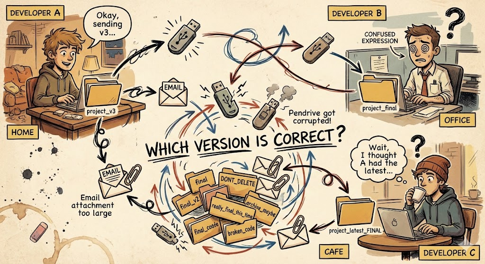
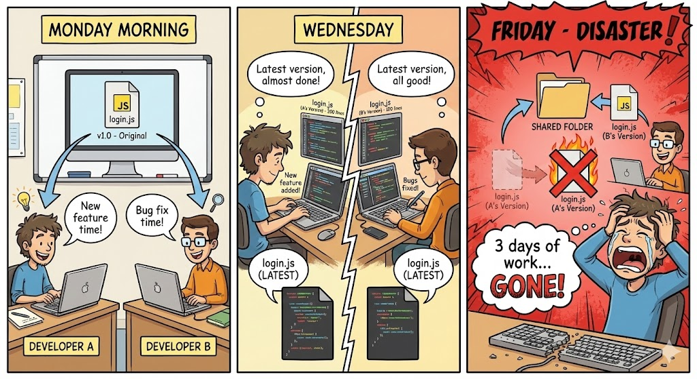
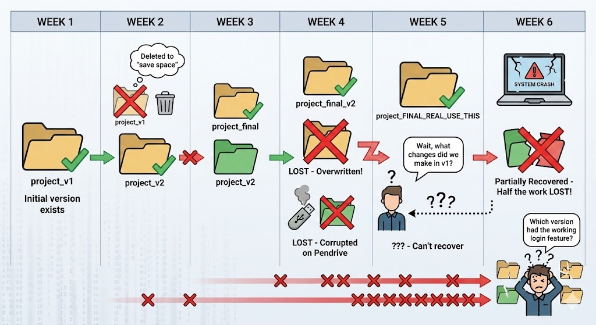
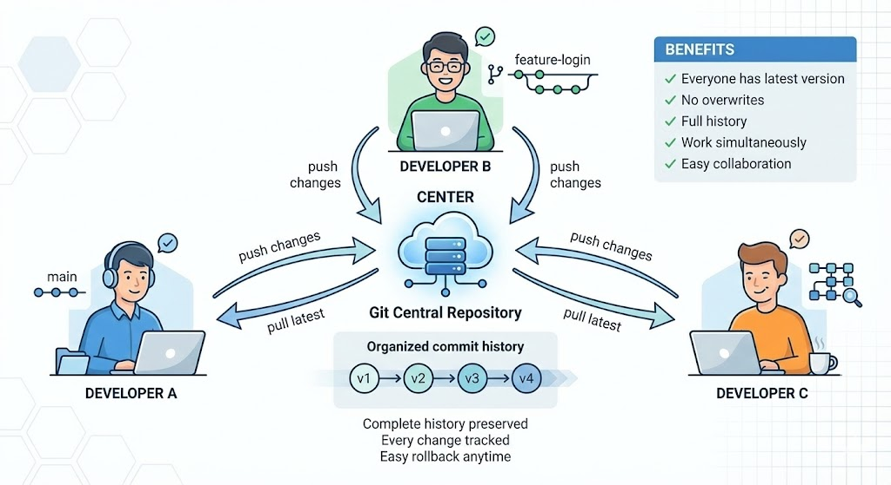

It's 2 AM. Deadline is in 6 hours.

You've been working on the login feature for three days straight. It's finally working — authentication, validation, error handling, everything. You save your files, stretch your back, and feel pretty good about yourself.

Then your teammate messages: "Hey, I just copied the latest code from my pendrive to the shared folder. We're all synced up now!"

Your heart sinks.

You open the shared folder. Your login feature is gone. Completely overwritten. Three days of work, vanished in seconds.

This isn't a horror story. This was reality for developers before version control.

---

## The Dark Ages: How We Used to Share Code

Before Git, before version control systems, developers had to get creative (and desperate) to collaborate on code.



### The Pendrive Shuffle

Developer A finishes a feature at home. Copies files to a pendrive. Brings it to office next day. Copies to shared computer. Meanwhile, Developer B was working on the same files at the cafe. They email their version. Developer C downloads the attachment but it's 3 days old.

Which version is correct? Nobody knows.

### The Email Attachment Era

"Hey, here's the latest code" — with a 50MB zip file attached.

"Email bounced, attachment too large."

"Okay, I'll split it into 5 parts."

Three days later, someone realizes part 3 was corrupted.

### The Folder Naming Convention

Every developer's worst nightmare:

```
project/
project_backup/
project_final/
project_final_v2/
project_final_v2_FIXED/
project_FINAL_REAL/
project_DONT_DELETE/
project_USE_THIS_ONE/
project_latest_final_v3_WORKING/
```

Which one do you use? The one that says "FINAL" or the one that says "USE_THIS_ONE"? What if "FINAL" is newer than "USE_THIS_ONE"? 

Nobody remembers. Everyone guesses. Someone picks wrong.

---

## The Problems We Faced

This chaotic workflow created real, painful problems.

### Problem 1: Overwriting Each Other's Work

This happened constantly.



Monday: Two developers start working on the same file. Both think they have the "latest" version.

Wednesday: Developer A adds a new feature. Developer B fixes bugs. Both are happy with their progress.

Friday: Developer B copies their version to the shared folder. Developer A's entire feature — gone. No warning, no merge, just... overwritten.

The worst part? Sometimes you wouldn't notice for days. By then, you've forgotten exactly what you wrote.

### Problem 2: No History

"Hey, remember that function we removed last month? We need it back."

"Uh... which version had it?"

"I don't know. Check the backups?"

"Which backup? There are 47 folders."

Without version control, there's no way to see what changed, when it changed, or why. You can't go back to "how it was on Tuesday" because you don't have Tuesday's version. You deleted it to save disk space.

### Problem 3: Lost Work



Week 1: Project starts. Everything is fine.

Week 2: Someone deletes v1 to "save space." 

Week 3: Pendrive with v2 gets corrupted.

Week 4: Someone accidentally overwrites the "final" folder.

Week 5: "Wait, what changes did we make in v1?" — Can't recover. It's gone.

Week 6: Laptop crashes. Half the work lost forever.

This wasn't rare. This was normal. Every team had stories of lost code, corrupted drives, and accidentally deleted folders.

### Problem 4: No Collaboration

"Don't touch `login.js`, I'm working on it!"

"For how long?"

"Maybe two days?"

"But I need to fix a bug in it today!"

"Well... wait, I guess?"

Two people couldn't work on the same file. You had to take turns. Or worse, you'd both work on it and then spend hours manually merging your changes line by line.

### Problem 5: No Accountability

"The payment system is broken. Who changed it?"

*Silence*

"Anyone?"

*More silence*

"It was working last week!"

Without history, there's no way to know who changed what. No blame, sure, but also no way to understand what went wrong or how to fix it.

---

## The Breaking Point

As software projects grew larger, teams grew bigger, and deadlines grew tighter, the pendrive workflow became impossible.

Imagine:
- 10 developers
- 500 files
- 3 different offices
- 1 shared folder

How do you coordinate? How do you make sure everyone has the latest code? How do you prevent overwrites?

You can't. Not with pendrives and emails.

Something had to change.

---

## The Solution: Version Control

Version control systems were built to solve exactly these problems.



Instead of chaos, you get order:

**One central repository** — Everyone pushes to and pulls from the same place. No more "which folder is latest?"

**Complete history** — Every change is recorded. Who made it, when, and why. You can go back to any point in time.

**No overwrites** — Version control tracks changes, not files. Two people can work on the same file, and the system helps merge their work.

**Branching** — Want to experiment? Create a branch. If it works, merge it. If it fails, delete it. Your main code stays safe.

**Accountability** — Every change has an author. Not for blame, but for understanding.

---

## Pendrive vs Version Control: The Comparison

| Aspect | Pendrive/Email Era | Version Control |
|--------|-------------------|-----------------|
| Sharing code | Copy to pendrive, email zips | Push/pull from repository |
| Finding latest version | Guess from folder names | Always clear (main branch) |
| History | None (or scattered backups) | Complete, searchable |
| Collaboration | Take turns, manual merge | Work simultaneously, auto-merge |
| Recovering old code | Hope you have a backup | Checkout any previous version |
| Tracking changes | "Something changed... somewhere" | Exact diff of every change |
| Working offline | Yes (only advantage) | Yes (with distributed VCS like Git) |

---

## Why Version Control Became Mandatory

Today, you cannot work as a professional developer without version control. It's not optional — it's infrastructure.

**Open source runs on it.** Linux, React, VS Code — millions of developers contributing to the same codebase. Impossible without version control.

**Companies require it.** Every tech company uses Git. It's in every job description. It's assumed knowledge.

**CI/CD depends on it.** Automated testing, deployment, code review — all built on top of version control.

**Remote work needs it.** Teams spread across the world, working asynchronously. Version control makes it possible.

The pendrive era is over. And honestly? Good riddance.

---

## Wrapping Up

Version control exists because the old way was painful, error-prone, and didn't scale.

- Pendrives get corrupted
- Emails get lost
- Folders get overwritten
- Humans forget

Version control systems like Git solve all of this. They give us history, collaboration, safety, and sanity.

If you've ever lost work to an accidental overwrite, or spent hours merging two versions of the same file, or stared at 15 folders trying to figure out which one is "real" — you understand why version control matters.

---
