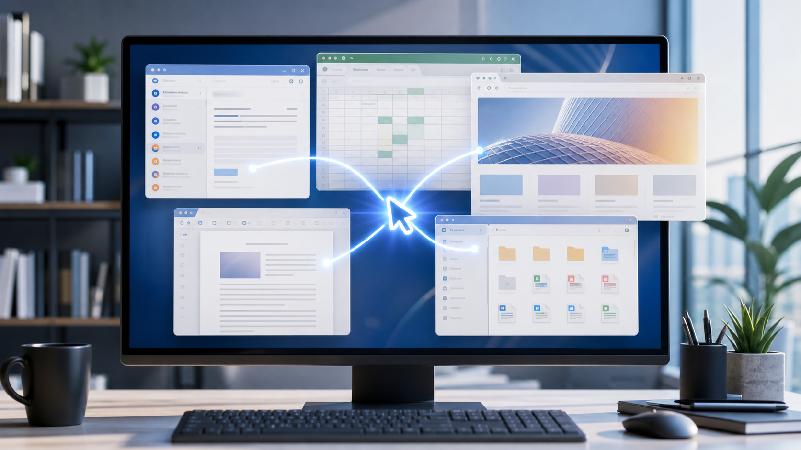
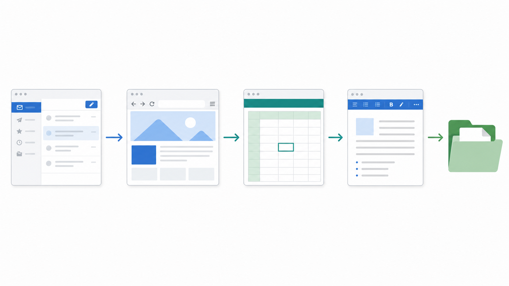
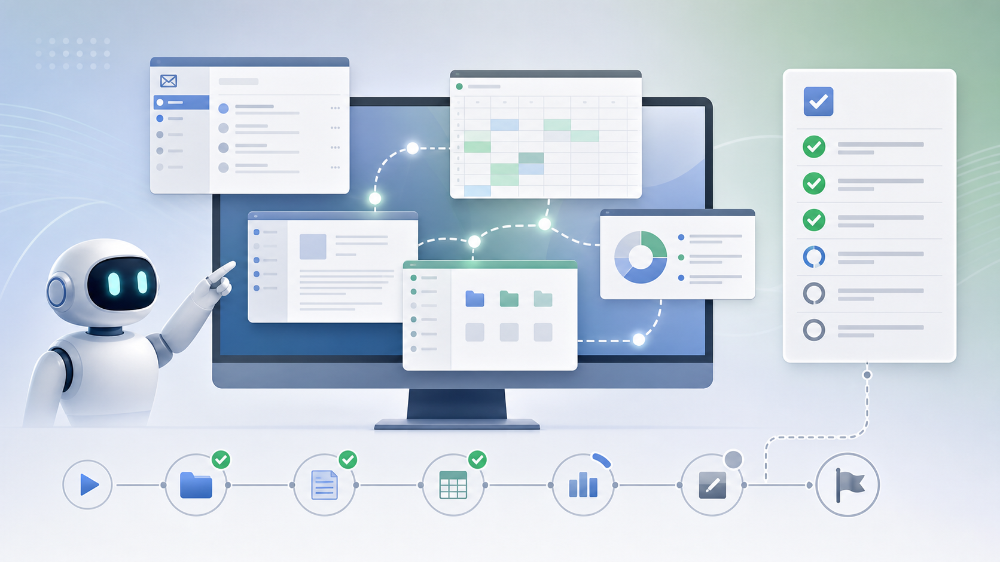
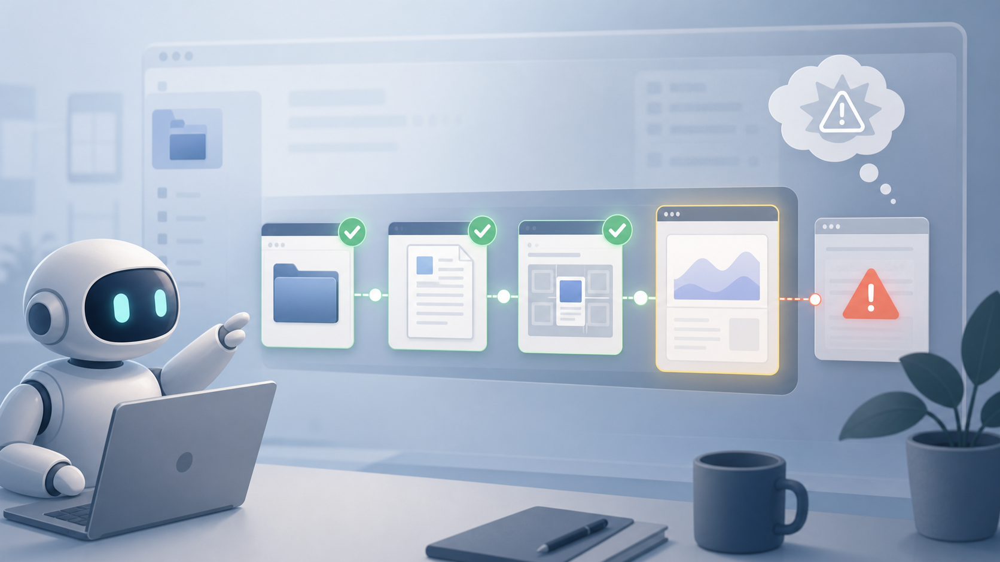

# AI Agents Can Click Buttons, But Can They Do Real Office Work?

**Subheadline:** WindowsWorld, a new arXiv benchmark, tests AI agents on the messy multi-app workflows that make up everyday office work.

Picture a small task from a regular workday. A manager sends an email asking for a short update. The numbers are in a spreadsheet. One missing detail is inside a PDF. A supporting point needs to be checked in a browser. The final answer has to be added to a document, saved in the right folder, and sent back politely.

For a person, this is not a heroic task. It is just office work.

For an AI agent, it is much harder than it looks.

That difference is the point of **WindowsWorld: A Process-Centric Benchmark of Autonomous GUI Agents in Professional Cross-Application Environments**, an arXiv paper submitted on April 30, 2026. The benchmark asks a practical question behind many agent demos: can an AI system actually operate a computer through a full professional workflow, or can it only perform impressive-looking fragments?

The answer, at least for now, is sobering.

## The Problem With Neat Demos

Computer-use agents are AI systems that can see a screen and take actions on it. Instead of only replying in a chat window, they may click buttons, type into fields, open files, scroll through pages, or switch between applications.

That is a powerful idea because most digital work is not trapped inside one prompt. A real employee does not simply "answer a question." They move between inboxes, spreadsheets, browsers, PDFs, slide decks, file managers, and messaging tools. They also remember what they are doing, notice when something changes, and make small judgments along the way.

This is where many demos become less convincing. A demo might show an agent filling one form or finding one piece of information. That is useful, but it is not the same as completing a task that crosses several apps and depends on previous steps being done correctly.

WindowsWorld is built around that harder version of the problem.

## What WindowsWorld Tests

The benchmark focuses on cross-application workflows. In plain language, that means the agent cannot stay inside one clean environment. It may need to start in one app, collect information from another, update a file somewhere else, and finish with a result that depends on the whole chain.

According to the paper and the official project repository, WindowsWorld includes:

- **181 tasks** across **17 desktop applications**
- Tasks based on **16 professional personas**
- **4 difficulty levels**
- An average of about **5 intermediate checkpoints per task**
- **77.9% multi-app tasks**, where more than one application is involved

That last number is the most interesting one. WindowsWorld is not mainly asking, "Can the agent click the right button?" It is asking, "Can the agent keep a work process alive across several tools?"

The researchers also evaluate intermediate checkpoints, not only the final result. This is a smart design choice. In office work, failure often happens before the final output. An agent may open the right file but copy the wrong value. It may complete the first two steps and then lose track of the instruction. It may keep clicking after the useful path has already disappeared.

Looking at the process makes those failures visible.

## The Result: The Hard Part Is Not Clicking

The paper reports that leading computer-use agents achieved **less than 21% final success** on multi-application tasks. In other words, the agents often made some progress, but they rarely completed the full workflow correctly.

The weak spots are familiar to anyone who has tried to rely on an AI assistant for a multi-step job.

First, the agents struggle with long-range planning. They can follow a local instruction, but the larger task can fade as the screen changes. A human knows that opening the spreadsheet is only step three of a bigger request. An agent may treat the current window as the whole world.

Second, they struggle with conditional judgment. Real work is full of small branches: if the value is missing, check another source; if the document already has a section, update it instead of creating a new one; if the email asks for a summary, do not send raw data. These choices are simple for a trained worker, but they are exactly where brittle automation breaks.

Third, they are inefficient. The paper notes that tasks can fail even after agents exceed human step limits. That matters because an assistant that needs too many clicks, retries, and detours is not really saving time.

So the issue is not whether AI agents can control a mouse. They can. The issue is whether they can understand work as a sequence of connected decisions.

## Why This Matters For Workplaces

Agentic AI is often presented as the next layer of productivity software. The pitch is attractive: let the AI handle routine workflows while people focus on judgment, creativity, and relationships.

WindowsWorld does not reject that future. It simply makes the near-term challenge clearer.

If an AI agent is going to help in a workplace, it has to be dependable in boring situations. It must know which file it opened, why it opened it, what value it extracted, where that value should go, and when the task is finished. It also has to recover when a window looks different, a file is missing, or a step depends on information from an earlier app.

There is also a trust issue. A chat response can be checked before it is used. A computer-use agent may directly edit a document, move a file, or send a message. That makes reliability and safety much more than research details. They become product requirements.

That makes WindowsWorld useful beyond model development. It gives journalists, business leaders, and AI users a better way to judge agent claims. Instead of asking whether an agent can perform a single flashy action, we should ask whether it can complete an ordinary workflow without losing context.

## The Takeaway

The most useful reading of WindowsWorld is not "AI agents failed." It is more specific: today's agents are still weak at the kind of multi-step, multi-app coordination that defines real office work.

That may change. Better models, stronger memory, improved visual understanding, and safer tool-use systems could make computer-use agents far more capable. But the benchmark shows why the jump from demo to deployment is not automatic.

For now, AI agents can click, type, scroll, and switch windows. What they still need to learn is the quieter skill behind professional work: carrying a goal across messy tools until the job is actually done.

## Sources

- arXiv: [WindowsWorld: A Process-Centric Benchmark of Autonomous GUI Agents in Professional Cross-Application Environments](https://arxiv.org/abs/2604.27776)
- Official GitHub: [HITsz-TMG/WindowsWorld](https://github.com/HITsz-TMG/WindowsWorld)
