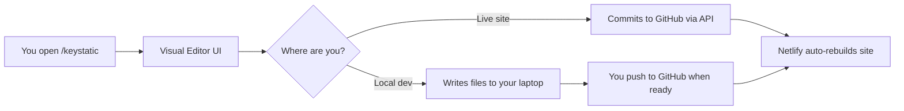
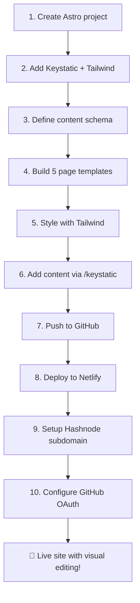

# 🚀 Portfolio Site — Tech Stack Recommendation

Based on deep research across 3 parallel investigations into Keystatic CMS, framework comparisons, deployment platforms, and Hashnode integration.

---

## 🏆 Recommended Stack: **Astro + Keystatic + Tailwind CSS + Netlify**

| Layer | Choice | Why |
|:---|:---|:---|
| **Framework** | **Astro** | HTML-first, zero JS shipped to visitors, blazing fast, simplest code |
| **CMS** | **Keystatic** | Git-based visual editor at `/keystatic`, no database needed |
| **Styling** | **Tailwind CSS v4** | Utility-first, modern look, first-class Astro support |
| **Deployment** | **Netlify** (primary) | Free tier allows commercial use (freelancing!), 300 build min/mo |
| **Blog** | **Hashnode** (subdomain) | `blog.yoursite.com` via CNAME — zero blog code to maintain |
| **Forms** | **Netlify Forms** | Built-in free form handling, zero backend code |

---

## 🤔 Why This Stack Beats the Alternatives

### Astro vs Next.js vs Remix

| Criteria | Astro ✅ | Next.js ❌ | Remix ❌ |
|:---|:---|:---|:---|
| **Code Complexity** | Very low — `.astro` files = HTML + CSS + JS | High — React Server Components, `"use client"`, hydration | Moderate — loaders/actions, full-stack React |
| **JS Shipped to Browser** | **~0 KB** (HTML only) | **70-200+ KB** (React runtime) | **Full React bundle** |
| **Lighthouse Score** | **98-100** out of the box | 80-95 (needs optimization) | 85-95 |
| **Learning Curve** | Know HTML/CSS? You're good | Must learn React deeply | Must learn React + routing patterns |
| **Maintenance Over Time** | Stable, minimal updates | Frequent breaking changes | Framework shifting to React Router v7 |
| **Keystatic Support** | ✅ First-class `@keystatic/astro` | ✅ First-class | ✅ First-class |
| **Commercial Free Hosting** | ✅ Netlify free tier | ⚠️ Vercel Hobby **forbids** commercial use | ✅ Netlify free tier |

> [!IMPORTANT]
> **Vercel's free Hobby plan prohibits commercial activity.** Since your portfolio is for freelance client acquisition, **Netlify is the safer free deployment choice.** You can always add Vercel later if needed.

---

## 🧠 How Keystatic Works (The Magic)



### Two Modes You'll Use:
1. **Local Mode** (during development) — Edit at `localhost:4321/keystatic`, changes save directly to your files
2. **GitHub Mode** (on live site) — Edit at `yoursite.com/keystatic`, changes auto-commit to GitHub → Netlify rebuilds

### What You Can Edit Visually (no code):
- ✏️ Hero text, tagline, photo
- ✏️ About section content
- ✏️ Project cards (title, description, image, links, tech stack)
- ✏️ Education entries, skills, courses, experience
- ✏️ Contact info, social links
- ✏️ Site settings (name, SEO meta, colors)

---

## 📁 Site Structure (Only ~15 files!)

```
portfolio/
├── src/
│   ├── components/
│   │   ├── Header.astro          # Navigation bar
│   │   ├── Footer.astro          # Footer with social links
│   │   ├── Hero.astro            # Landing hero section
│   │   ├── ProjectCard.astro     # Reusable project card
│   │   ├── SkillBadge.astro      # Skill/tech icon badge
│   │   └── Timeline.astro        # Experience/education timeline
│   ├── content/                  # ← Keystatic manages these files
│   │   ├── projects/             # Each project = 1 markdown file
│   │   ├── education/            # Education entries
│   │   ├── experience/           # Work experience entries
│   │   ├── skills/               # Skills data
│   │   └── site-settings.yaml    # Global site config (name, bio, socials)
│   ├── layouts/
│   │   └── Layout.astro          # Base HTML layout (head, nav, footer)
│   └── pages/
│       ├── index.astro           # Page 1: Home / Hero + About
│       ├── projects.astro        # Page 2: Projects gallery
│       ├── education.astro       # Page 3: Education / Skills / Experience
│       ├── blog.astro            # Page 4: Blog (redirects to Hashnode)
│       └── contact.astro         # Page 5: Contact form
├── keystatic.config.ts           # CMS schema (what's editable)
├── astro.config.mjs              # Astro config
├── tailwind.config.mjs           # Tailwind config
└── package.json
```

> [!TIP]
> The entire codebase is ~15 files. Compare that to a typical Next.js setup which would be 30-50+ files with API routes, middleware, and config files.

---

## 📄 The 5 Pages — Purpose & Strategy

### Page 1: 🏠 Home / Landing + About
- **Hero section**: Name, title, professional photo, compelling tagline
- **About section**: Your story, what drives you, your value proposition
- **Dual CTAs**: `[View My Work]` + `[Hire Me / Contact]`
- **Strategy**: This is your conversion engine — 80% of visitors decide here

### Page 2: 💼 Projects
- **Case study format**: Problem → Solution → Tech Stack → Impact
- **Visual cards**: Screenshot/mockup, title, description, live link, GitHub link
- **Quantify results**: "Improved load times by 45%" > "Built a fast website"
- **Strategy**: Proof of competence for both recruiters and clients

### Page 3: 🎓 Education / Skills / Experience
- **Education**: Degrees, certifications, courses with institution logos
- **Skills**: Categorized tech stack with proper icons (Frontend, Backend, Tools, etc.)
- **Experience**: Timeline with company logos, role, duration, key achievements
- **Strategy**: Builds trust and credibility — logos and icons matter for visual authority

### Page 4: 📝 Blog
- **Simple page** with a redirect/link to `blog.yoursite.com` (Hashnode)
- **Optional**: Pull latest 3 posts via Hashnode API to show previews
- **Strategy**: Demonstrates thought leadership and problem-solving skills

### Page 5: 📬 Contact
- **Contact form** (powered by Netlify Forms — free, zero code)
- **Social links**: LinkedIn, GitHub, Twitter/X, email
- **Optional**: Embedded Calendly/Cal.com booking widget for freelance calls
- **Strategy**: Make it dead simple to reach you

---

## 🌐 Hashnode Blog Setup (`blog.yoursite.com`)

### DNS Configuration (one-time, 5 minutes):
1. In your domain registrar (Namecheap, Cloudflare, etc.):
   - **Type**: `CNAME`
   - **Host**: `blog`
   - **Target**: `hashnode.network`
2. In Hashnode Dashboard → Publication Settings → Domain:
   - Enter `blog.yoursite.com` → Click Verify
3. Hashnode auto-provisions SSL certificate ✅

### Zero Code Maintenance:
- Blog lives entirely on Hashnode's infrastructure
- Your portfolio just links to it
- SEO juice flows back to your domain

---

## ⚠️ Important Gotchas to Know

| Issue | Impact | Solution |
|:---|:---|:---|
| Netlify 300 build min/month | Each Keystatic edit triggers a rebuild | Astro builds in ~30-45s = ~400-600 edits/month. Use local mode for batch editing |
| Keystatic needs API routes | Pure static won't work for admin UI | Use Astro `output: 'hybrid'` + `@astrojs/netlify` adapter |
| GitHub OAuth setup required | Admin login on live site needs auth | Create free GitHub App, add 3 env vars to Netlify |
| Vercel Hobby = no commercial use | Can't use for freelancing on free tier | Deploy on Netlify (commercial allowed on free tier) |
| Git repo size with images | Large images bloat Git history | Use Keystatic Cloud for image storage, or optimize images before upload |

---

## 💰 Total Cost: **$0/month** (+ domain ~$10/year)

| Service | Cost |
|:---|:---|
| Netlify hosting | Free (100GB bandwidth, 300 build min) |
| Keystatic CMS | Free (open source) |
| Hashnode blog | Free |
| GitHub repo | Free |
| Netlify Forms | Free (100 submissions/month) |
| SSL Certificate | Free (auto-provisioned) |
| **Domain name** | **~$10-15/year** (only paid item) |

---

## 🔧 Development Workflow


